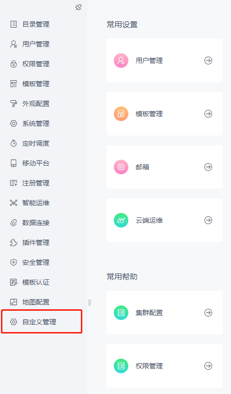

# 增加管理系统节点

## 接口作用

在管理系统中新增一个管理节点，同时支持分级权限控制，可以下放给次级管理员管理。

## 开放资源

| 接口资源 |
| --- |
| `dec.provider.management` |

## 示例

```js
BI.config("dec.provider.management", function (provider) {
    provider.inject({
        modules: [
            {
                value: "custom_manage",
                id: "decision-management-custom-manage",
                text: "自定义管理",
                cardType: "my.custom_manage",
                cls: "setting-font",
                dev: true
            }
        ]
    });
});
```

## 效果



## 注意事项

后端支持 [SystemOptionProvider 接口](zh/tutorial/common-extensions/platform/SystemOptionProvider.md)，需要配合后端接口使用，否则无法在权限管理中配置权限。

| FineUI 文档地址 |
| --- |
| [http://fanruan.design/doc.html?post=0169cf558d](http://fanruan.design/doc.html?post=0169cf558d) |