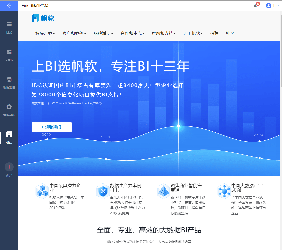

# 增加侧边栏节点

## 接口作用

在左侧边栏（目录、仪表板、数据准备、管理系统）的基础上新增节点。

## 开放资源

| 接口资源 |
| --- |
| `dec.provider.frame.menu` |

## 示例

```js
BI.config("dec.provider.frame.menu", function (provider) {
    provider.inject({
        menus: [
            {
                value: "fanruan",
                text: BI.i18nText("帆软"),
                cardType: {
                    src: "http://www.fanruan.com/"
                },
                cls: "fr-logo-font"
            }
        ]
    });
});

// 如果失效，可以使用兼容性写法
BI.config("dec.constant.menu.items", function (items) {
    items.push({
        value: "fanruan",
        text: BI.i18nText("帆软"),
        cardType: {
            src: "http://www.fanruan.com/"
        },
        cls: "fr-logo-font"
    });
    return items;
});
```

## 效果

示例工程：[https://code.fanruan.com/fanruan/demo-system-management](https://code.fanruan.com/fanruan/demo-system-management)



## 注意事项

| FineUI 文档地址 |
| --- |
| [http://fanruan.design/doc.html?post=0169cf558d](http://fanruan.design/doc.html?post=0169cf558d) |