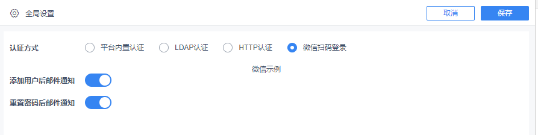

# 自定义登录认证方式

## 接口作用

在现有的三种默认、LDAP、HTTP 认证方式的基础上，扩展新的认证方式，如企业微信登录、钉钉登录等。

## 开放资源

| 接口资源 |
| --- |
| `dec.provider.user` |

## 示例

```js
BI.config("dec.provider.user", function (provider) {
    provider.inject({
        authenticationMethod: {
            wechat: {
                value: "wechat",
                text: "微信扫码登录",
                "@class": "com.fr.decision.webservice.bean.authentication.WechatAuthenticBean",
                component: {
                    type: "dec.user.setting.wechat"
                }
            }
        }
    });
});
```

## 效果



## 注意事项

后端支持示例参见：[https://git.fanruan.com/fanruan/demo-ldaps-passport](https://git.fanruan.com/fanruan/demo-ldaps-passport)

| FineUI 文档地址 |
| --- |
| [http://fanruan.design/doc.html?post=0169cf558d](http://fanruan.design/doc.html?post=0169cf558d) |
