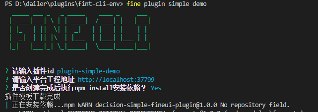
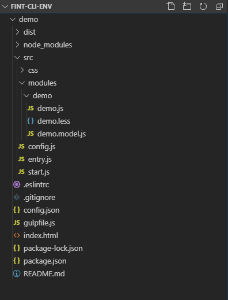
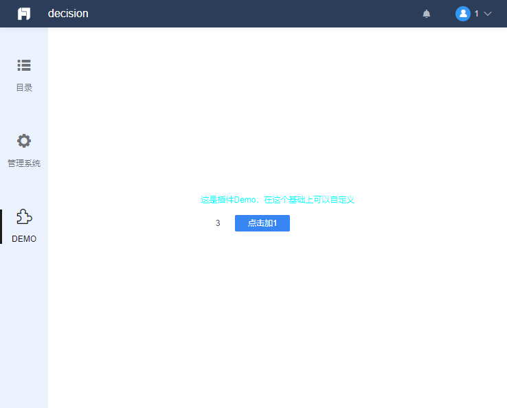

# 第一个可执行的例子

## 学习准备

首先，我们假设你已经有了良好的 JavaScript 基础，并且初步学习了 [FineUI 文档](http://fanruan.design/doc.html?post=0169cf558d)，对组件化的概念有了初步认识。

## 环境准备

参阅[搭建纯前端插件开发环境](./frontend-dev-env.md)，启动一个纯前端插件开发环境。由 gulp 工具整合，实时打包 js 和 less。

采用代理的方式连接服务端工程，因此就算不具备服务端开发知识的人也可以顺畅地开发用户界面插件。



初始化完成后，将得到如下目录结构，打开浏览器 `localhost:3000` 即可查看到平台内容：



## 第一个可执行的例子

首先打开 `demo/src/config.js`，修改内容为：

```js
!(function () {
    BI.config("dec.provider.management", function (provider) {
        provider.inject({
            modules: [
                {
                    value: "pluginD",
                    text: "DEMO",
                    cardType: "dec.plugin.demo",
                    cls: "management-plugin-font",
                    dev: true
                }
            ]
        });
    });
})();
```

再次查看 `localhost:3000`，页面已自动刷新，可以看到左侧侧栏多了一个按钮，右侧相对应的页面内容为一个简单的计数器：


