# 搭建纯前端插件开发环境

> **注意**：此文档已经废弃。  
> demo 参考 [https://code.fanruan.com/dailer/javascript-dev-demo](https://code.fanruan.com/dailer/javascript-dev-demo)

---

## 安装 NodeJS

如果当前环境已经安装过 NodeJS 可以直接跳过当前步骤。

1. **下载** 进入[官网下载页](https://nodejs.org/zh-cn/download/)下载 nodejs，首先选择长期支持版（LTS），然后根据自己的操作系统选择对应的平台安装包。这边以 Windows 操作系统为例安装。

   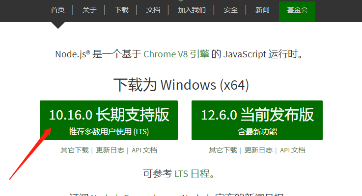

2. **安装** 点击下载的 msi 文件进行安装，中间不需要做什么设置，只要下一步即可，最后选择安装。

   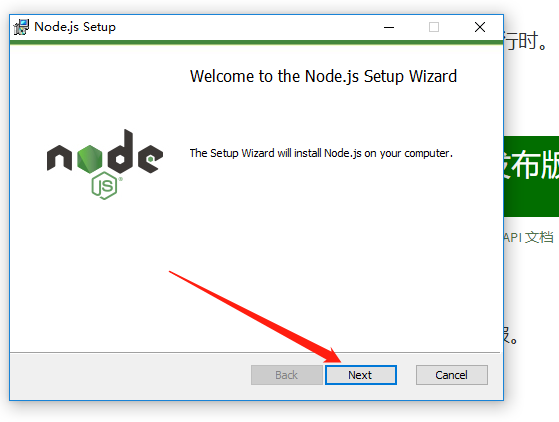

3. **验证** 安装完成之后，可以打开命令行查看是否安装成功，是否已经加入环境变量中。使用 `node -v` 查看当前 node 的版本。

   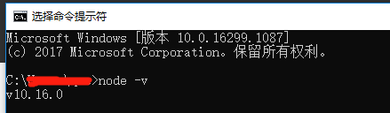

4. **NPM** NPM 是随同 NodeJS 一起安装的包管理工具，能解决 NodeJS 代码部署上的很多问题。详细了解可以查看这篇 [NPM 使用介绍](https://www.runoob.com/nodejs/nodejs-npm.html)。在我们安装 NodeJS 的时候，NPM 同时也已经安装好了，使用 `npm -v` 查看当前 npm 的版本。

   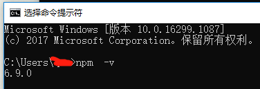

其他操作系统可以参考官网或者根据 [Node.js 安装配置](https://www.runoob.com/nodejs/nodejs-install-setup.html) 教程来安装。

## 安装 git

如果当前环境已经安装过 git 可以直接跳过当前步骤。

1. **下载** 进入[官网下载页](https://git-scm.com/downloads)下载 git，可以根据自己的操作系统选择合适自己的安装包。这个的下载过程会比较长，可以使用 [taobao 的镜像下载](http://npm.taobao.org/mirrors/git-for-windows/)，这边下载的是 [Git-2.22.0-64-bit.exe](http://npm.taobao.org/mirrors/git-for-windows/v2.22.0.windows.1/Git-2.22.0-64-bit.exe)。

   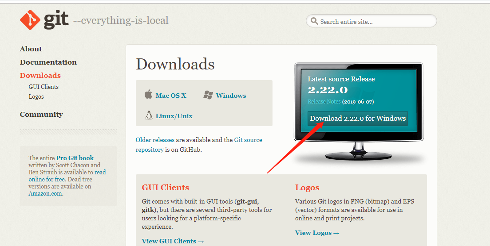

2. **安装** 点击下载的安装包，直接下一步直到安装完成。除非有明确的需求，不然每步直接用默认选项即可。

   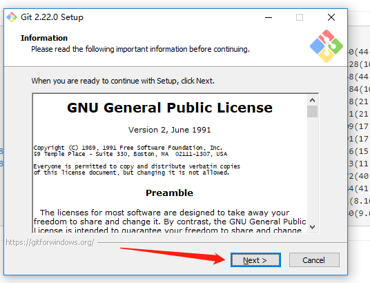

3. **验证** git 安装完成之后，同样可以在命令行中使用 git 命令。同时可以看到多了几个 git 相关的工具。

   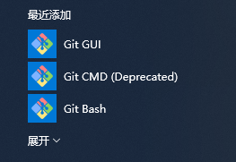

   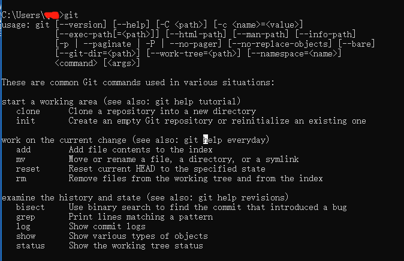

4. **简单配置** 使用 git 的过程中，一般都需要进行几个简单的设置。

   ```bash
   # 配置用户名
   git config --global user.name "你的名字"

   # 配置邮箱
   git config --global user.email "你的邮箱"

   # 查看配置
   git config --list
   ```

## 安装平台插件开发脚手架

首先全局安装脚手架，如果遇到类似 `Error: EPERM: operation not permitted` 这种报错，需要以管理员身份打开命令行，如果是 Linux 需要加上 `sudo`。

```bash
# 全局安装
npm install -g fine-cli

# 由于插件模板中使用了gulp，需要全局安装gulp
npm install -g gulp

# 安装完成后在命令行输入fine查看相关信息
fine

# 通过fine plugin获取插件相关信息
fine plugin
```

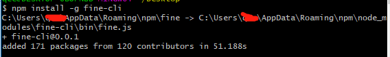

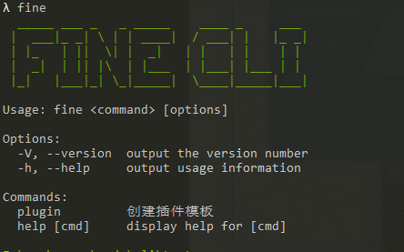

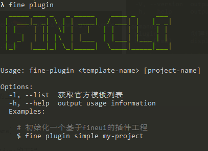

## 创建一个插件的前端工程

通过上一步安装的脚手架可以快速生成一个插件前端的工程。

```bash
# fine plugin <template-name> [project-name]

# 根据插件模板decision-fineui生成一个文件夹为demo的工程
fine plugin simple demo

# 查看当前支持的插件模板
fine plugin -l
```

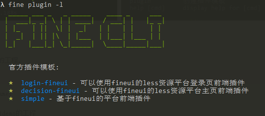

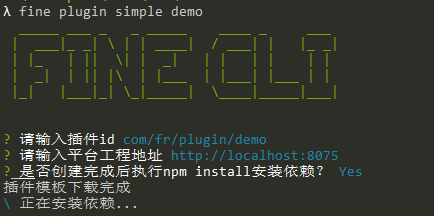

通过上述操作就能创建一个插件的前端工程，新建一个前端工程就是以下几步：

1. 通过 `fine plugin -l` 查看当前有哪些插件模板
2. 通过 `fine plugin <template-name> [project-name]` 生成工程
3. 完成安装过程中的提示信息
4. 新建完成之后，可以根据需要修改模板里面的内容
5. 根据自己的需求实现对应的功能

在创建过程中需要填写一些信息：插件的 id，这个就是我们最后要完成插件的 id；平台工程地址，这个是启动工程后浏览 web 页面的工程地址，只需要填写 host 部分；创建完成之后默认自动安装依赖，如果选择不安装需要后续自行安装。

如果对 fineui 有比较深入了解的可以使用 `xxx-fineui` 模板，开始使用可以直接使用 `simple` 模板。
