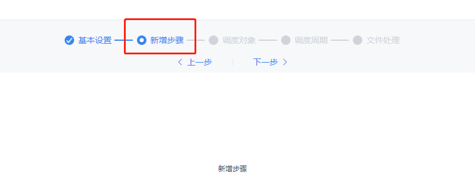
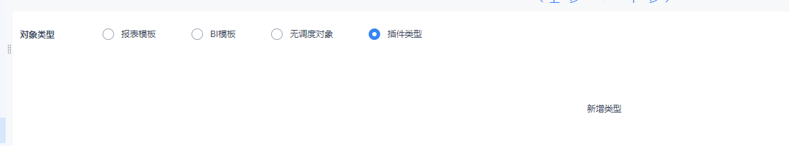

# 定时调度添加一个任务前端开发接口

## 公共模块扩展

### Provider

`dec.provider.schedule`

### 注册新的步骤

#### 方法

`registerTaskStep(config[, index])`

#### 参数

- `config`：Object，必选，步骤对象。包含属性 `text`（显示的文本）、`value`（标志符）、`cardType`（新增步骤的组件 shortcut）。
- `index`：Number，可选，插入位置。数组进行 splice 操作的起始位置，不填则插入到最后一步。

#### 示例

```js
// 步骤条增加一个步骤
// 第一个参数为步骤对象
// 第二个参数为插入的位置
BI.config("dec.provider.schedule", function (provider) {
    provider.registerTaskStep({
        text: BI.i18nText("新增步骤"),
        value: "plugin_step",
        cardType: "dec.schedule.task.plugin"
    }, 1);
});
```

页面实现示例：

```js
// 新增步骤实现
!(function () {
    var Plugin = BI.inherit(BI.Widget, {

        props: {
            baseCls: ""
        },

        render: function () {
            return {
                type: "bi.label",
                text: "新增步骤"
            };
        },

        /**
         * 校验函数，可选
         * 点击下一步或者可以保存时执行，回调验证结果
         * @param callback
         */
        validation: function (callback) {
            callback(true);
        },

        /**
         * 取值函数，必选
         * 返回的值会与当前任务的值 this.model.currTask 通过 BI.extend 合并
         * @returns {{}}
         */
        getValue: function () {
            return {};
        }
    });
    BI.shortcut("dec.schedule.task.plugin", Plugin);
})();
```

从上述可以看出，添加任务的过程有一个全局的 model 用来保存当前已经设置的值，可以通过 `this.model.currTask` 获取和修改当前编辑任务的值。

#### 效果



---

### 新增调度类型

#### 方法

`registerDispatcher(dispatcher[, handings])`

#### 参数

- `dispatcher`：Object，必选，调度对象类型。包含属性 `text`（显示的文本）、`value`（标志符）、`cardType`（新增调度类型的组件 shortcut）。
- `handings`：Array，可选，新增对象类型的处理方式。处理方式定义参考下述「新增文件处理方式」，不填则默认不注册处理方式，后续可通过 `registerHandingWay` 新增。

#### 示例

```js
// 注册新的调度对象类型
// 第一个参数为新增调度对象
// 第二个参数为新增调度对象的处理方式
BI.config("dec.provider.schedule", function (provider) {
    provider.registerDispatcher({
        value: "plugin",
        text: "新增类型",
        cardType: "dec.schedule.task.dispatcher.plugin"
    }, []);
});
```

**页面的实现同新增一个步骤**，需要实现必选函数 `getValue`，可选函数 `validation`。

#### 效果



---

### 新增文件处理方式

#### 方法

`registerHandingWay(config, scopes)`

#### 参数

- `config`：Object，必选，处理方式。包含属性 `text`（显示的文本）、`value`（与后台同步的 ***actionName***）、`cardType`（新增文件处理方式的组件 shortcut）。可选属性 `actions` 在只显示一种处理方式但实际上有多个 action 时可用，实现参考**客户端通知**。若需要实现类似定时计算那种不可取消的效果，设置可选属性 `selected` 和 `forceSelected` 为 `true`。
- `scopes`：Array，必选，处理方式作用范围。此参数必须设置，否则不会注册到任何类型的处理方式中。有效值为内置三种（示例中给出）以及插件注册的调度对象类型（即 `registerDispatcher` 方法 `dispatcher` 参数的 `value` 值）。

#### 示例

```js
// 新增处理方式
// 第一个参数为新增处理方式对象
// 第二个参数为作用范围数组，有效值为内置三种以及插件的调度对象类型
BI.config("dec.provider.schedule", function (provider) {
    provider.registerHandingWay({
        text: "新增处理方式",
        value: "com.fr.xxxx", // 插件的actionName
        cardType: "dec.schedule.task.file.handling.plugin",
        actions: [] // 一种处理方式如果有多个action
    }, [DecCst.Schedule.TaskType.DEFAULT, DecCst.Schedule.TaskType.REPORT, DecCst.Schedule.TaskType.BI]);
});
```

> **注意**：不要注册 `runType` 进去，目前有对 `runType` 做兼容处理，后期将逐步移除对 `runType` 的支持。

页面实现示例：

```js
// 处理方式实现
!(function () {
    var Plugin = BI.inherit(BI.Widget, {

        props: {
            baseCls: ""
        },

        render: function () {
            return {
                type: "bi.label",
                text: "新增类型"
            };
        },

        /**
         * 校验函数，可选
         * 返回值为当前处理方式是否通过校验
         * @returns {boolean}
         */
        validation: function () {
            return true;
        },

        /**
         * 取值函数，必选
         * 返回的值放到 outputActionList 中
         * @returns {{}}
         */
        getValue: function () {
            return {};
        }
    });
    BI.shortcut("dec.schedule.task.file.handling.plugin", Plugin);
})();
```

---

### 新增附件存档方式

#### 方法

`registerTaskAttached(config, scopes)`

#### 参数

- `config`：Object，必选，处理方式。包含属性 `text`（显示的文本）、`value`（与后台交互的值）。
- `scopes`：Array，必选，处理方式作用范围。此参数必须设置，否则不会注册到任何类型的处理方式中。有效值为内置两种（示例中给出）以及插件注册的调度对象类型。

#### 示例

```js
// 新增附件存档方式
// 第一个参数为新增附件存档方式
// 第二个参数为作用范围数组
BI.config("dec.provider.schedule", function (provider) {
    provider.registerTaskAttached({
        value: 11,
        text: "pluginText"
    }, [DecCst.Schedule.TaskType.REPORT, DecCst.Schedule.TaskType.BI]);
});
```

---

## 更新记录

- 2019.10.10：使用 provider 实现插件注册
- 2019.11.12：新增附件存档方式