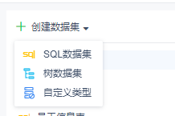

# 服务器数据集接口

## Provider

`dec.provider.data.set`

## 新增一种数据集类型

新增类型实际上是在编辑或添加时有额外的类型可以选择，因此操作的是编辑页面，预览页面无需实现。

#### 方法

`registerDataSetType(config)`

#### 参数

`config`：Object，必选，步骤对象。包含属性 `text`（显示的文本）、`value`（标志符）、`cardType`（新增数据集类型的组件 shortcut）。

#### 示例

```js
// 注册新类型
BI.config("dec.provider.data.set", function (provider) {
    provider.registerDataSetType({
        value: "plugin",
        text: "自定义类型",
        cardType: "dec.data.set.type.plugin"
    });
});
```

页面实现：

```js
// 页面实现
!(function () {
    var Plugin = BI.inherit(BI.Widget, {

        _store: function () {
            return BI.Models.getModel("dec.model.data.set.type.plugin", this.options);
        },

        render: function () {
            var self = this, o = this.options;
            return {};
        },

        /**
         * 必选
         * 只需要当前类型的值即可，无需 datasetName 和 datasetType
         * 返回的值会作为 datasetData 的值
         * @returns {{}}
         */
        getValue: function () {
            return {};
        },

        /**
         * 可选校验方法
         * @returns {boolean}
         */
        validation: function () {
            return true;
        }
    });
    BI.shortcut("dec.data.set.type.plugin", Plugin);
})();
```

插件 model：

```js
// 插件model
!(function () {
    var Model = BI.inherit(Fix.Model, {

        // 通过 dataSetName 获取数据集名称，修改 ableSave 改变右上角保存按钮是否可用
        context: ["dataSetName", "ableSave"],

        state: function () {
            return {};
        },

        computed: {},

        actions: {}
    });
    BI.model("dec.model.data.set.type.plugin", Model);
})();
```

如果需要实现预览功能，可以使用内置组件 `dec.data.set.preview`，提供预览、预览成功、预览失败、取消预览的功能，通过 context 传入 `previewAble` 实时改变能否预览，`previewedDataSet` 改变预览的数据集。

#### 效果



## 常用方法

1. **判断某种类型数据集是否被支持**

   ```js
   BI.Services.getService("dec.service.data.set").isSupportDataSet(type);
   ```

2. **获取不同类型参数的默认值**

   ```js
   BI.Services.getService("dec.service.data.set").getDefaultValueByType(type);
   ```

3. **刷新数据参数**（如 SQL 语句的参数）

   ```js
   // 通过传入当前数据集请求获取参数，然后调用 getParameters 合并新旧参数
   Dec.Utils.getDataSetParameters(dataSet, function (res) {
       newParameters = BI.Services.getService("dec.service.data.set").getParameters(res.data, oldParameters);
   });
   ```

4. **创建不同类型参数的输入框**

   ```js
   BI.Services.getService("dec.service.data.set").createParameterValueItem(param, cb);
   ```

   该方法接受两个参数：`param` 是当前参数的信息 `{type: "参数类型", value: "参数值", name: "参数名"}`，`cb` 为回调函数，会在输入框值改变后触发。

5. **显示用户输入参数弹窗**

   ```js
   BI.Services.getService("dec.service.data.set").showParametersPopover(parameters, cb)
   ```

   该方法接受两个参数：`parameters` 是参数列表（每个参数的 `name` 和 `value` 都要有），`cb` 为回调函数，点击确定后触发。
