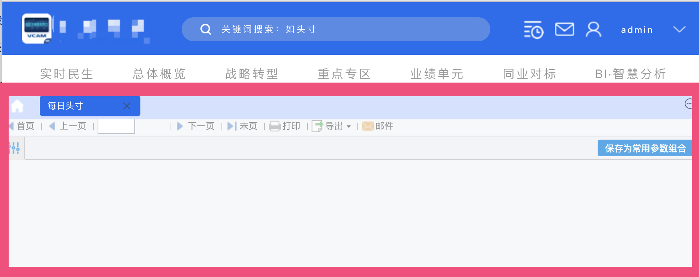
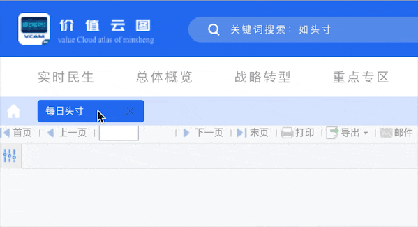

# 开发主题时支持收藏功能

在新的 FineUI 后台框架中，使用 `type: "dec.provider.tab_pane"` 来展示模板内容和显示网页，但是在做自定义主题开发的时候不能直接使用它，需要封装一个父类。

本文将讲述一个主题的例子，效果如下图：



其中红框部分就是 `type: "dec.provider.tab_pane"`。

## 骨架部分代码

```js
// 主题的骨架
BI.config("dec.provider.layout", function (provider) {
    provider.setConfig({
        type: "bi.absolute",
        cls: "demo-background",
        items: [
            {
                el: {
                    type: "zxl.tabs", // 展示tabs实际是对于dec.provider.tab_pane的封装
                },
                top: 120, left: 0, right: 0, bottom: 0
            }, {
                el: {
                    type: "dec.header" // 自定义的头部
                },
                height: 120,
                top: 0, left: 0, right: 0
            },
        ]
    });
    return provider;
}());
```

上面代码中使用了一个 `zxl.tabs`，他是对 `dec.provider.tab_pane` 的封装。**直接使用 `dec.provider.tab_pane` 会导致调用下面代码时无法打开模板**：

```js
BI.Services.getService("dec.service.frame.tab_pane").addItem(item)
```

## zxl.tabs 封装实现

```js
// zxl.tabs
(function () {
    var Widget = BI.inherit(BI.Widget, {

        _store: function () {
            return BI.Models.getModel("dec.zxl.tabs")
        },
        beforeInit: function (e) {
            this.store.initFavs(e); // 初始化收藏和所有目录
        },
        render: function () {
            var self = this;
            return {
                type: "bi.absolute",
                items: [{
                    el: BI.Providers.getProvider("dec.provider.tab_pane").getTabPaneComponent({
                        // 不能直接用 type:"dec.provider.tab_pane"，要使用 Providers 来获取 el
                        ref: function (e) {
                            initHomepage(); // 初始化首页
                        },
                        showTabBar: true,
                        cls: "bi-background-tab",
                    }),
                    top: 0, bottom: 0, right: 0,
                    left: 0
                }]
            };
        }
    });
    BI.shortcut("zxl.tabs", Widget);
})();
```

这里有两个关键点：
1. 自定义了一个 model
2. 使用 `BI.Providers.getProvider("dec.provider.tab_pane").getTabPaneComponent`，**不能直接用 `type: "dec.provider.tab_pane"`，要使用 Providers 来获取 el**

其中自定义 model 是因为 `dec.provider.tab_pane` 中需要 `favorites` 和 `entries` 两个 context（上下文），代码如下：

```js
(function () {
    var e = BI.inherit(Fix.Model, {
        state: function () {
            return { // 定义两个属性
                favorites: [],
                entries: []
            }
        },
        childContext: ["favorites", "entries"], // 把这两个属性传到子控件的model中
        actions: {
            initFavs: function (callBack) {
                var self = this;
                this.model.loading = true;
                // 初始化收藏和完整的所有的models，这些都是dec.provider.tab_pane需要的
                Dec.Utils.getFavoritesList(function(e) {
                    self.model.favorites = BI.Services.getService("dec.service.frame.entry").normalizeEntries(e.data, false);
                    callBack();
                    self.model.loading = false;
                });
                Dec.Utils.getCompleteDirectoryTree(function(e) {
                    self.model.entries = BI.Tree.transformToTreeFormat(BI.Services.getService("dec.service.frame.entry").normalizeEntries(e.data))
                })
            }
        }
    });
    BI.model("dec.zxl.tabs", e)
})();
```

注意：在这个代码中调用 `Dec.Utils.getFavoritesList` 和 `Dec.Utils.getCompleteDirectoryTree` 初始化了 `dec.provider.tab_pane` 需要的两个属性，并通过 `childContext` 传给子控件。

到这一步基本上就可以使用收藏和取消收藏的功能了：


