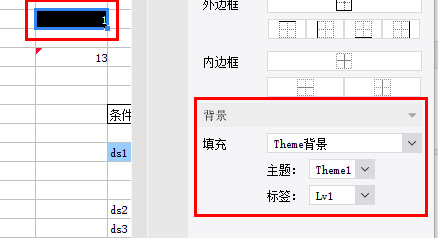

# BackgroundQuickUIProvider

| 属性 | 值 |
| --- | --- |
| 所属模块 | extra-designer |
| 完整类名 | `com.fr.design.fun.BackgroundQuickUIProvider` |
| 官方文档 | [查看文档](https://wiki.fanruan.com/display/PD/BackgroundQuickUIProvider) |

---

## 一、特殊名词介绍

无

## 二、背景、场景介绍

10.0版本之前，帆软报表提供了固定报表背景设置，诸如颜色，材质，图片之类的。但对于一些“类水印”动态背景的需要实现却没有提供解决方案（10.0中已支持水印背景设置），因此从8.0版本开始，提供了背景的扩展接口。允许开发者按照业务需要去扩展相应的背景类型。其主要场景是，基于公式或条件动态的生成相应背景的场景，常见的就是“水印场景”。也常被运用于“业务主题背景”快速配置场景。

## 三、接口介绍


```java
package com.fr.design.fun;

import com.fr.design.mainframe.backgroundpane.BackgroundQuickPane;
import com.fr.stable.fun.Level;
import com.fr.stable.fun.Provider;
import com.fr.stable.fun.mark.Mutable;

/**
 * Created by richie on 16/5/18.
 * 背景设置界面接口,用于扩展设置更多类型的背景
 */
public interface BackgroundQuickUIProvider extends Mutable {

    String MARK_STRING = "BackgroundQuickUIProvider";

    int CURRENT_LEVEL = 1;

    /**
     * 背景设置界面
     * @return 设置界面
     */
    BackgroundQuickPane appearanceForBackground();
}
```

常用参考实例：


```java
package com.fr.design.mainframe.predefined.ui.detail.background;

import com.fr.base.background.ColorBackground;
import com.fr.design.event.UIObserver;
import com.fr.design.event.UIObserverListener;
import com.fr.design.gui.ibutton.UIButton;
import com.fr.design.gui.ilable.UILabel;
import com.fr.design.layout.FRGUIPaneFactory;
import com.fr.design.layout.TableLayoutHelper;
import com.fr.design.style.color.ColorSelectPane;
import com.fr.general.Background;

import javax.swing.BorderFactory;
import javax.swing.JPanel;
import javax.swing.event.ChangeEvent;
import javax.swing.event.ChangeListener;
import java.awt.BorderLayout;
import java.awt.Component;
import java.awt.Dimension;

/**
 * Created by kerry on 2020-08-31
 */
public class ColorDetailPane extends AbstractBackgroundDetailPane<ColorBackground> {
    private ColorBackgroundSelectPane selectPane;


    public ColorDetailPane() {
        this.selectPane = new ColorBackgroundSelectPane();
        this.setLayout(FRGUIPaneFactory.createBorderLayout());
        this.add(this.selectPane, BorderLayout.CENTER);
    }

    @Override
    public void populate(ColorBackground background) {
        this.selectPane.setColor(background.getColor());
    }

    @Override
    public ColorBackground update() {
        return ColorBackground.getInstance(selectPane.getColor());
    }

    public String title4PopupWindow() {
        return com.fr.design.i18n.Toolkit.i18nText("Fine-Design_Basic_Color");
    }

    @Override
    public boolean accept(Background background) {
        return background instanceof ColorBackground;
    }

    class ColorBackgroundSelectPane extends ColorSelectPane implements UIObserver {
        protected UIObserverListener uiObserverListener;

        protected void initialCompents(boolean isSupportTransparent) {
            this.setLayout(FRGUIPaneFactory.createBorderLayout());
            this.setBorder(BorderFactory.createEmptyBorder());
            if (isSupportTransparent) {
                this.add(createNorthPane(), BorderLayout.NORTH);
            }
            JPanel centerPane = createCenterPane();
            this.add(centerPane, BorderLayout.CENTER);
            this.addChangeListener(new ChangeListener() {
                @Override
                public void stateChanged(ChangeEvent e) {
                    if (uiObserverListener != null) {
                        uiObserverListener.doChange();
                    }
                }
            });
        }

        private JPanel createNorthPane() {
//            UIButton transpanrentBtn = createTranspanrentButton();
            UIButton transpanrentBtn = new UIButton();
            transpanrentBtn.setPreferredSize(new Dimension(160, 20));
            JPanel jPanel = TableLayoutHelper.createGapTableLayoutPane(
                    new Component[][]{new Component[]{new UILabel(com.fr.design.i18n.Toolkit.i18nText("Fine-Design_Basic_Background_Color")),
                            transpanrentBtn}}, TableLayoutHelper.FILL_NONE, 33, 5);
            jPanel.setBorder(BorderFactory.createEmptyBorder(5, 0, 5, 10));
            return jPanel;
        }

        protected JPanel createCenterPane() {
//            JPanel centerPane = super.createCenterPane();
            JPanel centerPane = new JPanel();

            JPanel jPanel = TableLayoutHelper.createGapTableLayoutPane(
                    new Component[][]{new Component[]{new UILabel("    "), centerPane}}, TableLayoutHelper.FILL_NONE, 33, 5);
            jPanel.setBorder(BorderFactory.createEmptyBorder(5, 0, 5, 10));
            return jPanel;
        }

        @Override
        public void registerChangeListener(UIObserverListener listener) {
            this.uiObserverListener = listener;
        }

        @Override
        public boolean shouldResponseChangeListener() {
            return true;
        }
    }
}


```


```java

package com.fr.design.mainframe.predefined.ui.detail.background;

import com.fr.base.Style;
import com.fr.base.background.ImageBackground;
import com.fr.base.background.ImageFileBackground;
import com.fr.design.designer.IntervalConstants;
import com.fr.design.event.UIObserver;
import com.fr.design.event.UIObserverListener;
import com.fr.design.gui.frpane.ImgChooseWrapper;
import com.fr.design.gui.ibutton.UIButton;
import com.fr.design.gui.ibutton.UIRadioButton;
import com.fr.design.gui.ilable.UILabel;
import com.fr.design.layout.FRGUIPaneFactory;
import com.fr.design.layout.TableLayoutHelper;
import com.fr.design.style.background.image.ImageFileChooser;
import com.fr.design.style.background.image.ImagePreviewPane;
import com.fr.general.Background;
import com.fr.stable.Constants;

import javax.swing.BorderFactory;
import javax.swing.ButtonGroup;
import javax.swing.JPanel;
import javax.swing.event.ChangeEvent;
import javax.swing.event.ChangeListener;
import java.awt.BorderLayout;
import java.awt.Component;
import java.awt.Dimension;
import java.awt.GridLayout;
import java.awt.event.ActionEvent;
import java.awt.event.ActionListener;

/**
 * Image background pane.
 */
public class ImageDetailPane extends AbstractBackgroundDetailPane<ImageBackground> implements UIObserver {
    private UIObserverListener listener;
    protected ImagePreviewPane previewPane = null;
    private Style imageStyle = null;
    private ChangeListener changeListener = null;
    private ImageFileChooser imageFileChooser = null;

    private UIRadioButton defaultRadioButton = null;
    private UIRadioButton tiledRadioButton = null;
    private UIRadioButton extendRadioButton = null;
    private UIRadioButton adjustRadioButton = null;


    public ImageDetailPane() {
        this.setLayout(FRGUIPaneFactory.createBorderLayout());
        this.add(initSelectFilePane(), BorderLayout.CENTER);
        imageFileChooser = new ImageFileChooser();
        imageFileChooser.setMultiSelectionEnabled(false);
        previewPane = new ImagePreviewPane();
        this.addChangeListener(new ChangeListener() {
            @Override
            public void stateChanged(ChangeEvent e) {
                if (listener != null) {
                    listener.doChange();
                }
            }
        });
    }

    public JPanel initSelectFilePane() {
        JPanel selectFilePane = FRGUIPaneFactory.createBorderLayout_L_Pane();
        selectFilePane.setBorder(BorderFactory.createEmptyBorder());
        UIButton selectPictureButton = new UIButton(
                com.fr.design.i18n.Toolkit.i18nText("Fine-Design_Basic_Background_Image_Select"));
        selectPictureButton.setMnemonic('S');
        selectPictureButton.addActionListener(selectPictureActionListener);
        selectPictureButton.setPreferredSize(new Dimension(160, 20));
        //布局
        defaultRadioButton = new UIRadioButton(com.fr.design.i18n.Toolkit.i18nText("Fine-Design_Basic_Style_Alignment_Layout_Default"));
        tiledRadioButton = new UIRadioButton(com.fr.design.i18n.Toolkit.i18nText("Fine-Design_Basic_Style_Alignment_Layout_Image_Titled"));
        extendRadioButton = new UIRadioButton(com.fr.design.i18n.Toolkit.i18nText("Fine-Design_Basic_Style_Alignment_Layout_Image_Extend"));
        adjustRadioButton = new UIRadioButton(com.fr.design.i18n.Toolkit.i18nText("Fine-Design_Basic_Style_Alignment_Layout_Image_Adjust"));

        defaultRadioButton.addActionListener(layoutActionListener);
        tiledRadioButton.addActionListener(layoutActionListener);
        extendRadioButton.addActionListener(layoutActionListener);
        adjustRadioButton.addActionListener(layoutActionListener);

        JPanel jp = new JPanel(new GridLayout(4, 1, 15, 10));
        for (UIRadioButton button : imageLayoutButtons()) {
            jp.add(button);
        }

        ButtonGroup layoutBG = new ButtonGroup();
        layoutBG.add(defaultRadioButton);
        layoutBG.add(tiledRadioButton);
        layoutBG.add(extendRadioButton);
        layoutBG.add(adjustRadioButton);

        defaultRadioButton.setSelected(true);

        Component[][] components = new Component[][]{
                new Component[]{new UILabel(com.fr.design.i18n.Toolkit.i18nText("Fine-Design_Basic_Background_Image")), selectPictureButton},
                new Component[]{new UILabel(com.fr.design.i18n.Toolkit.i18nText("Fine-Design_Basic_Background_Fill_Mode")), jp}
        };
        JPanel centerPane = TableLayoutHelper.createGapTableLayoutPane(components, TableLayoutHelper.FILL_NONE,
                IntervalConstants.INTERVAL_L4, IntervalConstants.INTERVAL_L1);
        selectFilePane.add(centerPane, BorderLayout.CENTER);
        return selectFilePane;
    }

    protected UIRadioButton[] imageLayoutButtons() {
        return new UIRadioButton[]{
                defaultRadioButton,
                tiledRadioButton,
                extendRadioButton,
                adjustRadioButton
        };
    }

    @Override
    public boolean accept(Background background) {
        return background instanceof ImageBackground;
    }


    /**
     * Select picture.
     */
    ActionListener selectPictureActionListener = new ActionListener() {

        public void actionPerformed(ActionEvent evt) {
            int returnVal = imageFileChooser.showOpenDialog(ImageDetailPane.this);
            setImageStyle();
            ImgChooseWrapper.getInstance(previewPane, imageFileChooser, imageStyle, changeListener).dealWithImageFile(returnVal);
        }
    };

    protected void setImageStyle() {
        if (tiledRadioButton.isSelected()) {
            imageStyle = Style.DEFAULT_STYLE.deriveImageLayout(Constants.IMAGE_TILED);
        } else if (adjustRadioButton.isSelected()) {
            imageStyle = Style.DEFAULT_STYLE.deriveImageLayout(Constants.IMAGE_ADJUST);
        } else if (extendRadioButton.isSelected()) {
            imageStyle = Style.DEFAULT_STYLE.deriveImageLayout(Constants.IMAGE_EXTEND);
        } else {
            imageStyle = Style.DEFAULT_STYLE.deriveImageLayout(Constants.IMAGE_CENTER);
        }
    }

    ActionListener layoutActionListener = new ActionListener() {

        @Override
        public void actionPerformed(ActionEvent evt) {
            setImageStyle();
            changeImageStyle();
        }

        private void changeImageStyle() {
            previewPane.setImageStyle(ImageDetailPane.this.imageStyle);
            previewPane.repaint();
        }
    };

    @Override
    public void populate(ImageBackground imageBackground) {
        if (imageBackground.getLayout() == Constants.IMAGE_CENTER) {
            defaultRadioButton.setSelected(true);
            imageStyle = Style.DEFAULT_STYLE.deriveImageLayout(Constants.IMAGE_CENTER);
        } else if (imageBackground.getLayout() == Constants.IMAGE_EXTEND) {
            extendRadioButton.setSelected(true);
            imageStyle = Style.DEFAULT_STYLE.deriveImageLayout(Constants.IMAGE_EXTEND);
        } else if (imageBackground.getLayout() == Constants.IMAGE_ADJUST) {
            adjustRadioButton.setSelected(true);
            imageStyle = Style.DEFAULT_STYLE.deriveImageLayout(Constants.IMAGE_ADJUST);
        } else {
            tiledRadioButton.setSelected(true);
            imageStyle = Style.DEFAULT_STYLE.deriveImageLayout(Constants.IMAGE_TILED);
        }
        previewPane.setImageStyle(ImageDetailPane.this.imageStyle);
        if (imageBackground.getImage() != null) {
            previewPane.setImageWithSuffix(imageBackground.getImageWithSuffix());
            previewPane.setImage(imageBackground.getImage());
        }

        fireChagneListener();
    }

    @Override
    public ImageBackground update() {
        ImageBackground imageBackground = new ImageFileBackground(previewPane.getImageWithSuffix());
        setImageStyle();
        imageBackground.setLayout(imageStyle.getImageLayout());
        return imageBackground;
    }

    @Override
    public void addChangeListener(ChangeListener changeListener) {
        this.changeListener = changeListener;
    }

    private void fireChagneListener() {
        if (this.changeListener != null) {
            ChangeEvent evt = new ChangeEvent(this);
            this.changeListener.stateChanged(evt);
        }
    }

    @Override
    public void registerChangeListener(UIObserverListener listener) {
        this.listener = listener;
    }


    @Override
    public String title4PopupWindow() {
        return com.fr.design.i18n.Toolkit.i18nText("Fine-Design_Basic_Background_Image");
    }


}

```

关联接口


```java
/*
 * Copyright(c) 2001-2010, FineReport Inc, All Rights Reserved.
 */
package com.fr.general;

import com.fr.common.annotations.Open;
import com.fr.json.JSONException;
import com.fr.json.JSONObject;
import com.fr.stable.bridge.ObjectHolder;
import com.fr.stable.web.Repository;
import com.fr.stable.xml.XMLPrintWriter;
import com.fr.stable.xml.XMLableReader;

import java.awt.*;

/**
 * 加强版的背景类，用于支持画颜色、纹理、图片以及其他一些复杂的背景
 * 由于属于基本接口，所以放到com.fr.base包下面
 */
@Open
public interface Background extends Cloneable, java.io.Serializable {

    /**
     * 根据指定的画图对象和几何图形来画背景
     *
     * @param g     画图对象
     * @param shape 几何图形
     */
    void paint(Graphics g, Shape shape);

    /**
     * 根据指定的画图对象和几何图形并结合模板计算上下文画背景
     * @param g 画图对象
     * @param repo 模板上下文
     * @param shape 集合图形
     */
    void paint(Graphics g, Repository repo, Shape shape);

	/**
	 * 根据指定的画图对象和尺寸来画背景，并且保存对应的单元格坐标点，背景预处理
	 * @param g 画图对象
	 * @param repo 模板上下文
	 * @param cellPoint 单元格坐标
	 * @param width 图片宽
	 * @param height 图片高
	 */
	void preDealBackground(Graphics g, Repository repo, Point cellPoint, int width, int height);

    /**
     * 根据指定的画图对象和几何图形来画具有渐变色的边框的背景
     *
     * @param g     画图对象
     * @param shape 几何图形
     */
    void drawWithGradientLine(Graphics g, Shape shape);

    /**
     * 布局变化
     *
     * @param width  背景宽度
     * @param height 背景高度
     */
    void layoutDidChange(int width, int height);

    /**
     * 判断当前对象是否和指定的对象相等
     *
     * @param object 指定的对象
     * @return 相等则返回true，不相等则返回false
     */
    boolean equals(Object object);

    /**
     * 修正哈希码
     *
     * @param code 已经计算好的哈希码
     * @return 哈希码
     */
    int fixHashCode(int code);

    /**
     * 背景转JSON对象
     *
     * @return JSON对象
     * @throws JSONException
     */
    JSONObject toJSONObject() throws JSONException;

    /**
     * 新增接口方法 保证h5 和移动端表单报表块 背景计算时能拿到算子
     * @param repo
     * @return
     * @throws JSONException
     */
    JSONObject toJSONObject(Repository repo) throws JSONException;

    JSONObject toJSONObject(Repository repo, Dimension size) throws JSONException;

    /**
     * 克隆一个当前对象
     *
     * @return 返回克隆生成的对象
     * @throws CloneNotSupportedException
     */
    Object clone() throws CloneNotSupportedException;


    /**
     * 用于web端辨识背景类型的字符串
     *
     * @return 返回用于表示背景类型的字符串
     */
    String getBackgroundType();

    Background readAdditionalAttr(XMLableReader reader);

    void writeAdditionalAttr(XMLPrintWriter writer);
	/**
	 * 导出的时候更改背景
	 * @param operate 导出的操作类型，excel,pdf,word...
	 * @return 背景
	 */
	Background traverseForExport(ObjectHolder operate);

	/**
	 * 输出json到web端.
	 *
     * @param repo 浏览器上下文
	 * @return json格式内容.
	 */
    JSONObject createJSONConfig(Repository repo) throws JSONException;


    /**
     *
     * @param repo
     * @param width
     * @param height
     * @return
     * @throws JSONException
     */
    JSONObject createJSONConfig(Repository repo, int width, int height) throws JSONException;
}


```


```java
/*
 * Copyright(c) 2001-2010, FineReport Inc, All Rights Reserved.
 */
package com.fr.base.background;

import com.fr.general.Background;
import com.fr.general.ComparatorUtils;
import com.fr.json.JSONException;
import com.fr.json.JSONObject;
import com.fr.stable.StableUtils;
import com.fr.stable.web.Repository;
import com.fr.stable.xml.XMLPrintWriter;
import com.fr.stable.xml.XMLableReader;

import java.awt.*;
import java.awt.image.BufferedImage;

/**
 * 颜色背景类，该背景就只是单一的一种给定的颜色
 */
public class ColorBackground extends AbstractBackground {
	private static final long serialVersionUID = -6930147321476711514L;

	private static java.util.Map initializeCBG = new java.util.HashMap();//<Color--ColorBackground>

	private Color color = null;

	/**
	 * 获取一个没有颜色的背景
	 *
	 * @return 颜色背景，颜色为空值
	 */
	public static ColorBackground getInstance() {
		return getInstance(null);
	}

	/**
	 * 获取指定颜色的背景
	 *
	 * @param color 背景指定的颜色
	 * @return 颜色背景
	 */
	public static ColorBackground getInstance(Color color) {
		// openjdk 1.8有个bug, hashmap里放了null的key, 有几率报错
		// https://bugs.openjdk.java.net/browse/JDK-8046085
		if (color == null) {
			return new ColorBackground(null);
		}

		Object valueBg = initializeCBG.get(color);
		if (valueBg != null) {
			return (ColorBackground) valueBg;
		} else {
			ColorBackground cbg = new ColorBackground(color);
			initializeCBG.put(color, cbg);
			return cbg;
		}
	}

	public ColorBackground() {

	}

	private ColorBackground(Color color) {
		this.color = color;
	}

	/**
	 * 返回颜色背景所使用的颜色
	 *
	 * @return 颜色
	 */
	public Color getColor() {
		return color;
	}

	/**
	 * 根据指定的画图对象和几何图形来画颜色背景
	 *
	 * @param g     画图对象
	 * @param shape 几何图形
	 */
	public void paint(Graphics g, Shape shape) {
		Paint paint = this.getColor();
		if (paint == null) {
			return;
		}

		// shape类型 Rectangle2D
		Graphics2D g2d = (Graphics2D) g;
		Paint oldPaint = g2d.getPaint();

		g2d.setPaint(paint);
		g2d.fill(shape);

		g2d.setPaint(oldPaint);
	}

	public JSONObject toJSONObject(Repository repo, Dimension size) throws JSONException {
		JSONObject jo = super.toJSONObject(repo, size);
		jo.put("color", StableUtils.javaColorToCSSColor(color));
		return jo;
	}

	protected BufferedImage createBufferedImage(int width, int height) {
		return null;
	}

	/**
	 * 根据指定的画图对象和几何图形来画具有渐变色的边框的颜色背景
	 *
	 * @param g     画图对象
	 * @param shape 几何图形
	 */
	public void drawWithGradientLine(Graphics g, Shape shape) {
		Paint paint = this.getColor();
		if (paint == null) {
			return;
		}

		// shape类型 Rectangle2D
		Graphics2D g2d = (Graphics2D) g;
		Paint oldPaint = g2d.getPaint();

		g2d.setPaint(paint);
		g2d.draw(shape);

		g2d.setPaint(oldPaint);
	}

	/**
	 * 判断当前对象是否和指定的对象相等
	 *
	 * @param object 指定的对象
	 * @return 相等则返回true，不相等则返回false
	 */
	public boolean equals(Object object) {
		return object instanceof ColorBackground &&
				ComparatorUtils.equals(((ColorBackground) object).color, color);
	}

	/**
	 *重写下hashcode,条件属性设置背景颜色时，用到了clone方法，
	 * style里的缓存map用get的时候拿不到已缓存的，导致内存泄漏
	 * @return hashcode
	 */
	public int hashCode() {
		return color == null ? 0 : color.hashCode();
	}

	/**
	 * 修正哈希码
	 *
	 * @param code 已经计算好的哈希码
	 * @return 哈希码
	 */
	public int fixHashCode(int code) {
		return code ^ hashCode();
	}

	/**
	 * 克隆一个当前对象
	 *
	 * @return 返回克隆生成的对象
	 * @throws CloneNotSupportedException
	 */
	public Object clone() throws CloneNotSupportedException {
		ColorBackground cloned = (ColorBackground) super.clone();

		return cloned;
	}

	/**
	 * 将颜色背景输出成JSON对象
	 *
	 * @return 表示颜色背景的JSON对象
	 * @throws JSONException
	 */
	public JSONObject toJSONObject() throws JSONException {
		JSONObject js = super.toJSONObject();

		if (this.color != null) {
			js.put("color", StableUtils.javaColor2JSColorWithAlpha(color));
		}

		return js;
	}

	/**
	 * 颜色背景在web端作为辨识的字符串
	 *
	 * @return 返回用于表示颜色背景类型的字符串
	 */
	public String getBackgroundType() {
		return "ColorBackground";
	}

	/**
	 * 读取 添加的背景属性
	 * @param reader 读取
	 * @return 返回背景
	 */
	public Background readAdditionalAttr(XMLableReader reader) {
		ColorBackground colorBackground = null; // kunsnat: 不能直接读取颜色. 然后默认一个, 因为传Js的时候, 有可能就是传空值null
		if (reader.getAttrAsString("color", null) == null) {
			colorBackground = ColorBackground.getInstance(null);
		} else {
			colorBackground = ColorBackground.getInstance(reader.getAttrAsColor("color", Color.black));
		}
		return colorBackground;
	}

	/**
	 * 输出 添加属性
	 * @param writer 输出添加属性
	 */
	public void writeAdditionalAttr(XMLPrintWriter writer) {
		writer.attr("name", "ColorBackground");
		if (getColor() != null) {
			writer.attr("color", getColor().getRGB());
		}
	}

	@Override
	public JSONObject createJSONConfig(Repository repo) throws JSONException {
		Color color = this.getColor();
		if (color == null) {
			// 透明色, 不设置{background : ""}.
			return JSONObject.EMPTY;
		}

		String colorStr = StableUtils.javaColorToCSSColor(color);
		return JSONObject.create().put("background", colorStr);
	}

	public JSONObject createJSONConfig(Repository repo, int width, int height) throws JSONException{
		JSONObject jsonObject = new JSONObject();
		jsonObject.put("background-color", StableUtils.javaColorToCSSColor((this.getColor())));
		return jsonObject;
	}

}


```


```java
/*
 * Copyright(c) 2001-2010, FineReport  Inc, All Rights Reserved.
 */
package com.fr.base.background;

import com.fr.base.Base64;
import com.fr.base.BaseUtils;
import com.fr.base.GraphHelper;
import com.fr.base.ImageProvider;
import com.fr.general.Background;
import com.fr.general.ImageWithSuffix;
import com.fr.general.xml.FineImage;
import com.fr.general.xml.GeneralXMLTools;
import com.fr.json.JSONException;
import com.fr.json.JSONObject;
import com.fr.plugin.injectable.PluginModule;
import com.fr.stable.BaseConstants;
import com.fr.stable.Constants;
import com.fr.stable.StableUtils;
import com.fr.stable.StringUtils;
import com.fr.stable.bridge.StableFactory;
import com.fr.stable.fun.ImageLayoutDescriptionProcessor;
import com.fr.stable.plugin.ExtraClassManagerProvider;
import com.fr.stable.web.Repository;
import com.fr.stable.xml.XMLConstants;
import com.fr.stable.xml.XMLPrintWriter;
import com.fr.stable.xml.XMLReadable;
import com.fr.stable.xml.XMLableReader;

import java.awt.Dimension;
import java.awt.Graphics;
import java.awt.Graphics2D;
import java.awt.Image;
import java.awt.Paint;
import java.awt.Point;
import java.awt.Shape;
import java.awt.TexturePaint;
import java.awt.geom.Rectangle2D;
import java.awt.image.BufferedImage;
import java.awt.print.PrinterGraphics;
import java.io.IOException;
import java.io.ObjectInputStream;
import java.io.ObjectOutputStream;

import static com.fr.general.xml.GeneralXMLTools.DEFAULT_IMAGE_FORMAT;
import static java.awt.image.BufferedImage.TYPE_INT_ARGB;

/**
 * 图片背景，该背景使用一张图片作为填充。
 */
public class ImageBackground extends AbstractBackground {
    private transient ImageWithSuffix image = null;
    private int layout = Constants.IMAGE_CENTER; //layout.
    //这个layout只是用来展示的,不保存进xml,因为图片远大于单元格时,会变成空白,需要动态改变layout以展示图片
    private int layout4Draw = Constants.IMAGE_CENTER;

    private static final int PAINT_WIDTH_OFFSET = 40;
    private static final int PAINT_HEIGHT_OFFSET = 40;

    //背景图片所在单元格坐标点
    private Point cellPoint = new Point(-1, -1);

    /**
     * 默认的构造函数
     */
    public ImageBackground() {
        this(null);
    }

    /**
     * 根据指定图片生成的图片背景
     *
     * @param image 给定的图片
     * @deprecated
     */
    public ImageBackground(Image image) {
        this(image, Constants.IMAGE_TILED);
    }

    /**
     * 根据指定的图片和布局方式生成的图片背景
     *
     * @param image  给定的图片
     * @param layout 布局方式
     * @deprecated
     */
    public ImageBackground(Image image, int layout) {
        this.setImage(ImageWithSuffix.build(image));
        this.setLayout(layout);
    }

    public ImageBackground(Image image, int layout, String path) {
        ImageWithSuffix imageWithSuffix = ImageWithSuffix.build(new FineImage(image, path));
        this.setImage(imageWithSuffix);
        this.setLayout(layout);
    }

    /**
     * 根据指定图片生成的图片背景
     *
     * @param image 给定带后缀的图片
     */
    public ImageBackground(ImageWithSuffix image) {
        this(image, Constants.IMAGE_TILED);
    }

    /**
     * 根据指定的图片和布局方式生成的图片背景
     *
     * @param image  给定带后缀的图片
     * @param layout 布局方式
     */
    public ImageBackground(ImageWithSuffix image, int layout) {
        this.image = image;
        this.layout = layout;
    }

    /**
     * 获取用于填充背景的图片
     *
     * @return 图片
     */
    public Image getImage() {
        if (this.image == null) {
            return null;
        }

        return this.image.getImage();
    }

    /**
     * 获取未转换成bufferImage的图片
     *
     * @return 图片信息
     */
    private ImageProvider getFineImage() {
        if (this.image == null) {
            return null;
        }

        return this.image.getFineImage();
    }

    /**
     * 获取带后缀的图片
     *
     * @return 带后缀的图片
     */
    public ImageWithSuffix getImageWithSuffix() {
        return this.image;
    }

    /**
     * 设置图片背景所使用的图片
     *
     * @param img 背景所使用的图片
     */
    public void setImage(Image img) {
        this.image = ImageWithSuffix.build(img);
    }

    /**
     * 设置图片背景所使用的图片
     *
     * @param image 背景所使用的图片
     */
    public void setImage(ImageWithSuffix image) {
        this.image = image;
    }

    /**
     * 获取图片背景的布局方式
     * 可能的值包括Constants.IMAGE_DEFAULT、Constants.IMAGE_TILED、
     * Constants.IMAGE_CENTER和Constants.IMAGE_EXTEND
     * 默认为Constants.IMAGE_DEFAULT
     *
     * @return 图片背景布局
     */
    public int getLayout() {
        return this.layout;
    }

    public int getLayout4Draw() {
        return layout4Draw == Constants.IMAGE_CENTER ? this.layout : layout4Draw;
    }

    public void setLayout4Draw(int layout4Draw) {
        this.layout4Draw = layout4Draw;
    }

    /**
     * 设置图片背景的布局方式
     *
     * @param layout 布局方式
     * @see Constants#IMAGE_DEFAULT
     * @see Constants#IMAGE_TILED
     * @see Constants#IMAGE_CENTER
     * @see Constants#IMAGE_EXTEND
     */
    public void setLayout(int layout) {
        this.layout = layout;
    }

    public Point getCellPoint() {
        return cellPoint;
    }

    public void setCellPoint(Point cellPoint) {
        this.cellPoint = cellPoint;
    }

    /**
     * 根据指定的画图对象和几何图形来画图片背景
     *
     * @param g     画图对象
     * @param shape 几何图形
     */
    @Override
    public void paint(Graphics g, Shape shape) {
        if (this.getImage() == null || shape == null) {
            return;
        }

        Graphics2D g2d = (Graphics2D) g;

        Paint paint = g2d.getPaint();

        if (isPDFExport(g2d) || isPrint(g2d)) {
            //pdf画板的话使用原图放置到pdf文件中，这样pdf阅读器拿到的就是没有处理过的图片，会清晰一些
            //打印时的处理同pdf导出
            paintBackgroundImage(g2d, shape, StableUtils.isNotSupportARGB(g2d));
        } else {
            //其他画板的话将原图重绘一遍（固定死宽高），可能会模糊一些，但对于设计器而言，渲染会快一些，打开含高清大图的模板不会那么卡
            g2d.setPaint(createPaint(shape, StableUtils.isNotSupportARGB(g2d)));
            g2d.fill(shape);
        }

        g2d.setPaint(paint);
    }

    private boolean isPDFExport(Graphics2D g2d) {
        return g2d.getClass().getName().contains("PdfGraphics2D");
    }

    private boolean isPrint(Graphics2D g2d) {
        return g2d instanceof PrinterGraphics;
    }

    /**
     * 根据指定的画图对象和几何图形来画具有渐变色的边框的图片背景
     *
     * @param g     画图对象
     * @param shape 几何图形
     */
    @Override
    public void drawWithGradientLine(Graphics g, Shape shape) {
        if (this.getImage() == null || shape == null) {
            return;
        }
        Graphics2D g2d = (Graphics2D) g;

        Paint paint = g2d.getPaint();
        g2d.setPaint(createPaint(shape, StableUtils.isNotSupportARGB(g2d)));

        g2d.draw(shape);

        g2d.setPaint(paint);
    }

    /**
     * 布局变化
     *
     * @param width  背景宽度
     * @param height 背景高度
     */
    @Override
    public void layoutDidChange(int width, int height) {
        int imageLayout = layout;
        if (layout == 1) {
            imageLayout = StableUtils.changeImageLayout4Draw(getImage(), getLayout(), width, height);
        }
        setLayout4Draw(imageLayout);
    }

    private void paintBackgroundImage(Graphics2D g2d, Shape shape, boolean isNotSupportARGB) {
        Rectangle2D rec2D = shape.getBounds2D();
        if (rec2D.getWidth() <= 0 || rec2D.getHeight() <= 0) {
            return;
        }

        Image image = this.getImage();
        if (image instanceof BufferedImage) {
            dealWithNotDisplayProblemInARGB(g2d, (BufferedImage) image);
        }
        Shape oldClip = g2d.getClip();
        g2d.translate(rec2D.getX(), rec2D.getY());
        g2d.setClip(0, 0, (int) rec2D.getWidth(), (int) rec2D.getHeight());
        GraphHelper.paintImage(g2d, (int) rec2D.getWidth(), (int) rec2D.getHeight(), image,
                // 默认的话. 图片是从左上开始画
                this.getLayout4Draw(), Constants.LEFT, Constants.TOP, -1, -1, isNotSupportARGB);
        g2d.translate(-rec2D.getX(), -rec2D.getY());
        g2d.setClip(oldClip);
    }

    private Paint createPaint(Shape shape, boolean isNotSupportARGB) {
        Rectangle2D rec2D = shape.getBounds2D();
        if ((int) rec2D.getWidth() <= 0) {
            rec2D.setRect(rec2D.getX(), rec2D.getY(), rec2D.getWidth() + PAINT_WIDTH_OFFSET, rec2D.getHeight());
        }
        if ((int) rec2D.getHeight() <= 0) {
            rec2D.setRect(rec2D.getX(), rec2D.getY(), rec2D.getWidth(), rec2D.getHeight() + PAINT_HEIGHT_OFFSET);
        }
        //daniel:查了一下flash的ARGB有BUG，不能使用ARGB，653没有使用TexturePaint直接用GraphHelper画的所以没问题
        BufferedImage buffered = new BufferedImage((int) rec2D.getWidth(), (int) rec2D.getHeight(), isNotSupportARGB ? BufferedImage.TYPE_INT_RGB : TYPE_INT_ARGB);
        Graphics2D g2 = buffered.createGraphics();
        GraphHelper.paintImage(g2, (int) rec2D.getWidth(), (int) rec2D.getHeight(), this.getImage(),
                // 默认的话. 图片是从左上开始画
                this.getLayout4Draw(), Constants.LEFT, Constants.TOP, -1, -1, isNotSupportARGB);

        g2.dispose();

        dealWithNotDisplayProblemInARGB(g2, buffered);

        return new TexturePaint(buffered, rec2D);
    }

    private void dealWithNotDisplayProblemInARGB(Graphics2D g2d, BufferedImage buffered) {
        //不是pdf 绘制时不需要管
        if (!g2d.getClass().getName().endsWith("PdfGraphics2D")) {
            return;
        }
        // 当图片“只包含透明和纯黑像素点”的时候，用 ARGB，PDF 导出时会消失。
        // 只要有一个像素点不满足这个条件，图片就可以正常显示。
        int rgb = buffered.getRGB(0, 0);
        //-16777216 纯黑
        // 0 透明
        if (-16777216 == rgb || 0 == rgb) {
            buffered.setRGB(0, 0, rgb + 1);
        }
    }

    /**
     * Paints background of the shape and the background can move with the Scroll.
     * If the value is -1, use the actual size.
     * see paint(), this method has two more parameters.
     */
    /**
     * 画截取了指定宽度和高度的图片背景，用于滚动中动态更改背景
     *
     * @param g          画图对象
     * @param shape      几何形状
     * @param moveWidth  截取宽度
     * @param moveHeight 截取高度
     */
    public void paint4Scroll(Graphics g, Shape shape, int moveWidth, int moveHeight) {
        if (this.getImage() == null) {
            return;
        }

        Rectangle2D rec2D = shape.getBounds2D();

        Graphics2D g2d = (Graphics2D) g;
        Shape oldClip = g2d.getClip();
        g2d.clip(shape);
        g2d.translate(rec2D.getX(), rec2D.getY());

        GraphHelper.paintImageMoved(g2d, (int) rec2D.getWidth(), (int) rec2D.getHeight(), this.getImage(),
                //daniel 默认画靠近顶部
                this.getLayout(), Constants.LEFT, Constants.TOP, -1, -1,
                moveWidth, moveHeight, false);

        g2d.translate(-rec2D.getX(), -rec2D.getY());
        g2d.setClip(oldClip);
    }

    /**
     * 判断当前对象是否和指定的对象相等
     *
     * @param obj 指定的对象
     * @return 相等则返回true，不相等则返回false
     */
    @Override
    public boolean equals(Object obj) {
        if (!(obj instanceof ImageBackground)) {
            return false;
        }

        ImageBackground newImageBackground = (ImageBackground) obj;
        return this.getLayout() == newImageBackground.getLayout()
                && BaseUtils.imageEquals(this.getFineImage(), newImageBackground.getFineImage());
    }

    /**
     * 将背景输出成JSON对象
     *
     * @return 表示背景的JSON对象
     * @throws JSONException
     */
    @Override
    public JSONObject toJSONObject() throws JSONException {
        JSONObject js = super.toJSONObject();

        js.put("layout", this.layout);
        //兼容老版本,在后续的版本中应该去除
        if (this.getFineImage() != null) {
            js.put("image", Base64.encode(this.getFineImage().getBytes()));
            if (this.getImage() != null) {
                js.put("imgWidth", this.getImage().getWidth(null));
                js.put("imgHeight", this.getImage().getHeight(null));
            }
        }

        return js;
    }

    @Override
    public JSONObject toJSONObject(Repository repo, Dimension size) throws JSONException {
        // MOBILE-10972 移动端直接拿原图.
        JSONObject result = this.toJSONObject();
        result.put("src", createImageURL(repo));
        return result;
    }

    @Override
    public JSONObject toJSONObject(Repository repo) throws JSONException {
        JSONObject result = this.toJSONObject();
        result.put("src", createImageURL(repo));
        return result;
    }

    /**
     * 图片背景在web端作为辨识的字符串
     *
     * @return 返回用于表示图片背景类型的字符串
     */
    @Override
    public String getBackgroundType() {
        return "ImageBackground";
    }

    @Override
    public Background readAdditionalAttr(XMLableReader reader) {
        //layout
        setLayout(reader.getAttrAsInt("layout", Constants.IMAGE_DEFAULT));

        reader.readXMLObject(new XMLReadable() {

            @Override
            public void readXML(XMLableReader reader) {
                if (reader.isChildNode()) {
                    if (reader.getTagName().equals(XMLConstants.Image_TAG)) { //image.
                        Image image = GeneralXMLTools.readImage(reader);
                        setImage(ImageWithSuffix.build(image));
                    } else if (XMLConstants.Deprecated_Image_TAG.equals(reader.getTagName())) {
                        Image image = GeneralXMLTools.deprecatedReadImage(reader);
                        setImage(ImageWithSuffix.build(image));
                    } else if (ImageWithSuffix.XML_TAG.equals(reader.getTagName())) {
                        ImageWithSuffix image = new ImageWithSuffix();
                        setImage((ImageWithSuffix) reader.readXMLObject(image));
                    }
                }
            }
        });
        return this;
    }

    @Override
    public void writeAdditionalAttr(XMLPrintWriter writer) {
        writer.attr("name", "ImageBackground");

        //width/height
        writer.attr("layout", getLayout());

        //image.
        if (this.image != null) {
            this.image.writeXML(writer);
        }
    }

    @Override
    public JSONObject createJSONConfig(Repository repo) throws JSONException {
        return createJSONConfig(repo, this.layout);
    }

    private JSONObject createJSONConfig(Repository repo, int layoutType) {
        StringBuffer sb = new StringBuffer();
        // 取出图片
        String url = createImageURL(repo);
        sb.append("url(").append(url).append(") ");
        sb.append(createImageLayoutDescription(layoutType));
        if (layoutType == Constants.IMAGE_ADJUST || layoutType == Constants.IMAGE_EXTEND) {
            return adjustBackgroundJson(repo, url, sb, layoutType);
        }

        return JSONObject.create().put("background", sb.toString());
    }

    private String createImageURL(Repository repo) {
        //使用url方式
        BackgroundImageDisplayModeProcessor processor = StableFactory.getMarkedInstanceObjectFromClass(BackgroundImageDisplayModeProcessor.XML_TAG,
                BackgroundImageDisplayModeProcessor.class);
        if (processor != null) {
            return processor.changeDisplayMode(repo, this.getFineImage(), BaseConstants.CHECKOUTIMAGE);
        }
        return repo.checkoutObject(this.getFineImage(), BaseConstants.CHECKOUTIMAGE);
    }


    private JSONObject adjustBackgroundJson(Repository repo, String url, StringBuffer sb, int type) throws JSONException {
        JSONObject jo = JSONObject.create();
        // 拉伸和自适应需要在web端再做处理
        if (repo.getBrowser().isLowIEVersion()) {
            jo.put("type", type);
            jo.put("url", url);
            // 这里生成参数面板背景的repo获取不到boxModel 而ie8杂项需要特别处理
            jo.put("background", sb.toString());
            jo.put("background-repeat", "no-repeat");
            jo.put("background-image", "none");
            jo.put("filter", "progid:DXImageTransform.Microsoft.AlphaImageLoader(src='" + url + "',sizingMethod='scale')");
            return jo;
        }

        jo.put("background", sb.toString());
        switch (type) {
            case Constants.IMAGE_ADJUST:
                jo.put("background-size", "contain");
                jo.put("background-position", "center");
                break;
            case Constants.IMAGE_EXTEND:
                jo.put("background-size", "100% 100%");
                break;
            default:
                break;
        }

        return jo;
    }

    private static String createImageLayoutDescription(int layout) {
        ExtraClassManagerProvider pluginProvider = PluginModule.getAgent(PluginModule.ExtraCore);
        if (pluginProvider != null) {
            ImageLayoutDescriptionProcessor processor = pluginProvider.getSingle(ImageLayoutDescriptionProcessor.XML_TAG);
            if (processor != null) {
                String description = processor.getCustomLayoutDescription(layout);
                if (StringUtils.isNotEmpty(description)) {
                    return description;
                }
            }
        }

        switch (layout) {
            case Constants.IMAGE_DEFAULT:
                return "no-repeat";
            case Constants.IMAGE_ADJUST:
                return "no-repeat";
            case Constants.IMAGE_CENTER:
                return "no-repeat center";
            case Constants.IMAGE_TILED:
                return "repeat";
            case Constants.IMAGE_EXTEND:
                return "no-repeat center";
            default:
                return StringUtils.EMPTY;
        }
    }

    @Override
    public JSONObject createJSONConfig(Repository repo, int width, int height) throws JSONException {
        this.layoutDidChange(width, height);
        return this.createJSONConfig(repo, this.getLayout4Draw());
    }

    private void readObject(ObjectInputStream in) throws ClassNotFoundException, IOException {
        in.defaultReadObject();
        String format = in.readUTF();
        Object obj = in.readObject();
        if (obj instanceof ImageSerializable) {
            setImage(ImageWithSuffix.build(((ImageSerializable) obj).getImage(), format));
        }

    }

    private void writeObject(ObjectOutputStream out) throws IOException {
        out.defaultWriteObject();
        String format = this.image == null ? DEFAULT_IMAGE_FORMAT : this.image.getFormat();
        out.writeUTF(format);
        Image serialableTarget = getSeriableTarget(this.image);
        ImageSerializable imageSerializable = new ImageSerializable(serialableTarget, format);
        out.writeObject(imageSerializable);
    }

    private Image getSeriableTarget(ImageWithSuffix imageWithSuffix) {
        if (imageWithSuffix == null || imageWithSuffix.getImage() == null) {
            return new BufferedImage(1, 1, TYPE_INT_ARGB);
        }
        return imageWithSuffix.getImage();
    }
}


```

## 四、支持版本

| 产品线 | 版本 | 支持情况 | 备注 |
| --- | --- | --- | --- |
| FR | 8.0 | 支持 |  |
| FR | 9.0 | 支持 |  |
| FR | 10.0 | 支持 |  |
| FR | 11.0 | 支持 |
| BI | 3.6 | 支持 |  |
| BI | 4.0 | 支持 |  |
| BI | 5.1 | 支持 |  |
| BI | 5.1.2 | 支持 |  |
| BI | 5.1.3 | 支持 |  |

## 五、插件注册


```xml
<extra-designer>
        <BackgroundQuickUIProvider class="your class name"/>
</extra-designer>
```

## 六、原理说明

在单元格背景面板BackgroundPane/BackgroundSpecialPane和决策报表组件样式背景面板FormBackgroundSettingPane初始化时，会从设计器中加载插件中申明的BackgroundQuickUIProvider接口实例并生效。

## 七、特殊限制说明

插件接口本身要实现的方法很简单，复杂的是关联的具体背景对象接口很繁琐，要实现的方法非常多。建议开发者在使用时，直接参考提供的两种背景去实现会方便一些。

## 八、常用链接

demo地址：[demo-background-quick-ui-provider](https://code.fanruan.com/hugh/demo-background-quick-ui-provider)



## 九、开源案例

免责声明：所有文档中的开源示例，均为开发者自行开发并提供。仅用于参考和学习使用，开发者和官方均无义务对开源案例所涉及的所有成果进行教学和指导。若作为商用一切后果责任由使用者自行承担。

暂无
