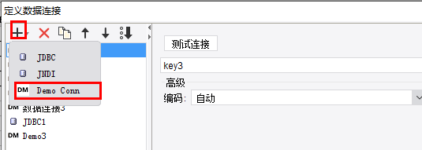
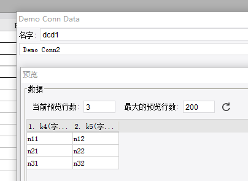

# ConnectionProvider

| 属性 | 值 |
| --- | --- |
| 所属模块 | extra-designer |
| 完整类名 | `com.fr.design.fun.ConnectionProvider` |
| 官方文档 | [查看文档](https://wiki.fanruan.com/display/PD/ConnectionProvider) |

---

## 一、特殊名词介绍

无

## 二、背景、场景介绍

数据源是相对于数据集而言的。主要是在功能的设计上的一个划分。就技术实现本身而言，数据集接口其实本身是可以覆盖到几乎所有场景的。数据源的代码抽象上实质就是把一组具有部分相同配置的数据集的配置整合在一起作为一个统一的配置供数据集引用。而这些相同配置的生效过程也就是数据源的“连接”、“验证”过程。比如：我们可以写一个程序数据集，里面自己实现JDBC连接池调用JDBC的所有配置连接数据库执行SQL，从实现上来说是完全可以的。但我们把JDBC连接池和JDBC的连接配置统一抽取出来做成一个数据源配置，对于用户的使用和维护来说会更方便（如果分开每个数据集都要单独配置JDBC链接，那一旦链接信息便跟，这个维护量是相当大的）。

## 三、接口介绍


```java
package com.fr.design.fun;

import com.fr.data.impl.Connection;
import com.fr.design.beans.BasicBeanPane;
import com.fr.stable.fun.mark.Mutable;

/**
 * @author : richie
 * @since : 8.0
 */
public interface ConnectionProvider extends Mutable {

    String XML_TAG = "ConnectionProvider";

    // 2016-12-14 1 -> 2 , 增加connection.feature方法导致不兼容.
    int CURRENT_LEVEL = 2;

    /**
     * 数据连接弹出菜单的名字
     *
     * @return 名字
     */
    String nameForConnection();

    /**
     * 数据连接弹出菜单的图标
     *
     * @return 图标路径
     */
    String iconPathForConnection();

    /**
     * 数据连接的类型
     *
     * @return 连接类型
     */
    Class<? extends com.fr.data.impl.Connection> classForConnection();

    /**
     * 数据连接的设计界面
     *
     * @return 设计界面
     */
    Class<? extends BasicBeanPane<? extends Connection>> appearanceForConnection();
}

```

Connection介绍（**⚠️ 注：22年及以后的版本实现该接口时需要实现equals方法，否则会出现配置无法保存的异常。原因是产品迭代时增加了，如果两个连接是相等的，则不会进行更新和覆盖。**）

## 四、支持版本

| 产品线 | 版本 | 支持情况 | 备注 |
| --- | --- | --- | --- |
| FR | 8.0 | 支持 |  |
| FR | 9.0 | 支持 |  |
| FR | 10.0 | 支持 |  |
| FR | 11.0 | 支持 |
| BI | 3.6 | 支持 |  |
| BI | 4.0 | 支持 |  |
| BI | 5.1 | 支持 |  |
| BI | 5.1.2 | 支持 |  |
| BI | 5.1.3 | 支持 |  |

## 五、插件注册


```xml
<extra-designer>
        <ConnectionProvider class="your class name"/>
</extra-designer>
```

## 六、原理说明

当ConnectionListPane被加载时createNameableCreators方法会被执行，从而读取插件中声明的所有数据源连接类，初始化数据源连接列表，点击确定后数据会存储到finedb中。

## 七、特殊限制说明

在实现BasicBeanPane时推荐开发者继承DatabaseConnectionPane，可以节省很多开发内容。不过需要注意的是，如果继承DatabaseConnectionPane，因为mainPanel接口方法，是在父类构造时被调用的，所以如果开发者实现的实例类中有声明相关的控件被mainPanel调用，则不要直接在定义成员时初始化控件（这样mainPanel调用时，控件就是null）。也不要对成员进行任何赋值！【[点我查看](https://code.fanruan.com/hugh/demo-connection-provider/src/branch/10.0/src/main/java/com/tptj/demo/hg/connection/conn/DemoConnectionPane.java)】

一般说来该接口几乎不会独立使用，都是用来搭配数据集接口联合使用的。

## 八、常用链接

demo地址：[demo-connection-provider](https://code.fanruan.com/hugh/demo-connection-provider)




[UniversalConnectionProvider](https://wiki.fanruan.com/display/PD/com.fr.decision.fun.UniversalConnectionProvider)

## 九、开源案例

免责声明：所有文档中的开源示例，均为开发者自行开发并提供。仅用于参考和学习使用，开发者和官方均无义务对开源案例所涉及的所有成果进行教学和指导。若作为商用一切后果责任由使用者自行承担。

[demo-tabledata-redis](https://code.fanruan.com/fanruan/demo-tabledata-redis)
