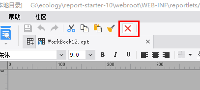

# DesignerFrameUpButtonProvider

| 属性 | 值 |
| --- | --- |
| 所属模块 | extra-designer |
| 完整类名 | `com.fr.design.fun.DesignerFrameUpButtonProvider` |
| 官方文档 | [查看文档](https://wiki.fanruan.com/display/PD/DesignerFrameUpButtonProvider) |

---

## 一、特殊名词介绍

无

## 二、背景、场景介绍

DesignerFrameUpButtonProvider接口主要用于设计器模板编辑页面的顶部图标按钮工具栏的扩展。

一般用于配合实现对当前工作区的内容的增删改或者对当前工作区的模板做一些配置的处理。



## 三、接口介绍


```java
package com.fr.design.fun;

import com.fr.design.gui.ibutton.UIButton;
import com.fr.stable.fun.mark.Mutable;

/**
 * 设计器面板最上方的按钮接口（保存，赋值，撤销同级）
 * Coder: zack
 * Date: 2016/9/22
 * Time: 15:40
 */
public interface DesignerFrameUpButtonProvider extends Mutable {

    int CURRENT_LEVEL = 1;

    String XML_TAG = "DesignerFrameUpButtonProvider";

    /**
     * 根据当前的设计状态返回最上层工具按钮
     * @param menuState 现在设计器的设计状态
     * @return 按钮
     */
    UIButton[] getUpButtons(int menuState);
}


```

## 四、支持版本

| 产品线 | 版本 | 支持情况 | 备注 |
| --- | --- | --- | --- |
| FR | 8.0 | 支持 |  |
| FR | 9.0 | 支持 |  |
| FR | 10.0 | 支持 |  |
| FR | 11.0 | 支持 |

## 五、插件注册


```xml
<extra-designer>
        <DesignerFrameUpButtonProvider class="your class name"/>
</extra-designer>
```

## 六、原理说明

报表设计和表单设计的编辑区域（JTemplate）生成或变化模式时，读取插件中申明的接口并读取其中的扩展按钮进行展示。

## 七、特殊限制说明

getUpButtons(int menuState) 方法中入参menuState当前是没有什么用的，仅作为保留参数，目前是固定值0，所以开发者无需关注这个入参。

而因为入参目前是无法区分场景的，所以需要开发者通过获取当前工作区对象来判断当前的场景是cpt报表还是决策报表或者是聚合报表【点击查看设计器常用代码知识】

并根据场景进行对应的处理。

## 八、常用链接

demo地址：[demo-designer-frame-up-button-provider](https://code.fanruan.com/hugh/demo-designer-frame-up-button-provider)

设计器常用代码知识

## 九、开源案例

免责声明：所有文档中的开源示例，均为开发者自行开发并提供。仅用于参考和学习使用，开发者和官方均无义务对开源案例所涉及的所有成果进行教学和指导。若作为商用一切后果责任由使用者自行承担。

暂无
