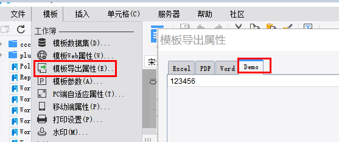

# ExportAttrTabProvider

| 属性 | 值 |
| --- | --- |
| 所属模块 | extra-designer |
| 完整类名 | `com.fr.design.fun.ExportAttrTabProvider` |
| 官方文档 | [查看文档](https://wiki.fanruan.com/display/PD/ExportAttrTabProvider) |

---

## 一、特殊名词介绍

无

## 二、背景、场景介绍

ExportAttrTabProvider接口主要用于模板导出配置项属性的扩展。常规控制属性本身产品及产品插件已提供对应的配置界面。这里主要指一些产品功能之外的配置项的扩展配置。该接口本身不作为独立使用的接口，通常用于配合导出逻辑控制相关的接口一同使用。



## 三、接口介绍


```java
package com.fr.design.fun;

import com.fr.design.beans.BasicStorePane;
import com.fr.stable.fun.mark.Mutable;

/**
 * 导出属性Tab页的接口
 */
public interface ExportAttrTabProvider extends Mutable {
    String XML_TAG = "ExportAttrTabProvider";

    int CURRENT_LEVEL = 1;

    /**
     * 转换成业务视图界面
     *
     * @return 业务视图界面
     */
    BasicStorePane<?> toServiceComponent();
}

```

## 四、支持版本

| 产品线 | 版本 | 支持情况 | 备注 |
| --- | --- | --- | --- |
| FR | 8.0 | 支持 |  |
| FR | 9.0 | 支持 |  |
| FR | 10.0 | 支持 |  |
| FR | 11.0 | 支持 |

## 五、插件注册


```xml
<extra-designer>
        <ExportAttrTabProvider class="your class name"/>
</extra-designer>
```

## 六、原理说明

设计器及相关插件中通过Set<ExportAttrTabProvider> providers = ExtraDesignClassManager.getInstance().getArray(ExportAttrTabProvider.XML_TAG);读取所有申明的扩展接口实现，并在配置后通过把配置属性注入到报表对象的ReportExportAttr中，或者注入到IOAttrMark中，实现属性写入模板。从而实现配置计算时跟插件的设计器界面分离的效果。
在标准产品中，该接口是在ReportExportAttrPane(导出属性配置面板)构造时，会读取插件中所有申明的导出配置扩展实例并构造对应的配置界面。

## 七、特殊限制说明

接口设计场景本身只能对产品自带的ReportExportAttr的固定属性进行扩展。而产品本身其实已经通过产品和相关插件实现了这些固定属性的配置界面。所以开发者通常用到这个接口时，基本都是要对产品已有的导出属性之外的属性进行自定义的扩展和配置。通常就需要配合IOFileAttrMark接口一同使用，对报表的配置进行扩展。这些扩展的属性本身需要在实际导出时，通过模板对象重新读取出来进行生效。所以该接口在一般实践中，也需要配合导出相关的接口一起使用。

## 八、常用链接

demo地址：[demo-export-attr-tab-provider](https://code.fanruan.com/hugh/demo-export-attr-tab-provider)

IOFileAttrMark

导出接口关系和运用详解

## 九、开源案例

免责声明：所有文档中的开源示例，均为开发者自行开发并提供。仅用于参考和学习使用，开发者和官方均无义务对开源案例所涉及的所有成果进行教学和指导。若作为商用一切后果责任由使用者自行承担。

暂无
