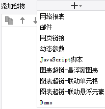

# HyperlinkProvider

| 属性 | 值 |
| --- | --- |
| 所属模块 | extra-designer |
| 完整类名 | `com.fr.design.fun.HyperlinkProvider` |
| 官方文档 | [查看文档](https://wiki.fanruan.com/display/PD/HyperlinkProvider) |

---

## 一、特殊名词介绍

无

## 二、背景、场景介绍

帆软报表中存在超链的功能，超链接本身是对某个元素（一般特指文本或者图形元素）的点击事件的一个响应。帆软报表中的超链种类本身比较多，但是总结起来其实就两种

1.打开某个URL（可以是网络报表、可以是具体的一个URL）

2.执行某个JS（动态参数、Javascript、超链图表、邮件等等的）

之所以会有这么多的细分类型，主要是出于用户使用体验考虑的，一般大部分非代码开发人员普遍的认为，UI直接配置的功能会比写代码易懂和可靠得多。另外一个原因就是，通过配置界面可以把一些难以理解和记忆的KEY/ID关联显示成容易理解的NAME，便于使用

举例：比如在帆软报表中封装了一个 FR.发送邮件("收件人地址","主题","正文","附件类型","正文报表")

这个API本身也能够通过超链JS实现发送邮件的目的。不过他的参数列表比较长顺序不好记忆，如果我们封装成JSON，那么用户拼写可能存在困难，很容易出现错误。再比如一些收件人邮箱可能很难记忆，附件类型的代号也不好记忆，对于使用来说还是比较困难的。

所以帆软报表中争对这类情况单独开放了HyperlinkProvider接口，便于开发者向用户提供一些通用的超链功能的扩展。



## 三、接口介绍


```java
package com.fr.design.fun;

import com.fr.design.beans.BasicBeanPane;
import com.fr.design.gui.controlpane.NameableCreator;
import com.fr.js.Hyperlink;
import com.fr.stable.fun.mark.Mutable;

/**
 * Created by zack on 2016/1/20.
 */
public interface HyperlinkProvider<T extends Hyperlink> extends Mutable {
    String XML_TAG = "HyperlinkProvider";

    int CURRENT_LEVEL = 2;


    /**
     * 超级链接的描述信息，如果是实现类中重载了这个方法，就不需要再实现下面的三个方法：
     * @see HyperlinkProvider#text()
     * @see HyperlinkProvider#target()
     * @see HyperlinkProvider#appearance()
     * 如果并不重载，就需要分别实现上面的三个方法，不推荐重载这个方法
     * @return 描述信息
     */
    NameableCreator createHyperlinkCreator();

    /**
     * 超级链接的名字
     * @return 名字
     */
    String text();

    /**
     * 超级链接的实现类
     * @return 实现类
     */
    Class<T> target();

    /**
     * 超级链接的界面配置类
     * @return 配置类
     */
    Class<? extends BasicBeanPane<T>> appearance();
}

```


```java
package com.fr.js;

import com.fr.base.BaseFormula;
import com.fr.base.Utils;
import com.fr.general.ComparatorUtils;
import com.fr.general.GeneralContext;
import com.fr.general.web.ParameterConstants;
import com.fr.json.JSONException;
import com.fr.json.JSONObject;
import com.fr.stable.AssistUtils;
import com.fr.stable.BaseSessionFilterParameterManager;
import com.fr.stable.FilterParameterManager;
import com.fr.stable.ParameterProvider;
import com.fr.stable.StringUtils;
import com.fr.stable.web.Repository;
import com.fr.stable.xml.XMLPrintWriter;
import com.fr.stable.xml.XMLableReader;

import java.util.Date;
import java.util.Map;

/**
 * 超级链接
 */
public abstract class Hyperlink extends AbstractJavaScript {
    
    //超级链接到的页面的打开方式, 新窗口
    private static final String BLANK_FRAME = "_blank";
    
    private static final int MAX_PARA_NAME_LENGTH = 20;
    
    private static final String WIDTH = "width";
    
    private static final String HEIGHT = "height";
    
    protected static final String CHART_SOURCE_NAME = "__CHARTSOURCENAME__";
    
    protected static final String CHART_SIZE = "__CHARTSIZE__";
    
    private String targetFrame = BLANK_FRAME;
    
    private int width = 0;
    
    private int height = 0;
    
    //超链的名字(网页链接1,网络报表1...)做打开方式支持平台iframe内标签打开不得已加到这边来,原来只能在namejavascrpt中拿,
    // 且传到前台的时候单独存的name属性{data:FR.tc....,name:***},超链在执行data内容的时候很难拿name,就放在这边在后台传到data中去吧
    private String title;
    
    /**
     * 超级链接打开的新对话框的高宽等属性
     * 格式为  json
     *
     * @return 返回窗口属性 json
     */
    public JSONObject features4NewWindow(Repository repository) {
    
        JSONObject res = JSONObject.create();
        res.put("width", Math.max(this.width, 0));
        res.put("height", Math.max(this.height, 0));
        return res;
    }
    
    /**
     * @return 窗口属性信息 string
     * @see Hyperlink#features4NewWindow(Repository)
     * @deprecated
     */
    @Deprecated
    public String features4NewWindow() {
    
        StringBuilder sb = new StringBuilder();
    
        if (width > 0) {
            sb.append(WIDTH).append('=').append(width).append(',');
        }
        if (height > 0) {
            sb.append(HEIGHT).append('=').append(height).append(',');
        }
    
        return sb.toString();
    }
    
    /**
     * 继承自父报表的参数
     * 将额外的参数添加到给定的JSON对象中以做后续计算
     *
     * @param repo 模板计算上下文
     * @param jo   放置参数的JSON对象
     * @throws JSONException e
     */
    public void putExtendParameters(Repository repo, JSONObject jo) throws JSONException {
    
        Map paraMap = repo.getReportParameterMap();
        putExtendParameters(paraMap, jo);
    }
    
    /**
     * 添加 继承自父报表的参数
     *
     * @param paraMap 父报表的参数，键大写
     * @param jo      jo
     * @throws JSONException e
     */
    protected void putExtendParameters(Map paraMap, JSONObject jo) throws JSONException {
    
        removeUnusedPara(paraMap);
    
        //超链面板上配置的参数信息
        ParameterProvider[] linkParas = this.getParameters();
    
        for (Object o : paraMap.entrySet()) {
            Map.Entry entry = (Map.Entry) o;
            String key = (String) entry.getKey();
            Object value = entry.getValue();
        
            if (key.length() > MAX_PARA_NAME_LENGTH) {
                //青岛百灵, 用了jsf过滤, 导致我们里面会多很多乱七八糟的参数, 临时处理
                continue;
            }

            boolean hasLinkPara = false;
            for (ParameterProvider linkPara : linkParas) {
                if (key.equalsIgnoreCase(linkPara.getName())) {
                    hasLinkPara = true;
                }
            }
        
            //根据设计, 要求如果面板上配置了参数p1,那么就应该有参数值, 那么就不再从父模板继承参数p1
            if (!hasLinkPara) {
                // 要处理 参数值是 FArray 的情况
                jo.put(key, evalParameterValue(value));
            }
        }
    }
    
    private void removeUnusedPara(Map paraMap) {
        
        String[] extendParameterFilters = BaseSessionFilterParameterManager.getFilterParameters();
        for (String extendParameterFilter : extendParameterFilters) {
            paraMap.remove(extendParameterFilter);
        }
        
        for (int i = 0; i < ParameterConstants.ALL.length; i++) {
            paraMap.remove(ParameterConstants.ALL[i]);
        }
        
        for (String s : FilterParameterManager.getInstance().getEmbedded()) {
            paraMap.remove(s);
        }
        
        
        paraMap.remove(CHART_SOURCE_NAME);
        paraMap.remove(CHART_SIZE);
    }
    
    /**
     * 获取超级链接打开页面的位置，包括在本页面、新标签以及新页面打开。
     */
    public String getTargetFrame() {
    
        return targetFrame;
    }
    
    /**
     * 设置超级链接的页面打开的位置
     *
     * @param targetFrame 表示页面打开位置的字符串
     */
    public void setTargetFrame(String targetFrame) {
    
        this.targetFrame = targetFrame;
    }
    
    /**
     * 获取目标页面宽度
     *
     * @return 宽度
     */
    public int getWidth() {
    
        return width;
    }
    
    /**
     * 设置宽度
     *
     * @param width 宽度
     */
    public void setWidth(int width) {
    
        this.width = width;
    }
    
    /**
     * 获取高度
     *
     * @return 高度
     */
    public int getHeight() {
    
        return height;
    }
    
    /**
     * 设置高度
     *
     * @param height 高度
     */
    public void setHeight(int height) {
    
        this.height = height;
    }
    
    /**
     * 获取标题
     *
     * @return 超链的标题
     */
    public String getTitle() {
    
        return title;
    }
    
    /**
     * 设置标题
     *
     * @param title 标题
     */
    @Override
    public void setLinkTitle(String title) {
    
        this.title = title;
    }
    
    /**
     * 读取XML
     *
     * @param reader the element.
     */
    @Override
    public void readXML(XMLableReader reader) {
    
        super.readXML(reader);
    
        if (reader.isChildNode()) {
            if (ComparatorUtils.equals(reader.getTagName(), "TargetFrame")) {
                String tmpVal;
                if (StringUtils.isNotBlank((tmpVal = reader.getElementValue()))) {
                    Hyperlink.this.setTargetFrame(tmpVal);
                }
            } else if (ComparatorUtils.equals(reader.getTagName(), "Features")) {
                String tmpVal;
                Hyperlink.this.setWidth(reader.getAttrAsInt(WIDTH, 0));
                Hyperlink.this.setHeight(reader.getAttrAsInt(HEIGHT, 0));
    
                if (StringUtils.isNotBlank((tmpVal = reader.getElementValue()))) {
                    // alex:兼容之前只有features这么个属性(2010.7.14前)
                    String[] feArray = tmpVal.split(",");
                    for (int i = 0; i < feArray.length; i++) {
                        String fe = feArray[i];
                        String[] nameAndValue = fe.split("=");
                        if (nameAndValue.length != 2) {
                            continue;
                        }
                        String feName = nameAndValue[0];
                        String feValue = nameAndValue[1];
    
                        if (WIDTH.equalsIgnoreCase(feName)) {
                            Hyperlink.this.setWidth(Utils.string2Number(feValue).intValue());
                        } else if (HEIGHT.equalsIgnoreCase(feName)) {
                            Hyperlink.this.setHeight(Utils.string2Number(feValue).intValue());
                        }
                    }
                }
            }
        }
    }
    
    /**
     * 超链参数转成json
     */
    protected void para2JSON(JSONObject jo) throws JSONException {
    
        for (ParameterProvider parameter : getParameters()) {
            String name = parameter.getName();
            Object value = parameter.getValue();
            if (value == null || StringUtils.isEmpty(name)) {
                continue;
            }
            jo.put(name, evalParameterValue(value));
        }
    }
    
    /**
     * 对几种类型进行一个特殊处理（好难受）
     * 这些特殊处理最好放到公式模块去处理，提个任务
     */
    @Deprecated
    private Object evalParameterValue(Object o) {
        
        if (o instanceof BaseFormula) {
            // 如果是公式，那么要处理公式的计算结果
            //ju：不能用JSON的公式处理方式，FormulaSerializer是把公式写成了键值对
            o = ((BaseFormula) o).getResult();
            return evalParameterValue(o);
        } else if (o instanceof Date) {
            return GeneralContext.getDefaultValues().getDateTimeFormat().format(o);
        }
        return o;
    }
    
    @Override
    public JSONObject createJSONObject(Repository repo) throws JSONException {
        
        JSONObject jo = super.createJSONObject(repo);
        jo.put("target", this.getTargetFrame());
        jo.put("parameters", createPara(repo));
        jo.put("type", getHyperlinkType());
        
        return jo;
    }
    
    /**
     * 获取当前超链类型
     *
     * @return 超链类型
     */
    protected String getHyperlinkType() {
        // 兼容插件里的, 先不abstract了.
        return "none";
    }
    
    /**
     * 获取超链参数
     *
     * @param repo 浏览器上下文
     * @return 超链参数
     */
    protected JSONObject createPara(Repository repo) throws JSONException {
    
        return JSONObject.create();
    }
    
    /**
     * 输出XML
     *
     * @param writer the PrintWriter.
     */
    @Override
    public void writeXML(XMLPrintWriter writer) {
    
        super.writeXML(writer);
    
        if (StringUtils.isNotBlank(this.getTargetFrame())) {
            writer.startTAG("TargetFrame").textNode(this.getTargetFrame()).end();
        }
    
        writer.startTAG("Features");
        if (width > 0) {
            writer.attr(WIDTH, width);
        }
        if (height > 0) {
            writer.attr(HEIGHT, height);
        }
        writer.end();
    }
    
    protected boolean isPost() {
        
        return false;
    }
    
    public boolean equals(Object obj) {
        
        return super.equals(obj)
            && obj instanceof Hyperlink
            && AssistUtils.equals(height, ((Hyperlink) obj).height)
            && AssistUtils.equals(width, ((Hyperlink) obj).width)
            && AssistUtils.equals(targetFrame, ((Hyperlink) obj).targetFrame);
    }
}
```

## 四、支持版本

| 产品线 | 版本 | 支持情况 | 备注 |
| --- | --- | --- | --- |
| FR | 8.0 | 支持 |  |
| FR | 9.0 | 支持 |  |
| FR | 10.0 | 支持 |  |
| FR | 11.0 | 支持 |

## 五、插件注册


```xml
<extra-designer>
        <HyperlinkProvider class="your class name"/>
</extra-designer>
```

## 六、原理说明

接口只能在设计器中被调用，在需要调用的地方通过Set<HyperlinkProvider> providers = ExtraDesignClassManager.getInstance().getArray(HyperlinkProvider.XML_TAG);获取到插件中所有申明的超链扩展实现。

默认的产品中主要在：

一般报表(含聚合和决策报表)：HyperlinkGroupPane

图表中：HyperLinkPane、ChartInteractivePane、VanChartHyperLinkPane

中生效，通过调用超链扩展接口的createHyperlinkCreator接口方法，初始化对应的配置界面。配置好的信息会直接把Hyperlink对象（需要继承实现）序列化为XML保存到模板中，当模板计算时，就不会再走HyperlinkProvider接口了，而是直接反序列化保存的xml得到超链对象生效。

## 七、特殊限制说明

因为HyperlinkProvider的抽象类中已经实现了相关的方法，所以插件实现时，直接继承AbstractHyperlinkProvider。然后只需要实现createHyperlinkCreator、equals、hashCode 3个方法即可，实现方式可以直接仿照[demo示例](https://code.fanruan.com/hugh/demo-hyperlink-provider)即可，这个接口本身只是起到一个桥梁的作用引入对应的超链而已。

createHyperlinkCreator接口返回值是一个NameableCreator对象，这个对象是一个共用的封装，开发者只需要关注到它具体的用法即可。在HyperlinkProvider接口中，需要提供两个class:

要扩展的超链接（Hyperlink）对象（业务对象）的类名，

要扩展的超链接对象的配置界面（BasicBeanPane）的类名称

在实现Hyperlink的实例类时，除了要实现actionJS接口生成前端点击超链执行的具体的JS外。如果扩展的超链存在配置的，需要单独实现writeXML、readXML、clone、equals 4个方法分别实现配置的序列化保存、反序列化读取、复制、比较 四个方法【[点击看例子](https://code.fanruan.com/hugh/demo-hyperlink-provider/src/branch/10.0/src/main/java/com/tptj/demo/hg/hyperlink/provider/DemoHyperlink.java)】

注：功能点记录不要添加到BasicBeanPane的实现类上！

## 八、常用链接

com.fr.design.fun.JavaScriptActionProvider

[demo-hyperlink-provider](https://code.fanruan.com/hugh/demo-hyperlink-provider)

## 九、开源案例

免责声明：所有文档中的开源示例，均为开发者自行开发并提供。仅用于参考和学习使用，开发者和官方均无义务对开源案例所涉及的所有成果进行教学和指导。若作为商用一切后果责任由使用者自行承担。

[demo-file-submit-oss](https://code.fanruan.com/fanruan/demo-file-submit-oss)
