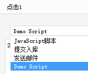

# JavaScriptActionProvider

| 属性 | 值 |
| --- | --- |
| 所属模块 | extra-designer |
| 完整类名 | `com.fr.design.fun.JavaScriptActionProvider` |
| 官方文档 | [查看文档](https://wiki.fanruan.com/display/PD/JavaScriptActionProvider) |

---

## 一、特殊名词介绍

无

## 二、背景、场景介绍

帆软报表在制作时向用户提供了一系列的交互事件。而JavaScriptActionProvider接口可以对这些事件进行扩展。

常见触发场景有：控件的交互事件/WEB属性中的事件。



该接口常配合JS引入、服务扩展等接口共同实现具体的交互响应

## 三、接口介绍


```java
package com.fr.design.fun;

import com.fr.design.beans.FurtherBasicBeanPane;
import com.fr.design.javascript.JavaScriptActionPane;
import com.fr.design.mainframe.JTemplate;
import com.fr.js.JavaScript;
import com.fr.stable.fun.mark.Mutable;

/**
 * 控件的事件扩展接口
 */
public interface JavaScriptActionProvider extends Mutable{

    String XML_TAG = "JavaScriptActionProvider";

    int CURRENT_LEVEL = 1;

    /**
     * 事件的界面
     */
    FurtherBasicBeanPane<? extends JavaScript> getJavaScriptActionPane();

    /**
     * 这个界面在哪些类型模板设计的时候会出现
     * @see com.fr.design.mainframe.JWorkBook
     * @see com.fr.design.mainframe.JForm
     */
    boolean accept(JTemplate template);

    @Deprecated
    FurtherBasicBeanPane<? extends JavaScript> getJavaScriptActionPane(JavaScriptActionPane pane);

    @Deprecated
    boolean isSupportType();
}

```

## 四、支持版本

| 产品线 | 版本 | 支持情况 | 备注 |
| --- | --- | --- | --- |
| FR | 8.0 | 支持 |  |
| FR | 9.0 | 支持 |  |
| FR | 10.0 | 支持 |  |
| FR | 11.0 | 支持 |

## 五、插件注册


```xml
<extra-designer>
        <JavaScriptActionProvider class="your class name"/>
</extra-designer>
```

## 六、原理说明

因为该接口主要通过交互触发JS的形式，来对具体的交互行为进行响应。所以在JavaScriptActionPane和ListenerEditPane中生成对应的响应处理的列表的时候会从插件中读取申明的JavaScriptActionProvider接口实例与产品标准的事件处理列表一起展现。

设置保存通过序列化的形式把对应的Script对象保存到cpt或者frm文件中。实际预览时再反序列化生成对应的对象生效。

## 七、特殊限制说明

该接口一个包含了4个接口方法，其中

boolean isSupportType();和FurtherBasicBeanPane<? extends JavaScript> getJavaScriptActionPane(JavaScriptActionPane pane);为保留的兼容接口，用于兼容旧版本中已经实现的插件。开发者在当前版本新开发时无需实现

另外两个接口功能比较简单，本身注释也清楚，就不再单独介绍。需要额外介绍的是FurtherBasicBeanPane 和JavaScript这两个关联接口。这两个才是实现的核心。


```java
package com.fr.design.beans;

import com.fr.common.annotations.Open;
import com.fr.stable.StringUtils;

@Open
public abstract class FurtherBasicBeanPane<T> extends BasicBeanPane<T> {
    /**
     * 是否是指定类型
     *
     * @param ob 对象
     * @return 是否是指定类型
     */
    public abstract boolean accept(Object ob);

    /**
     * title应该是一个属性，不只是对话框的标题时用到，与其他组件结合时，也会用得到
     *
     * @return 对话框标题
     */
    @Override
    public String title4PopupWindow() {
        return StringUtils.EMPTY;
    }

    /**
     * 重置
     */
    public abstract void reset();

}
```


```java
package com.fr.js;

import com.fr.decision.authority.base.constant.DeviceType;
import com.fr.json.JSONException;
import com.fr.json.JSONObject;
import com.fr.script.Calculator;
import com.fr.stable.ColumnRow;
import com.fr.stable.ParameterProvider;
import com.fr.stable.script.CalculatorKey;
import com.fr.stable.script.CalculatorProvider;
import com.fr.stable.script.ExTool;
import com.fr.stable.web.Repository;
import com.fr.stable.xml.XMLable;

/**
 * 用于生成客户端Javascript表达式的接口
 */
public interface JavaScript extends XMLable {

    CalculatorKey RECALCULATE_TAG = CalculatorKey.createKey("shouldRecalculate");
    
    DeviceType ALL_DEVICE = new DeviceType().supportAll();
    
    /**
     * 写XML的标签
     */
    String XML_TAG = "JavaScript";

    /**
     * 生成用于浏览器端执行的javascript表达式的字符串
     *
     * @param repo 报表请求上下文对象
     * @return Javascript表达式
     */
    String createJS(Repository repo);

    /**
     * 在现有的JS的内容之后追加一段脚本
     *
     * @param repo    上下文
     * @param content 追加的内容
     * @return 新的JS对象
     */
    JavaScript append(Repository repo, String content);

    /**
     * 在现有的JS的内容之前追加一段脚本
     *
     * @param repo    上下文
     * @param content 追加的内容
     * @return 新的JS对象
     */
    JavaScript prepend(Repository repo, String content);

    /**
     * 生成JSON表达式
     *
     * @param repo 报表请求上下文对象
     * @return JSON对象
     */
    JSONObject createJSONObject(Repository repo) throws JSONException;

    /**
     * 添加参数集到javascript中
     *
     * @param map 参数集
     */
    void addParameterMap(java.util.Map map);

    /**
     * 获取所有用于Javascript生成的参数组成的数组
     *
     * @return 生成Javascript所需参数组成的数组
     */
    ParameterProvider[] getParameters();

    /**
     * 设置生成Javascript所需的参数
     *
     * @param ps 参数数组
     */
    void setParameters(ParameterProvider[] ps);

    /**
     * 获取参数化的需要计算的配置项
     *
     * @return 参数化的需要计算的配置项
     */
    ParameterProvider[] getParameterizedConfig();

    /**
     * 记录超级链接中使用的相关格子，当格子值改变后，超级链接需要做相应的改变
     *
     * @param calculator 算子
     * @param exTool     格子间关系计算工具
     * @param currentCr  当前行列
     */
    void analyzeCorrelative(CalculatorProvider calculator, ExTool exTool, ColumnRow currentCr);

    /**
     * 是否需要重新计算
     *
     * @return 需要重新计算返回true，否则返回false
     */
    boolean shouldRecalculate();

    /**
     * 设置是否需要重新计算
     *
     * @param recalculate 需要重新计算则设置为true
     */
    void setShouldRecalculate(boolean recalculate);

    /**
     * 设置超链标题
     *
     * @param title 标题
     */
    void setLinkTitle(String title);

    /**
     * 计算JavaScript正文中的参数与公式
     */
    void renderContent(Calculator calculator);
    
    /**
     * 适用范围
     *
     * @return 设备类型
     */
    DeviceType getDeviceType();
}
```


```java
package com.fr.js;

import com.fr.base.BaseXMLUtils;
import com.fr.base.Parameter;
import com.fr.decision.authority.base.constant.DeviceType;
import com.fr.general.ComparatorUtils;
import com.fr.json.JSONException;
import com.fr.json.JSONObject;
import com.fr.script.Calculator;
import com.fr.stable.ArrayUtils;
import com.fr.stable.ColumnRow;
import com.fr.stable.FormulaProvider;
import com.fr.stable.ParameterProvider;
import com.fr.stable.script.CalculatorKey;
import com.fr.stable.script.CalculatorProvider;
import com.fr.stable.script.ExTool;
import com.fr.stable.web.Repository;
import com.fr.stable.xml.StableXMLUtils;
import com.fr.stable.xml.XMLPrintWriter;
import com.fr.stable.xml.XMLableReader;

import java.util.HashMap;
import java.util.Map;

/**
 * JavaScript接口的一个抽象实现
 */
public abstract class AbstractJavaScript implements JavaScript {
    private static final long serialVersionUID = -3629245217096045333L;

    private static final String JS_VERSION = "10";

    /**
     * @deprecated use {@link JavaScript#RECALCULATE_TAG} instead
     */
    @Deprecated
    public static CalculatorKey RECALCULATE_TAG = JavaScript.RECALCULATE_TAG;

    /**
     * 回调函数标识
     */
    public static final String CALLBACK = "callback";

    /**
     * 回调参数标识
     */
    public static final String FEEDBACKMAP = "feedbackMap";

    /**
     * javascript所使用的参数
     * protected没啥意义，禁止直接使用这个参数（保留兼容一些插件先），推荐使用getParameters()方法
     */
    @Deprecated
    protected ParameterProvider[] parameters;
    /**
     * 该事件作为 callback 事件时传入的参数
     * 例如，提交入库事件，在提交过程中会收集提交事件的执行信息，作为参数放到提交入库回调事件的 map 中作为该回调事件的参数，供回调事件使用
     * 暂时只有提交入库事件支持回调事件
     */
    protected Map<Object, Object> paraMap = new HashMap<Object, Object>();

    private boolean recalculate;

    private String itemName = "";//每一个js在界面中的名字

    public String getItemName() {
        return this.itemName;
    }

    public void setItemName(String itemName) {
        this.itemName = itemName;
    }

    /**
     * 获取javascript所使用的参数
     *
     * @return 参数数组
     */
    public ParameterProvider[] getParameters() {
        return this.parameters == null ? new ParameterProvider[0] : this.parameters;
    }

    /**
     * 设置javascript中所使用的参数
     *
     * @param parameters 参数数组
     */
    public void setParameters(ParameterProvider[] parameters) {
        this.parameters = parameters;
    }

    /**
     * 是否需要重新计算
     *
     * @return 需要重新计算返回true，否则返回false
     */
    public boolean shouldRecalculate() {
        return recalculate;
    }

    /**
     * 设置是否需要重新计算
     *
     * @param recalculate 需要重新计算则设置为true
     */
    public void setShouldRecalculate(boolean recalculate) {
        this.recalculate = recalculate;
    }

    /**
     * 生成表示客户端javascript的字符串
     *
     * @param repo Session相关
     * @return 表示javascript的字符串
     */
    public String createJS(Repository repo) {
        //b:自定义的js中的arguments不再指向控件事件中的arguments，所以这么改下
        //wei:js使用严格模式（"use strict"）时,是不允许给arguments赋值的,因此这边应该把arguments传递过去.
        return "var as=arguments; return FR.tc(function(){" + actionJS(repo) + "}, this, as)";
    }

    /**
     * 生成JSON表达式
     *
     * @param repo 报表请求上下文对象
     * @return JSON对象
     */
    public JSONObject createJSONObject(Repository repo) throws JSONException {
        JSONObject res = JSONObject.create();
        res.put("version", JS_VERSION);
        res.put("data", createJS(repo));
        return res;
    }

    protected abstract String actionJS(Repository repo);

    @Override
    public JavaScript append(Repository repo, String content) {
        return this;
    }

    @Override
    public JavaScript prepend(Repository repo, String content) {
        return this;
    }

    /**
     * 添加参数集到javascript中
     *
     * @param map 参数集
     */
    public void addParameterMap(java.util.Map map) {
        paraMap.putAll(map);
    }

    public void renderContent(Calculator calculator) {

    }
    
    @Override
    public DeviceType getDeviceType() {
        
        return ALL_DEVICE;
    }
    
    /**
     * 记录超级链接中使用的相关格子，当格子值改变后，超级链接需要做相应的改变
     *
     * @param calculator 算子
     * @param exTool     格子间关系计算工具
     * @param currentCr  当前行和列
     */
    public void analyzeCorrelative(CalculatorProvider calculator, ExTool exTool, ColumnRow currentCr) {
        ParameterProvider[] pps = getParameterizedConfig();
        for (int p = 0, len = pps.length; p < len; p++) {
            ParameterProvider provider = pps[p];
            Object pValue = provider.getValue();
            // 只有公式的时候，才有可能引用到其他格子的值
            if (pValue instanceof FormulaProvider) {
                exTool.setCreateRelation(true);
                calculator.exStatement(currentCr, ((FormulaProvider) pValue).getPureContent());
                exTool.setCreateRelation(false);
            }
        }
    }

    /**
     * 设置超链标题
     *
     * @param title 标题
     */
    public void setLinkTitle(String title) {

    }

    public boolean equals(Object obj) {
        if (this == obj) {
            return true;
        }
        if (!(obj instanceof AbstractJavaScript)) {
            return false;
        }

        return ComparatorUtils.equals(this.parameters, ((AbstractJavaScript) obj).parameters);
    }

    public void readXML(XMLableReader reader) {
        if (reader.isChildNode()) {
            if (Parameter.ARRAY_XML_TAG.equals(reader.getTagName())) { //parameters
                Parameter[] newParameters = BaseXMLUtils.readParameters(reader);
                this.setParameters(newParameters);
            }
        }
    }

    public void writeXML(XMLPrintWriter writer) {
        // Parameters
        StableXMLUtils.writeParameters(writer, this.getParameters());
    }

    public Object clone() throws CloneNotSupportedException {
        AbstractJavaScript cloned = (AbstractJavaScript) super.clone();
        if (parameters != null) {
            cloned.parameters = new Parameter[this.parameters.length];
            for (int i = 0; i < this.parameters.length; i++) {
                cloned.parameters[i] = (Parameter) this.parameters[i].clone();
            }
        }

        return cloned;
    }

    @Override
    public ParameterProvider[] getParameterizedConfig() {
        ParameterProvider[] parameters = getParameters();
        ParameterProvider[] extra = getExtraParameterizedConfig();

        return ArrayUtils.addAll(parameters, extra);
    }

    /**
     * 获取 除去公式之外需要额外在生成结果报表时计算的参数化配置项，例如标题支持公式等
     *
     * @return 除去公式之外需要额外在生成结果报表时计算的参数化配置项，例如标题支持公式等
     */
    public ParameterProvider[] getExtraParameterizedConfig() {
        return new ParameterProvider[0];
    }
}
```

在继承FurtherBasicBeanPane时需要注意，因为该抽象类默认实现了title4PopupWindow接口。而事件处理类型的列表名称实际就是来自这个接口的返回值，所以开发者需要手动实现一下；【点我看示例】

在实现JavaScript接口时，开发者只需直接继承AbstractJavaScript抽象类即可。如果开发者实现的接口实现类存在自定义的一些配置，需要额外实现的方法有readXML/writeXML/clone三个方法。【点我看示例】

## 八、常用链接

demo地址：[demo-java-script-action-provider](https://code.fanruan.com/hugh/demo-java-script-action-provider)

三组开放web服务接口的插件接口对比

三组常见引入JS和CSS的插件接口对比

## 九、开源案例

免责声明：所有文档中的开源示例，均为开发者自行开发并提供。仅用于参考和学习使用，开发者和官方均无义务对开源案例所涉及的所有成果进行教学和指导。若作为商用一切后果责任由使用者自行承担。

[demo-file-submit-oss](https://code.fanruan.com/fanruan/demo-file-submit-oss)
