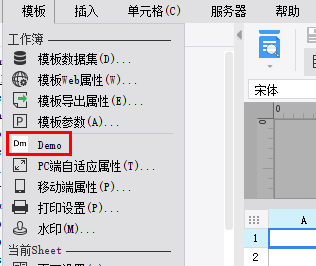
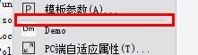

# MenuHandler

| 属性 | 值 |
| --- | --- |
| 所属模块 | extra-designer |
| 完整类名 | `com.fr.design.fun.MenuHandler` |
| 官方文档 | [查看文档](https://wiki.fanruan.com/display/PD/MenuHandler) |

---

## 一、特殊名词介绍

无

## 二、背景、场景介绍

菜单/导航/工具栏 作为用户配置交互的基本入口在帆软设计器中起到一个功能扩展的作用。当用户不满足于现有的设计器功能是，可以根据自身的业务要求使用MenuHandler对相应的功能进行扩充。



## 三、接口介绍


```java
package com.fr.design.fun;

import com.fr.design.mainframe.toolbar.ToolBarMenuDockPlus;
import com.fr.design.menu.ShortCut;
import com.fr.stable.fun.mark.Mutable;

/**
 * @author richie
 * @date 2015-04-01
 * @since 8.0
 * 设计器菜单栏插件接口
 */
public interface MenuHandler extends Mutable {

    String MARK_STRING = "MenuHandler";

    int CURRENT_LEVEL = 1;


    int LAST = -1;
    int HIDE =-2;

    String HELP = "help";
    String SERVER = "server";
    String FILE = "file";
    String TEMPLATE = "template";
    String INSERT = "insert";
    String CELL = "cell";
    String BBS = "bbs";

    /**
     * 插入菜单的位置
     *
     * @param total 插入的位置
     * @return 插入位置，如果想放到最后，则返回-1
     */
    int insertPosition(int total);

    /**
     * 是否在插入的菜单前插入一个分割符
     *
     * @return 是否插入分隔符
     */
    boolean insertSeparatorBefore();

    /**
     * 是否在插入的菜单后插入一个分割符
     *
     * @return 是否插入分隔符
     */
    boolean insertSeparatorAfter();

    /**
     * 所属的分类菜单
     *
     * @return 分类菜单名
     */
    String category();

    /**
     * 具体的菜单项内容
     *
     * @return 菜单项内容
     */
    ShortCut shortcut();

    /**
     * 具体的菜单项内容
     *
     * @param plus 当前模板
     * @return 菜单项内容
     */
    ShortCut shortcut(ToolBarMenuDockPlus plus);
}

```


```java
package com.fr.design.menu;

import com.fr.stable.fun.impl.AbstractProvider;
import com.fr.stable.fun.mark.API;
import com.fr.stable.fun.mark.Mutable;

import javax.swing.*;

/**
 * 用来往MenuDef或是ToolBarDef里面加东西时用的接口
 * august:ShortCut没有必要序列化和XMLabled
 * 原来那么多Menudef都提供持久化操作，太浪费资源
 */
@API(level = ShortCut.CURRENT_LEVEL)
public abstract class ShortCut extends AbstractProvider implements Mutable {

    public static final String TEMPLATE_TREE = "TemplateTreeShortCut";

    public static final int CURRENT_LEVEL = 1;

    public int currentAPILevel() {
        return CURRENT_LEVEL;
    }

    @Override
    public String mark4Provider() {
        return getClass().getName();
    }

    private MenuKeySet menuKeySet = null;

    /**
     * 将改菜单添加到menul里面去
     * @param menu 添加到的menu
     */
    public abstract void intoJPopupMenu(JPopupMenu menu);

    /**
     * 将该菜单添加到工具栏里面去
     * @param toolBar 工具栏
     */
    public abstract void intoJToolBar(JToolBar toolBar);


    public abstract void setEnabled(boolean b);

    /**
     * 是否可用
     * @return 可用
     */
    public abstract boolean isEnabled();


    /**
     *作为工具栏菜单
     * @param scs 菜单
     * @return 工具栏
     */
    public static final ToolBarDef asToolBarDef(ShortCut[] scs) {
        ToolBarDef def = new ToolBarDef();
        def.addShortCut(scs);

        return def;
    }


    public MenuKeySet getMenuKeySet() {
        return menuKeySet;
    }

    public void setMenuKeySet(MenuKeySet menuKeySet) {
        this.menuKeySet = menuKeySet;
    }

    /**
     * 权限编辑模式变更时候会调用这个方法
     * @param isAuhtority
     */
    public void notifyFromAuhtorityChange(boolean isAuhtority) {
    }
}
```

## 四、支持版本

| 产品线 | 版本 | 支持情况 | 备注 |
| --- | --- | --- | --- |
| FR | 8.0 | 支持 |  |
| FR | 9.0 | 支持 |  |
| FR | 10.0 | 支持 |  |
| FR | 11.0 | 支持 |

## 五、插件注册


```xml
<extra-designer>
        <MenuHandler class="your class name"/>
</extra-designer>
```

## 六、原理说明

接口只能在设计器中被调用，在需要调用的地方通过Set<MenuHandler> set = ExtraDesignClassManager.getInstance().getArray(MenuHandler.MARK_STRING);获取到插件中所有申明的菜单扩展实现。

默认的产品中主要在：MainDesigner中通过（继承ToolBarMenuDock）insertMenu方法加载并初始化所有插件中的菜单扩展。

## 七、特殊限制说明

MenuHandler可以扩展的菜单项主要有一下几个分类：


分别对应的category返回值为：FILE、TEMPLATE、INSERT、CELL、SERVER、HELP、BBS

insertSeparatorBefore和insertSeparatorAfter 接口表示的分隔符为下图所示的灰色的分割线



ShortCut shortcut();和ShortCut shortcut(ToolBarMenuDockPlus plus);两个接口方法从本质说用途是一样的就是提供扩展的菜单项实体。不过根据category的不同，需要实现的方法也不一样。为了省去记忆，开发者可以参照[demo示例](https://code.fanruan.com/hugh/demo-menu-handler/src/branch/10.0/src/main/java/com/tptj/demo/hg/menu/handler/Demo.java)中的例子直接两个都实现即可。

而在实现ShortCut实例类时，一般也不建议开发者直接继承实现ShortCut。而是推荐选择实现UpdateAction（继承于ShortCut ）甚至是如果有针对性的业务配置的话，可以选择对应的Action继承重写。【[点击看示例](https://code.fanruan.com/hugh/demo-menu-handler/src/branch/10.0/src/main/java/com/tptj/demo/hg/menu/handler/DemoAction.java)】

## 八、常用链接

[demo-menu-handler](https://code.fanruan.com/hugh/demo-menu-handler)

## 九、开源案例

免责声明：所有文档中的开源示例，均为开发者自行开发并提供。仅用于参考和学习使用，开发者和官方均无义务对开源案例所涉及的所有成果进行教学和指导。若作为商用一切后果责任由使用者自行承担。

暂无
