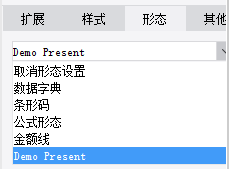

# PresentKindProvider

| 属性 | 值 |
| --- | --- |
| 所属模块 | extra-designer |
| 完整类名 | `com.fr.design.fun.PresentKindProvider` |
| 官方文档 | [查看文档](https://wiki.fanruan.com/display/PD/PresentKindProvider) |

---

## 一、特殊名词介绍

无

## 二、背景、场景介绍

PresentKindProvider主要用于提供数据展现形态的扩展。

比较常见的就是各类条码、二维码形态的扩展。



## 三、接口介绍


```java
package com.fr.design.fun;

import com.fr.base.present.Present;
import com.fr.design.beans.FurtherBasicBeanPane;
import com.fr.stable.fun.mark.Mutable;

/**
 * @author richie
 * @date 2015-05-22
 * @since 8.0
 * 形态类型接口
 */
public interface PresentKindProvider extends Mutable{

    int CURRENT_LEVEL = 1;

    String MARK_STRING = "PresentKindProvider";

    /**
     * 形态设置界面
     * @return 形态设置界面
     */
    FurtherBasicBeanPane<? extends Present> appearanceForPresent();

    /**
     * 在形态设置面板上显示的名字
     * @return 名字
     */
    String title();

    /**
     * 该形态对应的类
     * @return 类
     */
    Class<? extends Present> kindOfPresent();

    /**
     * 菜单快捷键
     * @return 快捷点对应的字符
     */
    char mnemonic();
}

```


```java
package com.fr.design.beans;

import com.fr.common.annotations.Open;
import com.fr.stable.StringUtils;

@Open
public abstract class FurtherBasicBeanPane<T> extends BasicBeanPane<T> {
    /**
     * 是否是指定类型
     *
     * @param ob 对象
     * @return 是否是指定类型
     */
    public abstract boolean accept(Object ob);

    /**
     * title应该是一个属性，不只是对话框的标题时用到，与其他组件结合时，也会用得到
     *
     * @return 对话框标题
     */
    @Override
    public String title4PopupWindow() {
        return StringUtils.EMPTY;
    }

    /**
     * 重置
     */
    public abstract void reset();

}
```


```java
package com.fr.base.present;

import com.fr.base.Style;
import com.fr.script.Calculator;
import com.fr.stable.ColumnRow;
import com.fr.stable.DependenceProvider;
import com.fr.stable.script.CalculatorProvider;
import com.fr.stable.script.ExTool;
import com.fr.stable.xml.XMLable;

/**
 * 形态。该类用于处理同事拥有实际值和显示值并且这两个值可能不同的对象。
 */
public interface Present extends DependenceProvider, XMLable {
    String XML_TAG = "Present";

    /**
     * 返回经过形态计算后原来的值的结果
     *
     * @param value      原始值
     * @param calculator 算子
     * @return 形态计算后的结果
     */
    Object present(Object value, Calculator calculator);

    /**
     * 返回经过形态计算后格子的值的结果
     *
     * @param value      原始格子的值
     * @param calculator 算子
     * @param cr         格子所处的行列位置
     * @return 形态计算后的结果
     */
    Object present(Object value, Calculator calculator, ColumnRow cr);

    /**
     * 记录形态中使用的相关格子，当格子值改变后，形态值需要相应做改变
     *
     * @param calculator 算子
     * @param exTool     格子间关系计算工具
     * @param currentCr  当前行列
     * @date 2014-9-21-下午10:51:24
     */
    void analyzeCorrelative(CalculatorProvider calculator, ExTool exTool, ColumnRow currentCr);

    /**
     * 返回形态的原型，比如NormalPresent在设计器界面的渲染是跟其他present区分开的
     *
     * @return 形态的原型
     */
    Object getPresentPrototype();

    /**
     * 处理形态中涉及到的style的改变，传入单元格
     * 形态中处理格子的样式
     *
     * @param cellStyle 单元格的样式
     * @param value     单元格的值
     */
    Style modifyCellStyle(Style cellStyle, Object value);

    /**
     * 对当前形态中涉及到的单元格值进行预处理
     *
     * @param value      值
     * @param calculator 算子
     */
    void valuePretreatment(Object value, CalculatorProvider calculator);

}
```


```java
package com.fr.base;

import com.fr.json.JSONException;
import com.fr.json.JSONObject;
import com.fr.stable.core.NodeVisitor;
import com.fr.stable.html.Tag;
import com.fr.stable.web.Repository;
import com.fr.stable.xml.XMLable;

import java.awt.*;

/**
 * 用于绘画图形的基本接口
 */
public interface Painter extends XMLable {

	/**
	 * 根据指定的图形上下文、目标图形的宽度和高度、屏幕分辨率以及样式画出目标图形
	 *
	 * @param g		  图形上下文
	 * @param width	  目标图形的宽度
	 * @param height	 目标图形的高度
	 * @param resolution 屏幕分辨率
	 * @param style	  样式
	 */
	void paint(Graphics g, int width, int height, int resolution, Style style);

    /**
     * 将Painter以JSON形式输出
     * @param visitor 访问者
     * @param repo 网络请求上细纹
     * @param width 宽度
     * @param height 高度
     * @return JSON对象
     */
    JSONObject toJSONObject(NodeVisitor visitor, Repository repo, int width, int height) throws JSONException ;

	/**
	 * 将Painter以JSON形式输出
	 * @param visitor 访问者
	 * @param repo 网络请求上细纹
	 * @param width 宽度
	 * @param height 高度
	 * @param style 样式
	 * @return JSON对象
	 */
	JSONObject toJSONObject(NodeVisitor visitor, Repository repo, int width, int height, Style style) throws JSONException ;

	/**
	 * 画出图形，生成 img 标签，加入上层 tag
	 * @param repo 网络请求上细纹
	 * @param width 宽度
	 * @param height 高度
	 * @param style 样式
	 * @param tag 上层 html 标签
	 * @return JSON对象
	 */
	void paintTag(Repository repo, int width, int height, Style style, Tag tag);
}
```

## 四、支持版本

| 产品线 | 版本 | 支持情况 | 备注 |
| --- | --- | --- | --- |
| FR | 8.0 | 支持 |  |
| FR | 9.0 | 支持 |  |
| FR | 10.0 | 支持 |  |
| FR | 11.0 | 支持 |

## 五、插件注册


```xml
<extra-designer>
        <PresentKindProvider class="your class name"/>
</extra-designer>
```

## 六、原理说明

PresentPane加载形态类型列表是会从插件中读取声明的PresentKindProvider接口实例并生成选择list,选中实例后会调用appearanceForPresent生成对应的UI，最终通过序列化把形态配置保存到cpt/frm中。计算时再反序列化生效。

## 七、特殊限制说明

PresentKindProvider接口方法功能都比较明确，而且是个桥梁性质的接口，实现比较简单。需要注意的是在实现Present接口时，通常我们把形态分为，图片类/html类/以及其他类 一共3种形式。

且PresentKindProvider接口根据原则上来说，都可以被自定义函数接口+函数形态进行覆盖。所以开发者在遇到形态的需求的时候，不要盲目的就选择PresentKindProvider接口，需要仔细确认面对的场景和要求，是否可以直接用更简单的函数接口即可满足要求。避免开发资源的浪费

## 八、常用链接

demo地址：[demo-present-kind-provider](https://code.fanruan.com/hugh/demo-present-kind-provider)

## 九、开源案例

免责声明：所有文档中的开源示例，均为开发者自行开发并提供。仅用于参考和学习使用，开发者和官方均无义务对开源案例所涉及的所有成果进行教学和指导。若作为商用一切后果责任由使用者自行承担。

[demo-show-present](https://code.fanruan.com/fanruan/demo-show-present)
