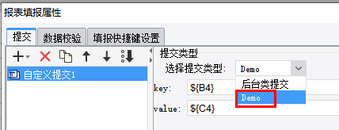

# SubmitProvider

| 属性 | 值 |
| --- | --- |
| 所属模块 | extra-designer |
| 完整类名 | `com.fr.design.fun.SubmitProvider` |
| 官方文档 | [查看文档](https://wiki.fanruan.com/display/PD/SubmitProvider) |

---

## SubmitProvider

## 一、特殊名词介绍

无

## 二、背景、场景介绍

帆软报表中存在数据采集的功能，也就是文档中常常提及的“提交”和“填报”功能。

数据采集本身是指为满足生产人对生产活动的监控、分析、记录、转承需要，在生产活动中对各类数据信息的收集过程。

帆软报表中数据采集根据采集的方式分为自动采集和手动采集，也就是“定时填报”和“预览填报”两种场景。

根据数据写入的方法分为数据库提交和自定义提交两种场景

其中对于自定义提交本身在产品中已经提供了[自定义提交接口](https://help.fanruan.com/finereport/doc-view-3703.html)的方式。但是该提交方式，是通过选择class文件，并且对于一些通用提交无法提供必要的配置界面；对模板制作人员要求比较高，需要大量的机械记忆。

为了进一步提升用户的使用体验，在报表产品中提供了插件的自定义提交接口SubmitProvider。该方式可以根据业务需要扩展出对应的提交方式和配置界面。便于制作人员制作。



## 三、接口介绍


```java
package com.fr.design.fun;

import com.fr.design.beans.BasicBeanPane;
import com.fr.stable.fun.mark.Mutable;

/**
 * 自定义提交接口
 */
public interface SubmitProvider extends Mutable{

    String MARK_STRING = "SubmitProvider";

    int CURRENT_LEVEL = 1;


    /**
     * 设置界面
     * @return 界面
     */
    BasicBeanPane appearanceForSubmit();

    /**
     * 下拉选项
     * @return 下拉框中的文本
     */
    String dataForSubmit();

    /**
     * 键
     * @return 提交的键
     */
    String keyForSubmit();
}

```


```java
package com.fr.data;

import com.fr.script.Calculator;

import java.sql.Connection;

/**
 * 扩展了SubmitJob，添加了一些方法
 * <p>
 * Created by loy on 2017/1/16.
 */
public interface SubmitTask extends SubmitJob {

    /**
     * 读写XML的标签
     */
    String XML_TAG = "SubmitTask";

    String getDBName(Calculator ca);

    void setConnection(Connection conn);

}


/**
 * 数据填报提交操作接口
 *
 * @deprecated 新的接口 @see {@link SubmitTask} 使用时应继承其抽象类 @see {@link AbstractSubmitTask}
 */
public interface SubmitJob extends XMLable, FinishJob {
    /**
     * 读写XML的标签
     */
    String XML_TAG = "SubmitJob";

    String getJobType();
}

public interface FinishJob {
    /**
     * 进行数据校验 置位结果状态 并且要设置出错的格子
     *
     * @param calculator 算子
     * @throws Exception 如果操作失败则抛出此异常
     */
    void doJob(Calculator calculator) throws Exception;

    /**
     * 提交或者校验完成后执行的方法
     *
     * @param calculator 算子
     * @throws Exception 方法执行出错时将抛出此异常
     */
    void doFinish(Calculator calculator) throws Exception;
}
```

## 四、支持版本

| 产品线 | 版本 | 支持情况 | 备注 |
| --- | --- | --- | --- |
| FR | 8.0 | 支持 |  |
| FR | 9.0 | 支持 |  |
| FR | 10.0 | 支持 |  |
| FR | 11.0 | 支持 |

## 五、插件注册


```xml
<extra-designer>
        <SubmitProvider class="your class name"/>
</extra-designer>
```

## 六、原理说明

接口只能在设计器中被调用，在需要调用的地方通过Set<SubmitProvider> providers = ExtraDesignClassManager.getInstance().getArray(SubmitProvider.XML_TAG);获取到插件中所有申明的超链扩展实现。

默认的产品中主要在：提交列表界面（SubmitVisitorListPane）的内部类自定义提交界面（CustomPane）中调用生效，该界面构造是会调用对应的接口实例生成提交类型列表。选择对应的类型时，会初始化对应的配置界面，配置好的信息保存会直接把SubmitTask对象（需要继承实现）序列化为XML保存到模板中，当模板计算时，就不会再走SubmitProvider接口了，而是直接反序列化保存的xml得到超链对象生效。

## 七、特殊限制说明

SubmitProvider一共需要实现3个接口方法 【[点击看示例](https://code.fanruan.com/hugh/demo-submit-provider/src/branch/10.0/src/main/java/com/tptj/demo/hg/submit/provider/Demo.java)】

appearanceForSubmit接口需要返回一个将要扩展到数据采集类型的配置界面实例对象

dataForSubmit 返回该类型在设计器上的显示类型名称

keyForSubmit 返回该类型的类型标识，用于匹配SubmitTask

在实现SubmitTask接口时 【[点击看示例](https://code.fanruan.com/hugh/demo-submit-provider/src/branch/10.0/src/main/java/com/tptj/demo/hg/submit/provider/DemoSubmit.java)】

getJobType接口 返回值必须与SubmitProvider实现类的keyForSubmit一致，才能匹配上。

doJob接口 主要用于提交事务的计算和处理

doFinish接口 主要用于处理完毕后的资源释放或者数据回滚等操作

readXML/writeXML接口 主要用于数据的序列化与反序列化（模板文件的读写）

最后不要忘记实现clone方法，否则设计器拷贝编辑会出现问题哦！

注：功能点记录不要添加到BasicBeanPane的实现类上！

## 八、常用链接

[demo-submit-provider](https://code.fanruan.com/hugh/demo-submit-provider)

## 九、开源案例

免责声明：所有文档中的开源示例，均为开发者自行开发并提供。仅用于参考和学习使用，开发者和官方均无义务对开源案例所涉及的所有成果进行教学和指导。若作为商用一切后果责任由使用者自行承担。

[demo-file-submit-oss](https://code.fanruan.com/fanruan/demo-file-submit-oss)
