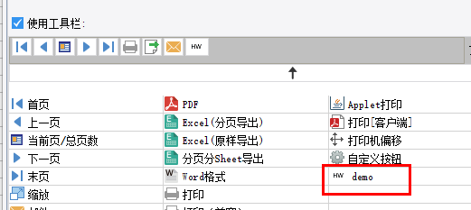
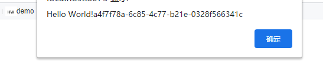

# ToolbarItemProvider

| 属性 | 值 |
| --- | --- |
| 所属模块 | extra-designer |
| 完整类名 | `com.fr.design.fun.ToolbarItemProvider` |
| 官方文档 | [查看文档](https://wiki.fanruan.com/display/PD/ToolbarItemProvider) |

---

## 一、特殊名词介绍

无

## 二、背景、场景介绍

帆软报表中允许用户在web属性中为分页/填报/数据分析等预览方式自定义工具栏按钮，在按钮事件中用户通过编写JS实现相应的功能，完成对工具栏的扩展。但是对于复杂的JS封装按钮，配置不方便、维护难成了影响用户体验的一个不可忽视的问题。为了解决这类问题，官方提供了基于插件形式的工具栏按钮的扩展。

常见的场景：

1.配合ExportOperateProvider接口实现新文件类型导出的快速调用。

2.实现预览界面的客户端推送扩展

3.实现预览界面的管理功能扩展

## 三、接口介绍


```java
package com.fr.design.fun;

import com.fr.design.mainframe.JTemplate;
import com.fr.form.ui.Widget;
import com.fr.stable.Filter;
import com.fr.stable.fun.mark.Mutable;

/**
 * @author : focus
 * @since : 8.0
 * 自定义web工具栏菜单
 */
public interface ToolbarItemProvider extends Mutable, Filter<JTemplate> {

    String XML_TAG = "ToolbarItemProvider";

    int CURRENT_LEVEL = 1;


    /**
     * 自定义web工具栏菜单实际类，该类可以继承自com.fr.form.ui.ToolBarMenuButton 或者 com.fr.form.ui.ToolBarButton;
     *
     * @return 菜单类
     */
    Class<? extends Widget> classForWidget();

    /**
     * 自定义web工具栏菜单在设计器界面上的图标路径
     *
     * @return 图标所在的路径
     */
    String iconPathForWidget();

    /**
     * 自定义web工具栏菜单在设计器上显示的名字
     *
     * @return 菜单名
     */
    String nameForWidget();

    /**
     * 模板（决策报表 or cpt）是否支持此工具栏按钮
     * JTemplate  模板
     * @return 支持返回true, 否则false
     */
    @Override
    boolean accept(JTemplate template);

}

```


```java
package com.fr.form.ui;

import com.fr.data.core.DataCoreXmlUtils;
import com.fr.form.event.Listener;
import com.fr.general.data.Condition;
import com.fr.js.JavaScript;
import com.fr.js.JavaScriptImpl;
import com.fr.json.JSONException;
import com.fr.json.JSONObject;
import com.fr.script.Calculator;
import com.fr.stable.core.NodeVisitor;
import com.fr.stable.web.Repository;
import com.fr.stable.xml.XMLPrintWriter;
import com.fr.stable.xml.XMLableReader;

/*
 * TODO ToolBar上面的所有Widget是有共同的默认方法(afterload)的， 任何类型的Widget也是默认的实现方法的
 * 故，希望多重继承，看了Think in java，觉得也许可以把ToolBar变成一个外部类，Email, Next那些作为ToolBar的内部类，也许可行
 */
public abstract class ToolBarButton extends Button {
    // richer:权限控制,仅使用PrivilegeCondition
    protected Condition condition;

    public ToolBarButton(String text) {
        super(text);
        this.setEnabled(true);
    }

    public ToolBarButton(String text, String iconName) {
        super(text, iconName);
        // alex:工具栏按钮默认为disabled
        this.setEnabled(true);
    }

    public String widgetName() {
        return getClass().getSimpleName();
    }

    public Condition getCondition() {
        return this.condition;
    }

    public void setCondition(Condition condition) {
        this.condition = condition;
    }

    public Listener[] createListeners(Repository repo) {
        return new Listener[]{
                new Listener(AFTERINIT, initAction(repo)),
                new Listener(EVENT_CLICK, clickScript(repo)),
                new Listener(
                        WebContentUtils.getContentPanel(repo), WebContentUtils.EVENT_STARTLOAD, new JavaScriptImpl(
                        getDisableAction()
                )
                ), new Listener(
                WebContentUtils.getContentPanel(repo), WebContentUtils.EVENT_AFTERLOAD, new JavaScriptImpl(
                onContentPanelAfterLoad(repo)
        )
        )
        };
    }

    /**
     * 返回按钮点击事件脚本
     * @param repo Repository 请求资料对象
     * @return 点击事件脚本
     * 这个函数不推荐再使用，推荐直接使用clickScript方法
     */
    @Deprecated
    protected abstract JavaScriptImpl clickAction(Repository repo);

    protected JavaScript clickScript(Repository repo){
        return clickAction(repo);
    }

    protected JavaScript initAction(Repository repo) {
        return new JavaScriptImpl("this.disable();");
    }

    /*
     * 对应于ContentPanel.afterload事件
     */
    protected String onContentPanelAfterLoad(Repository repo) {
        return getEnableAction();
    }

    @Override
    public JSONObject createJSONConfig(Repository repo, Calculator c, NodeVisitor nodeVisitor) throws JSONException {
        JSONObject jo = super.createJSONConfig(repo, c, nodeVisitor);
        jo.put("widgetName", widgetName());
        return jo;
    }

    public void readXML(XMLableReader reader) {
        super.readXML(reader);
        if (reader.isChildNode()) {
            if (Condition.XML_TAG.equals(reader.getTagName())) {
                ToolBarButton.this.condition = DataCoreXmlUtils.readCondition(reader);
            }
        }
    }

    public void writeXML(XMLPrintWriter writer) {
        super.writeXML(writer);
        if (condition != null) {
            DataCoreXmlUtils.writeXMLCondition(writer, condition);
        }
    }

    public boolean equals(Object obj) {
        if (obj == null || !(obj instanceof ToolBarButton)) {
            return false;
        }
        return super.equals(obj);
    }
}

```

## 四、支持版本

| 产品线 | 版本 | 支持情况 | 备注 |
| --- | --- | --- | --- |
| FR | 8.0 | 支持 |  |
| FR | 9.0 | 支持 |  |
| FR | 10.0 | 支持 |  |
| FR | 11.0 | 支持 |
| BI | 3.6 | 支持 | 不支持仪表板 |
| BI | 4.0 | 支持 | 不支持仪表板 |
| BI | 5.1 | 支持 | 不支持仪表板 |
| BI | 5.1.2 | 支持 | 不支持仪表板 |
| BI | 5.1.3 | 支持 | 不支持仪表板 |

## 五、插件注册


```xml
<extra-designer>
        <ToolbarItemProvider class="your class name"/>
</extra-designer>
```

## 六、原理说明

报表中的工具栏都会通过ExtraDesignClassManager#getWebWidgetOptions方法进行扩展，该方法中会读取插件中申明的所有ToolbarItemProvider接口，在设计器添加后将对应的类名和配置写入cpt中。报表实际预览时，通过类名和配置重新生成对应的实例进行生效。

## 七、特殊限制说明

实现具体的ToolBarButton时，必须申明一个无参构造。并调用super【ToolBarButton】(按钮名称, 图标的别名)进行构造。同时需要调用 SundryKit.loadToolbarIcon(按钮别名, 图标路径); 加载这个图标。

需要注意的是，加载图标的图标别名是全局共享的，所以需要注意申明的别名不要跟其他已有的别名冲突。

而实际点击按钮的操作在：ToolBarButton#clickAction( Repository repo )接口中产生，该接口返回一个JavaScriptImpl实例，简单生成就是 new JavaScriptImpl("JS 内容");也就是我们要利用上下文Repository，生成我们实际需要执行的JS内容。上下文包含了当前报表的请求、报表session等必要信息。

该接口一般极少独立使用，常常跟 服务接口和导出接口以及web资源引入接口配合使用。

## 八、常用链接

demo地址：[demo-toolbar-item-provider](https://code.fanruan.com/hugh/demo-toolbar-item-provider)





## 九、开源案例

免责声明：所有文档中的开源示例，均为开发者自行开发并提供。仅用于参考和学习使用，开发者和官方均无义务对开源案例所涉及的所有成果进行教学和指导。若作为商用一切后果责任由使用者自行承担。

[demo-export-xml](https://code.fanruan.com/fanruan/demo-export-xml/src/branch/master/src/main/java/com/fr/plugin/export/xml/ui/XmlExportToolbarUI.java)
