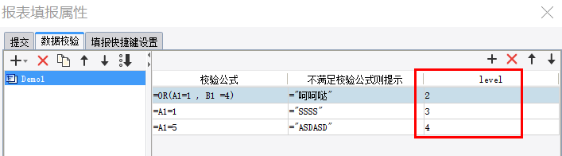
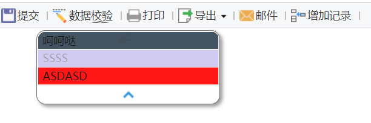

# VerifyDefineProvider

| 属性 | 值 |
| --- | --- |
| 所属模块 | extra-designer |
| 完整类名 | `com.fr.design.fun.VerifyDefineProvider` |
| 官方文档 | [查看文档](https://wiki.fanruan.com/display/PD/VerifyDefineProvider) |

---

## 一、特殊名词介绍

无

## 二、背景、场景介绍

该接口主要用于对产品固有的校验展现效果、提示信息细节需要扩展；或对大量的重复的校验判断进行封装的场景中使用。





## 三、接口介绍


```java
package com.fr.design.fun;

import com.fr.data.Verifier;
import com.fr.design.beans.BasicBeanPane;
import com.fr.stable.fun.mark.Mutable;

/**
 * Created by richie on 16/6/8.
 */
public interface VerifyDefineProvider extends Mutable {

    String MARK_STRING = "VerifyDefineProvider";

    int CURRENT_LEVEL = 1;

    /**
     * 对应的校验类
     * @return 校验类
     */
    Class<? extends Verifier> classForVerifier();

    /**
     * 校验设置的界面
     * @return 界面
     */
    Class<? extends BasicBeanPane> appearanceForVerifier();

    /**
     * 此种类型的校验的名字
     * @return 名字
     */
    String nameForVerifier();

    /**
     * 菜单图标
     * @return 图标路径
     */
    String iconPath();
}


```


```java
package com.fr.data;

import com.fr.general.data.MOD_COLUMN_ROW;
import com.fr.json.JSONException;
import com.fr.json.JSONObject;
import com.fr.script.Calculator;
import com.fr.stable.Nameable;
import com.fr.stable.script.CalculatorKey;
import com.fr.stable.xml.XMLable;

/**
 * 用于填报数据校验
 */
public interface Verifier extends XMLable, Nameable {

    CalculatorKey KEY = CalculatorKey.createKey(Verifier.class.getName());

    String XML_TAG = "TopVerifier";


    /**
     * 添加校验项
     *
     * @param item 校验对象
     */
    void addVerifyItem(VerifyItem item);

    /**
     * 根据索引获取校验项
     *
     * @param index 索引
     * @return 校验项
     */
    VerifyItem getVerifyItem(int index);

    /**
     * 获取校验项的数量
     *
     * @return 数量
     */
    int getVerifyItemsCount();

    /**
     * 清除所有的校验项
     */
    void clearVerifyItems();


    /**
     * 执行校验
     *
     * @param ca 算子
     * @throws Exception
     */
    void execute(Calculator ca) throws Exception;


    /**
     * 是否正常 有效
     *
     * @return 是否正常
     */
    boolean isValid();

    /**
     * 使用内部构建的校验
     *
     * @return 使用内部校验
     */
    boolean isBuiltInVerify();

    /**
     * 转换为JSON格式
     *
     * @return JSON对象
     * @throws JSONException 失败时抛出JSON异常
     */
    JSONObject toJSONObjectContent() throws JSONException;

    /**
     * 添加删除行的时候,公式需要跟着变化
     *
     * @param mod 行列记录器
     * @return 记录器
     */
    Object __mod_column_row(MOD_COLUMN_ROW mod);

    enum Status {

        SUCCESS(0), ERROR(1), WARNING(2);

        private int type;

        Status(int type) {
            this.type = type;
        }

        public static Status parse(int type) {
            for (Status status : Status.values()) {
                if (status.type == type) {
                    return status;
                }
            }
            return Status.SUCCESS;
        }

    }
}


```


```java
/*
 * Copyright(c) 2001-2010, FineReport Inc, All Rights Reserved.
 */
package com.fr.report.write;

import com.fr.data.VerifyItem;
import com.fr.general.data.MOD_COLUMN_ROW;
import com.fr.general.xml.GeneralXMLTools;
import com.fr.script.Calculator;
import com.fr.stable.FormulaProvider;
import com.fr.stable.xml.XMLConstants;
import com.fr.stable.xml.XMLPrintWriter;
import com.fr.stable.xml.XMLReadable;
import com.fr.stable.xml.XMLableReader;

import java.util.ArrayList;
import java.util.List;

/**
 * ValueVerifier.
 */
public class ValueVerifier extends AbstractVerifier {

    private List<VerifyItem> verifyItems;

    /**
     * Constructor.
     */
    public ValueVerifier() {

    }


    public void addVerifyItem(VerifyItem item) {
        if (verifyItems == null) {
            verifyItems = new ArrayList<VerifyItem>();
        }
        verifyItems.add(item);
    }

    public VerifyItem getVerifyItem(int index) {
        if (verifyItems == null) {
            return null;
        }
        if (index < 0 || index > verifyItems.size() - 1) {
            return null;
        }
        return verifyItems.get(index);
    }

    public int getVerifyItemsCount() {
        return verifyItems == null ? 0 : verifyItems.size();
    }

    public void clearVerifyItems() {
        if (verifyItems != null) {
            verifyItems.clear();
        }
    }

    public Object __mod_column_row(MOD_COLUMN_ROW mod) {
        for (int i = 0, len = getVerifyItemsCount(); i < len; i++) {
            getVerifyItem(i).__mod_column_row(mod);
        }
        return mod;
    }

    /**
     * 执行校验放在了WB
     *
     * @param ca 算子
     * @throws Exception
     */
    public void execute(Calculator ca) throws Exception {

    }

    public void readXML(XMLableReader reader) {
        super.readXML(reader);
        if (reader.isAttr()) {
            clearVerifyItems();
        } else if (reader.isChildNode()) {
            String tagName = reader.getTagName();
            if (tagName.equals(VerifyItem.XML_TAG)) {
                VerifyItem item = (VerifyItem) GeneralXMLTools.readXMLable(reader);
                addVerifyItem(item);
            } else {
                readOldVersion(reader, tagName);
            }
        }
    }

    private void readOldVersion(XMLableReader reader, String tagName) {
        if ("VV".equals(tagName)) {
            final VerifyItem item = new VerifyItem();
            reader.readXMLObject(new XMLReadable() {
                public void readXML(XMLableReader reader) {
                    String tagName = reader.getTagName();
                    if (XMLConstants.OBJECT_TAG.equals(tagName)) {
                        Object obj = GeneralXMLTools.readObject(reader);
                        if (obj instanceof FormulaProvider) {
                            item.setFormula((FormulaProvider) obj);
                        }
                    } else if ("Message".equals(tagName)) {
                        item.setMessage(reader.getElementValue());
                    }
                }
            });
            addVerifyItem(item);
        }
    }

    public void writeXML(XMLPrintWriter writer) {
        super.writeXML(writer);
        if (verifyItems != null) {
            for (VerifyItem item : verifyItems) {
                GeneralXMLTools.writeXMLable(writer, item, VerifyItem.XML_TAG);
            }
        }
    }

    /**
     * 字符串
     *
     * @return 字符串
     */
    public String toString() {
        return "Waiting complete!";
    }

    /**
     * Clone.
     */
    public Object clone() throws CloneNotSupportedException {
        ValueVerifier cloned = (ValueVerifier) super.clone();
        cloned.verifyItems = new ArrayList<VerifyItem>();
        for (int i = 0, len = getVerifyItemsCount(); i < len; i++) {
            cloned.addVerifyItem((VerifyItem) getVerifyItem(i).clone());
        }
        return cloned;
    }
}

```

## 四、支持版本

| 产品线 | 版本 | 支持情况 | 备注 |
| --- | --- | --- | --- |
| FR | 8.0 | 支持 |  |
| FR | 9.0 | 支持 |  |
| FR | 10.0 | 支持 |  |
| FR | 11.0 | 支持 |

## 五、插件注册


```xml
<extra-designer>
        <VerifyDefineProvider class="your class name"/>
</extra-designer>
```

## 六、原理说明

在代码中通过Set<VerifyDefineProvider> set = ExtraDesignClassManager.getInstance().getArray(VerifyDefineProvider.MARK_STRING);获取到所有的校验类型扩展申明。

产品中在：VerifierListPane#createNameableCreators方法中读取并加载到选择列表中，当配置好模板在保存时，将对于的校验对象序列化保存到cpt文件中，实际预览计算模板时再反序列化得到校验对象生效。

## 七、特殊限制说明

实现相关的对象时注意 clone方法的实现，否则设计器上复制时会出问题！

该接口常常跟 web资源引入接口配合使用。

## 八、常用链接

demo地址：[demo-verify-define-provider](https://code.fanruan.com/hugh/demo-verify-define-provider)

## 九、开源案例

免责声明：所有文档中的开源示例，均为开发者自行开发并提供。仅用于参考和学习使用，开发者和官方均无义务对开源案例所涉及的所有成果进行教学和指导。若作为商用一切后果责任由使用者自行承担。
