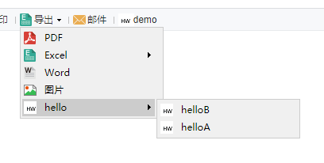

# ExtensionButtonProvider

| 属性 | 值 |
| --- | --- |
| 所属模块 | extra-report |
| 完整类名 | `com.fr.report.fun.ExtensionButtonProvider` |
| 官方文档 | [查看文档](https://wiki.fanruan.com/display/PD/ExtensionButtonProvider) |

---

## 一、特殊名词介绍

无

## 二、背景、场景介绍

帆软报表产品中允许用户自行对导出文件类型进行扩展，一般会配合ToolbarItemProvider接口在设计器上添加工具栏选项。而ExtensionButtonProvider接口则对应的用于报表自带的导出菜单按钮的选项扩展。

同时因为ExtensionButtonProvider接口本身难以独立生效，所以本文会同时介绍与之共存的另外一个接口ExportToolBarProvider



## 三、接口介绍


```java
package com.fr.report.fun;

import com.fr.form.ui.Widget;
import com.fr.stable.fun.mark.Mutable;
import com.fr.stable.xml.XMLable;

/**
 * 
 * @author focus
 * @date Jul 1, 2015
 * @since 8.0
 * 导出菜单接口,用于添加其他的导出方式，菜单目前只支持两级目录
 * 
 */
public interface ExtensionButtonProvider extends XMLable, Mutable{

	int CURRENT_LEVEL = 2;
	String XML_TAG = "ExtensionButtonProvider";
	
    /**
     * 导出菜单的实现类，该类可以继承自com.fr.form.ui.ToolBarMenuButton 或者 com.fr.form.ui.ToolBarButton;
     * @return 控件类
     */
    Class<? extends Widget> classForDirectoryButton();
	
    /**
     * 父目录
     * @return 父目录名称
     */
	 String getParentDirectory();
	
	/**
	 * 本层目录名称
	 * 
	 * @return 同上
	 */
	 String getType();
	
	/**
	 * 菜单项在设计器端对应的checkbox名称（用以控制是否在web端显示）
	 * 
	 * @return 同上
	 */
	 String getRelatedCheckBoxTitle();
	
	/**
	 * 该目录是否在web段显示
	 * 
	 * @return 同上
	 */
	 boolean isSelected();
	
	/**
	 * 设置目录是否在web端显示
	 * 
	 * @param isSelected 是否显示
	 */
	 void setSelected(boolean isSelected);
	
}

```


```java
package com.fr.design.fun;

import com.fr.plugin.injectable.SpecialLevel;
import com.fr.stable.fun.mark.Mutable;

import javax.swing.*;

/**
 * 导出菜单设计器端拓展，用于控制该菜单是否在web端显示
 */
public interface ExportToolBarProvider extends Mutable{
	
	String XML_TAG = SpecialLevel.ExportToolBarProvider.getTagName();

	int CURRENT_LEVEL = 1;

	/**
	 *
	 * 用于添加 控制web端是否显示该菜单的checkbox的面板
	 * 
	 * @param pane 面板
	 * @return 该面板
	 */
	JPanel updateCenterPane(JPanel pane);
	
	/**
	 * 更新界面
	 */
	void populate();
	
	/**
	 * 保存界面设置
	 */
	void update();
}

```

## 四、支持版本

| 产品线 | 版本 | 支持情况 | 备注 |
| --- | --- | --- | --- |
| FR | 8.0 | 支持 |  |
| FR | 9.0 | 支持 |  |
| FR | 10.0 | 支持 |  |
| FR | 11.0 | 支持 |
| BI | 3.6 | 支持 | 不支持BI的仪表板 |
| BI | 4.0 | 支持 | 不支持BI的仪表板 |
| BI | 5.1 | 支持 | 不支持BI的仪表板 |
| BI | 5.1.2 | 支持 | 不支持BI的仪表板 |
| BI | 5.1.3 | 支持 | 不支持BI的仪表板 |

## 五、插件注册


```xml
<extra-report>
        <ExtensionButtonProvider class="your class name"/>
</extra-report>
<extra-designer>
        <ExportToolBarProvider class="your class name"/>
</extra-designer>
```

## 六、原理说明


```java
package com.fr.report.web.button;

import com.fr.base.IconManager;
import com.fr.base.TemplateUtils;
import com.fr.form.ui.Button;
import com.fr.form.ui.ToolBarMenuButton;
import com.fr.general.ComparatorUtils;
import com.fr.log.FineLoggerFactory;
import com.fr.report.ExtraReportClassManager;
import com.fr.report.fun.ExtensionButtonProvider;
import com.fr.stable.xml.XMLPrintWriter;
import com.fr.stable.xml.XMLableReader;

import java.util.ArrayList;
import java.util.HashMap;
import java.util.Iterator;
import java.util.List;
import java.util.Map;
import java.util.Set;

/**
 * 分页预览时报表工具栏上的”导出“菜单按钮，它可以有PDF、Excel、Word、图片、HTML五个导出子菜单，
 * 而其中的Excel导出子菜单又可以有分页导出、原样导出、分页分sheet导出三个Excel导出子菜单
 */
public final class Export extends ToolBarMenuButton {
    private boolean pdfAvailable = true;
    private boolean excelPAvailable = true;
    private boolean excelOAvailable = true;
    private boolean excelSAvailable = true;
    private boolean wordAvailable = true;
    private boolean imageAvailable = true;
    private boolean htmlAvailabel = true;

    // 父目录列表
    private List<ExtensionButtonProvider> parentDerectorys;
    // 父子目录对应关系map
    private Map<ExtensionButtonProvider, List<ExtensionButtonProvider>> options;
    // 子目录有被勾选的目录
    private Map<ExtensionButtonProvider, List<ExtensionButtonProvider>> selectedOptions;

    public Export() {
        super(TemplateUtils.i18nTpl("Export"), IconManager.EXPORT.getName());
        initCompoents();
    }

    // 初始化拓展的目录
    private void initCompoents() {
        Set<ExtensionButtonProvider> exportBtnAdapters = ExtraReportClassManager.getInstance().getArray(ExtensionButtonProvider.XML_TAG);
        initExtraParentDerectory(exportBtnAdapters);
        initExtraOptions(exportBtnAdapters);
        initExtraSelectedOptions();
    }

    // 初始化父目录
    private void initExtraParentDerectory(Set<ExtensionButtonProvider> exportBtnAdapters) {
        if (exportBtnAdapters != null) {
            for (ExtensionButtonProvider provider : exportBtnAdapters) {
                if (provider.getParentDirectory() == null) {
                    if (parentDerectorys == null) {
                        parentDerectorys = new ArrayList<ExtensionButtonProvider>();
                    }
                    parentDerectorys.add(provider);
                }
            }
        }
    }

    // 初始化父子目录关系
    private void initExtraOptions(Set<ExtensionButtonProvider> exportBtnAdapters) {
        if (parentDerectorys != null) {
            for (int j = 0; j < parentDerectorys.size(); j++) {
                ExtensionButtonProvider parent = parentDerectorys.get(j);
                List<ExtensionButtonProvider> childItems = new ArrayList();
                for (ExtensionButtonProvider exportBtnAdapter : exportBtnAdapters) {
                    if (exportBtnAdapter.getParentDirectory() != null) {
                        if (ComparatorUtils.equals(parent.getType(), exportBtnAdapter.getParentDirectory())) {
                            childItems.add(exportBtnAdapter);
                        }
                    }
                    if (options == null) {
                        options = new HashMap<ExtensionButtonProvider, List<ExtensionButtonProvider>>();
                    }
                    options.put(parent, childItems);
                }

            }
        }
    }

    // 初始化子目录有被选中的目录
    private void initExtraSelectedOptions() {
        if (options != null) {
            boolean flag = false;
            Iterator<ExtensionButtonProvider> it = options.keySet().iterator();
            while (it.hasNext()) {
                ExtensionButtonProvider key = it.next();
                List<ExtensionButtonProvider> childItems = options.get(key);
                for (int i = 0; i < childItems.size(); i++) {
                    if (childItems.get(i).isSelected()) {
                        flag = true;
                        break;
                    }
                }
                if (flag) {
                    if (selectedOptions == null) {
                        selectedOptions = new HashMap<ExtensionButtonProvider, List<ExtensionButtonProvider>>();
                    }
                    selectedOptions.put(key, childItems);
                }
            }
        }
    }

    /**
     * 返回是否显示PDF导出按钮
     *
     * @return 如果显示PDF导出按钮则返回true
     */
    public boolean isPdfAvailable() {
        return pdfAvailable;
    }

    /**
     * 设置是否显示PDF导出按钮
     *
     * @param pdfAvailable true表示显示PDF导出按钮
     */
    public void setPdfAvailable(boolean pdfAvailable) {
        this.pdfAvailable = pdfAvailable;
    }

    /**
     * 返回是否显示Word导出按钮
     *
     * @return 如果显示Word导出按钮则返回true
     */
    public boolean isWordAvailable() {
        return wordAvailable;
    }

    /**
     * 设置是否显示Word导出按钮
     *
     * @param wordAvailable true表示显示Word导出按钮
     */
    public void setWordAvailable(boolean wordAvailable) {
        this.wordAvailable = wordAvailable;
    }

    /**
     * 返回是否显示Excel分页导出按钮
     *
     * @return 如果显示Excel分页导出按钮则返回true
     */
    public boolean isExcelPAvailable() {
        return excelPAvailable;
    }

    /**
     * 设置是否显示Excel分页导出按钮
     *
     * @param excelPAvailable true表示显示Excel分页导出按钮
     */
    public void setExcelPAvailable(boolean excelPAvailable) {
        this.excelPAvailable = excelPAvailable;
    }

    /**
     * 返回是否显示Excel原样导出按钮
     *
     * @return 如果显示Excel原样导出按钮则返回true
     */
    public boolean isExcelOAvailable() {
        return excelOAvailable;
    }

    /**
     * 设置是否显示Excel原样导出按钮
     *
     * @param excelOAvailable true表示显示Excel原样导出按钮
     */
    public void setExcelOAvailable(boolean excelOAvailable) {
        this.excelOAvailable = excelOAvailable;
    }

    /**
     * 返回是否显示Excel分页分sheet导出按钮
     *
     * @return 如果显示Excel分页分sheet导出按钮则返回true
     */
    public boolean isExcelSAvailable() {
        return excelSAvailable;
    }

    /**
     * 设置是否显示Excel分页分sheet导出按钮
     *
     * @param excelSAvailable true表示显示Excel分页分sheet导出按钮
     */
    public void setExcelSAvailable(boolean excelSAvailable) {
        this.excelSAvailable = excelSAvailable;
    }

    /**
     * 返回是否显示Excel导出按钮，显示的前提是分页导出、原样导出、分页分sheet导出至少有一个是需要显示的
     *
     * @return 如果显示Excel导出按钮则返回true
     */
    public boolean isExcelAvailable() {
        return excelPAvailable || excelOAvailable || excelSAvailable;
    }


    /**
     * 设置是否显示图片导出按钮
     *
     * @param imageAvailable true表示显示图片导出按钮，false表示不显示
     */
    public void setImageAvailable(boolean imageAvailable) {
        this.imageAvailable = imageAvailable;
    }

    /**
     * 返回是否显示图片导出按钮
     *
     * @return 如果显示图片导出按钮则返回true
     */
    public boolean isImageAvailable() {
        return imageAvailable;
    }

    /**
     * 返回是否显示HTML导出按钮
     *
     * @return 如果显示HTML导出按钮则返回true
     */
    public boolean isHtmlAvailabel() {
        return htmlAvailabel;
    }

    /**
     * 设置是否显示HTML导出按钮
     *
     * @param htmlAvailabel true表示显示导出按钮，否则不显示导出按钮
     */
    public void setHtmlAvailabel(boolean htmlAvailabel) {
        this.htmlAvailabel = htmlAvailabel;
    }

    /**
     * 是否支持移动端
     *
     * @return 不支持返回false
     */
    public boolean supportMobile() {
        return false;
    }


    @Override
    public String getXType() {
        return ButtonTypeConstants.EXCEL_MENU;
    }

    /**
     * 返回菜单按钮下拉出来的子菜单按钮的一个数组对象
     *
     * @return 子菜单按钮的数组
     */
    public Button[] createMenuItems() {
        java.util.List list = new ArrayList();
        if (pdfAvailable) {
            list.add(new PDF());
        }
        if (isExcelAvailable()) {
            list.add(new Excel(excelPAvailable, excelOAvailable, excelSAvailable));
        }
        if (wordAvailable) {
            list.add(new Word());
        }
        if (imageAvailable) {
            list.add(new Image());
        }

        if (selectedOptions != null) {
            Iterator<ExtensionButtonProvider> it = selectedOptions.keySet().iterator();
            while (it.hasNext()) {
                ExtensionButtonProvider adapter = it.next();
                Class export = adapter.classForDirectoryButton();
                try {
                    if (export != null) {
                        Button button = (Button) export.newInstance();
                        list.add(button);
                    }
                } catch (InstantiationException e) {
                    FineLoggerFactory.getLogger().error(e.getMessage(), e);
                } catch (IllegalAccessException e) {
                    FineLoggerFactory.getLogger().error(e.getMessage(), e);
                }
            }
        }


        //23452 屏蔽HTML输出, 功能需要进一步完善
//		if (htmlAvailabel) {
//			list.add(new HTML());
//		}

        return (Button[]) list.toArray(new Button[list.size()]);
    }

    private void readExtraXML(XMLableReader reader) {
        if (selectedOptions != null && !selectedOptions.isEmpty()) {
            Iterator<ExtensionButtonProvider> it = selectedOptions.keySet().iterator();
            while (it.hasNext()) {
                List<ExtensionButtonProvider> adapters = (List<ExtensionButtonProvider>) selectedOptions.get(it.next());
                for (int i = 0; i < adapters.size(); i++) {
                    adapters.get(i).readXML(reader);
                }
            }
        }
    }


    /**
     * 读取XML
     *
     * @param reader XML读取对象
     */
    public void readXML(XMLableReader reader) {
        super.readXML(reader);
        readExtraXML(reader);
        if (reader.isChildNode()) {
            if (reader.getTagName().equals("Buttons")) {
                Export.this.setPdfAvailable(reader.getAttrAsBoolean("pdf", true));
                Export.this.setWordAvailable(reader.getAttrAsBoolean("word", true));
                Export.this.setExcelPAvailable(reader.getAttrAsBoolean("excelP", true));
                Export.this.setExcelOAvailable(reader.getAttrAsBoolean("excelO", true));
                Export.this.setExcelSAvailable(reader.getAttrAsBoolean("excelS", true));
                Export.this.setImageAvailable(reader.getAttrAsBoolean("image", true));
                Export.this.setHtmlAvailabel(reader.getAttrAsBoolean("html", true));
            }
        }
    }


    /**
     * 写入XML
     *
     * @param writer xml写入对象
     */
    public void writeExtraXML(XMLPrintWriter writer) {
        if (selectedOptions != null && !selectedOptions.isEmpty()) {
            Iterator it = selectedOptions.keySet().iterator();
            while (it.hasNext()) {
                List<ExtensionButtonProvider> adapters = (List<ExtensionButtonProvider>) selectedOptions.get(it.next());
                for (int i = 0; i < adapters.size(); i++) {
                    adapters.get(i).writeXML(writer);
                }
            }
        }
    }

    /**
     * 写入XML
     *
     * @param writer xml写入对象
     */
    public void writeXML(XMLPrintWriter writer) {
        super.writeXML(writer);
        writeExtraXML(writer);
        writer.startTAG("Buttons")
                .attr("pdf", pdfAvailable)
                .attr("excelP", excelPAvailable)
                .attr("excelO", excelOAvailable)
                .attr("excelS", excelSAvailable)
                .attr("word", wordAvailable)
                .attr("image", imageAvailable)
                .attr("html", htmlAvailabel)
                .end();
    }

    /**
     * 判断当前对象是否和指定的对象相等
     *
     * @param obj 指定的要比较的对象
     * @return 如果两个对象相等则返回true，否则返回false
     */
    public boolean equals(Object obj) {
        return obj instanceof Export && super.equals(obj)
                && ((Export) obj).excelPAvailable == excelPAvailable
                && ((Export) obj).excelOAvailable == excelOAvailable
                && ((Export) obj).excelSAvailable == excelSAvailable
                && ((Export) obj).imageAvailable == imageAvailable
                && ((Export) obj).pdfAvailable == pdfAvailable
                && ((Export) obj).wordAvailable == wordAvailable
                && ((Export) obj).htmlAvailabel == htmlAvailabel;
    }
}
```

模板加载打开web属性编辑导出按钮时，会通过Export对插件申明的导出菜单扩展接口进行加载，并且根据ExportToolBarProvider接口进行设计器的渲染，具体逻辑可以参照上面代码示例，注意其中接口实例在selectedOptions对象中的调用。

## 七、特殊限制说明

ExtensionButtonProvider接口除极特殊情况之外，都要配合ExportToolBarProvider接口才能完整的生效。

就ExtensionButtonProvider接口而言

1.如果我们扩展的菜单不存在二级细分菜单，则可以直接继承AbstractExtensionButton实现即可

2.如果我们扩展的菜单存在二级细分菜单，则必须继承AbstractExtensionMenuButton并实现其中的createMenuItems方法

同时因为目前该接口本身存在的缺陷，在实现该接口时开发者必须自己创建一个bool变量保存，菜单的选择状态。且该布尔变量初始必须为true

同时开发的实例必须包含一个无参构造、通过名称和图标别名进行构造，且需要注册对应的图标SundryKit.loadToolbarIcon(别名, 图标路径);

getParentDirectory表示父级菜单的名称，一级菜单直接返回空即可，二级菜单返回值与一级菜单的getType返回值相同。

需要开发者自己实现xml的独写，该接口不支持服务器配置。

因为接口实际要实现的方法和对应关系还是较为复杂的，建议开发者在开始使用这个接口时，尽量仿照demo代码去实现比较稳妥

## 八、常用链接

demo地址：[demo-extension-button-provider](https://code.fanruan.com/hugh/demo-extension-button-provider)

(1)、三组开放web服务接口的插件接口对比

(1)、三组常见引入JS和CSS的插件接口对比

(1)、导出接口关系和运用详解

## 九、开源案例

免责声明：所有文档中的开源示例，均为开发者自行开发并提供。仅用于参考和学习使用，开发者和官方均无义务对开源案例所涉及的所有成果进行教学和指导。若作为商用一切后果责任由使用者自行承担。

[demo-export-xml](https://code.fanruan.com/fanruan/demo-export-xml/src/branch/master/src/main/java/com/fr/plugin/export/xml/ui/XmlExportToolbarUI.java)
