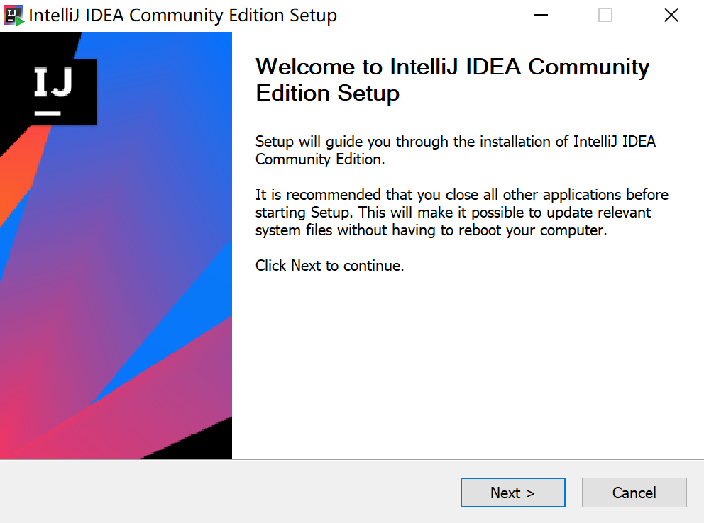

# 必备工具安装和配置

> 请注意：在配置环境变量之后，需要**重启 cmd 命令行**才能使相关配置生效。

> 从 2020 年 6 月起，插件开发工程和插件构建均切换为使用现代构建工具 **Gradle**，具体可参阅后续的文档。

---

## 安装 JDK

自 2019 年 1 月起，Oracle JDK 开始收费，建议使用 Oracle JDK 1.8.0_201 之前的版本，或改用 [Amazon Corretto JDK](https://docs.aws.amazon.com/corretto/latest/corretto-8-ug/downloads-list.html)。

选择适合您操作系统的版本下载安装。安装完成后，在命令行执行：

```bash
java -version
```

若输出如下内容，说明安装成功：

```
java version "1.8.0_181"
Java(TM) SE Runtime Environment (build 1.8.0_181-b13)
Java HotSpot(TM) 64-Bit Server VM (build 25.181-b13, mixed mode)
```

---

## 安装 Gradle

Gradle 用于管理插件开发工程配置、依赖下载和构建打包，推荐使用 **6.4 版本**。

下载地址（二选一）：

- 帆软提供（推荐）：[gradle-6.4-bin.zip](https://fine-doc.oss-cn-shanghai.aliyuncs.com/tools/gradle-6.4-bin.zip)
- 官方地址：[https://services.gradle.org/distributions](https://services.gradle.org/distributions)

下载后解压，并将 `bin` 目录添加到系统环境变量 `PATH` 中。配置完成后，在命令行执行：

```bash
gradle -v
```

若输出如下内容，说明安装成功：

```
------------------------------------------------------------
Gradle 6.4
------------------------------------------------------------

Build time:   ...
Revision:     ...

Kotlin:       ...
Groovy:       ...
Ant:          ...
JVM:          1.8.0_181 (Oracle Corporation 25.181-b13)
OS:           ...
```

---

## 安装 Git

Git 用于管理插件开发工程源码，以及下载插件开发示例（可选，但强烈推荐）。

下载地址（二选一）：

- 帆软提供：[Git-2.27.0-64-bit.exe](https://fine-doc.oss-cn-shanghai.aliyuncs.com/tools/Git-2.27.0-64-bit.exe)（Windows）
- 官方地址：[https://git-scm.com/](https://git-scm.com/)

安装完成后，在命令行执行：

```bash
git --version
```

若输出如下内容，说明安装成功：

```
git version 2.27.0.windows.1
```

> **注意**：Git 不是必须的，但为了方便下载插件开发示例，强烈推荐安装。也可以使用 IntelliJ IDEA 内置的 Git 工具替代。

---

## 安装 IntelliJ IDEA

IntelliJ IDEA 是插件开发的 IDE，推荐下载 **社区版（Community Edition）**。

下载地址（二选一）：

- 官方地址：[https://www.jetbrains.com/idea/download](https://www.jetbrains.com/idea/download)
- 帆软提供：
  - Windows：[ideaIC-2020.2.exe](https://fine-doc.oss-cn-shanghai.aliyuncs.com/tools/ideaIC-2020.2.exe)
  - Mac：[ideaIC-2020.2.dmg](https://fine-doc.oss-cn-shanghai.aliyuncs.com/tools/ideaIC-2020.2.dmg)

下载完成后，按照安装向导完成安装：



---

## 老版本：使用 Ant 构建插件的文档

<details>
<summary>点击展开（仅适用于 2020 年 6 月之前的旧版本工程）</summary>

### 安装 Ant

Ant 用于构建插件包。点击 [此处](http://ant.apache.org/) 下载 Ant，并参照教程配置环境变量。安装完成后，在命令行执行：

```bash
ant -version
```

若输出如下内容，说明安装成功：

```
Apache Ant(TM) version 1.10.3 compiled on March 24 2018
```

### 安装 Maven

Maven 用于管理插件开发工程配置和依赖下载。点击 [此处](http://maven.apache.org/download.html) 下载 Maven，并参照教程配置环境变量。安装完成后，在命令行执行：

```bash
mvn -v
```

若输出如下内容，说明安装成功：

```
Apache Maven 3.5.4 (1edded0938998edf8bf061f1ceb3cfdeccf443fe; 2018-06-18T02:33:14+08:00)
Maven home: C:\Apache\apache-maven-3.5.4\bin\..
Java version: 1.8.0_181, vendor: Oracle Corporation, runtime: C:\Program Files\Java\jre1.8.0_181
Default locale: zh_CN, platform encoding: GBK
OS name: "windows 10", version: "10.0", arch: "amd64", family: "windows"
```

</details>
