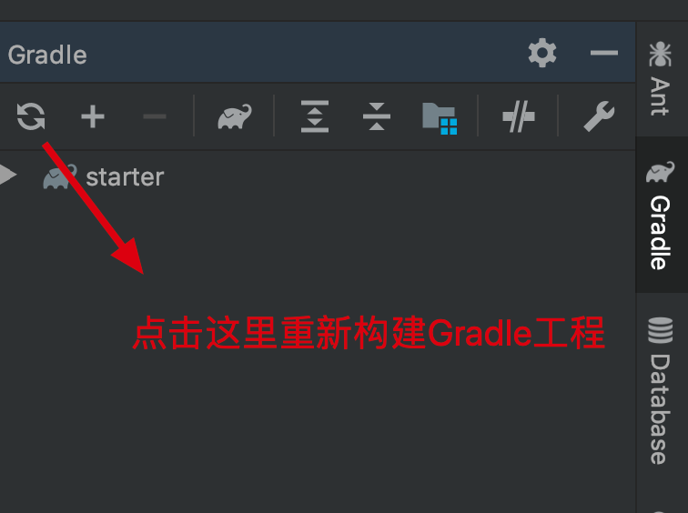
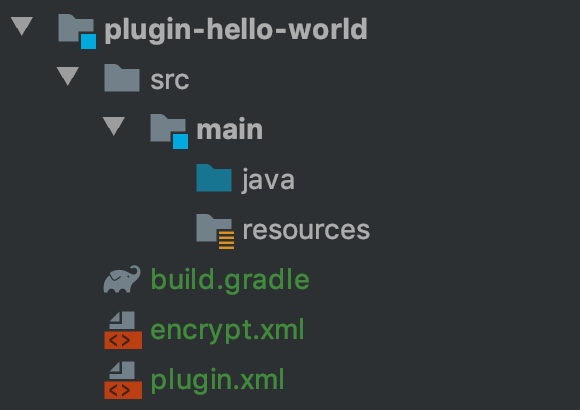

# 使用模板创建插件（Gradle）

通过前面几节的学习，我们已经学会了插件开发工程的配置、插件的开发和调试等基本操作，但到目前为止，我们都还只是使用插件开发工程中的示例插件，还没有新建一个完全由自己创建的插件。

---

## 新建插件

1. 在 `report-starter-latest` 目录下，新建一个目录，这里假设为 `plugin-hello-world`。

2. 将 `plugin-function` 中的 **plugin.xml**（用于描述插件接入点信息）以及 **build.gradle**（用于管理插件 jar 包依赖）、**encrypt.xml** 复制到 `plugin-hello-world` 目录下，然后对 `plugin.xml` 的内容稍作修改。

   修改后的文件内容如下：

   ```xml
   <?xml version="1.0" encoding="UTF-8" standalone="no"?>
   <plugin>
       <id>com.fr.plugin.function.hello.world</id>
       <name><![CDATA[Hello World]]></name>
       <active>yes</active>
       <version>1.0</version>
       <env-version>11.0</env-version>
       <jartime>2025-06-15</jartime>
       <vendor>author</vendor>
       <description><![CDATA[Hello]]></description>
       <change-notes><![CDATA[
         [2019-07-15]initialize the plugin<br/>
       ]]></change-notes>
       <extra-core>
           <FunctionDefineProvider class="com.fr.plugin.HelloWorld" name="hw" description="Hello World。"/>
       </extra-core>
       <function-recorder class="com.fr.plugin.HelloWorld"/>
   </plugin>
   ```

3. 在 `plugin-hello-world` 下新建用于存放 Java 源码的目录和用于存放其他资源文件的目录：

   - `src/main/java`
   - `src/main/resources`

---

## 插件依赖管理

在 `report-starter-latest/settings.gradle` 中增加一行：

```
include(':plugin-hello-world')
```

完成之后，在 IntelliJ IDEA 右侧边栏打开 Gradle 面板，点击刷新：



等待 IntelliJ IDEA 解析完 Gradle 配置之后，就可以看到 `java` 目录和 `resources` 目录都变样式了：



这里就可以直接在 `java` 目录下增加插件的实现类。

---

## 第三方依赖

插件开发过程中，通常还会依赖一些非 FineReport/FineBI 内置的 jar，只需要把这些 jar 拷贝到插件工程的 `lib` 根目录下即可（没有就新建一个）。

---

## 概要总结

通过 Gradle，我们可以不用关注插件的依赖关系在 IntelliJ IDEA 的管理，简化我们的开发过程。