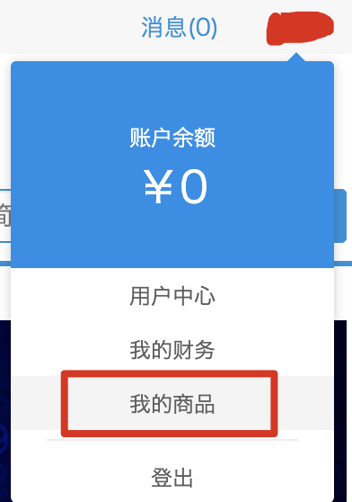

# 发布插件包

在前面的章节中，我们已经学会了如何开发、调试和打包插件，但还无法把自己开发的插件展示和售卖给大量的 FineReport/FineBI 用户。本节介绍如何将插件发布到帆软市场。

---

## 注册账号

访问 [https://market.fanruan.com](https://market.fanruan.com)（帆软市场），如果还没有账号，点击右上角的登录/注册：

如果没有账号，就注册一个；如果已经有账号，直接输入账号密码登录即可。

---

## 插件上传

成功进入帆软市场后，从右上角进入个人中心：

切换到添加新商品页面，直接将自己构建好的插件包拖拽到上传区域上传即可。

---

## 等待审核

成功上传后，等待帆软市场审核员审核通过，即可在帆软市场查看到自己的插件了。
