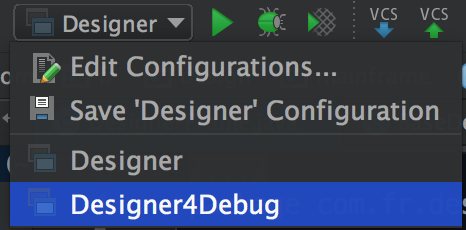
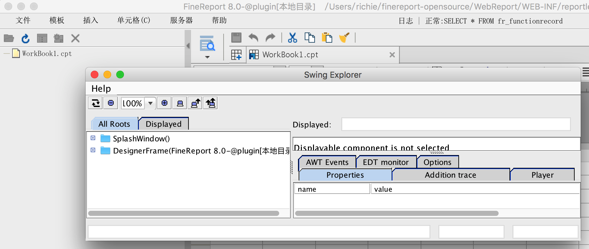
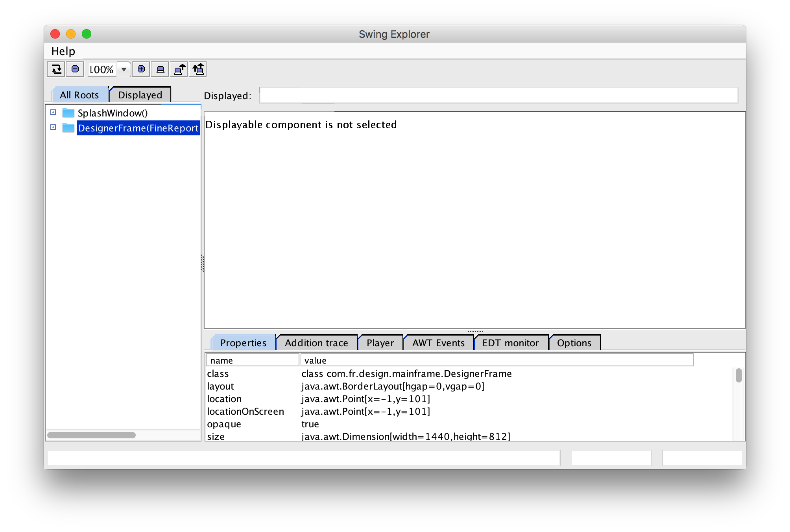
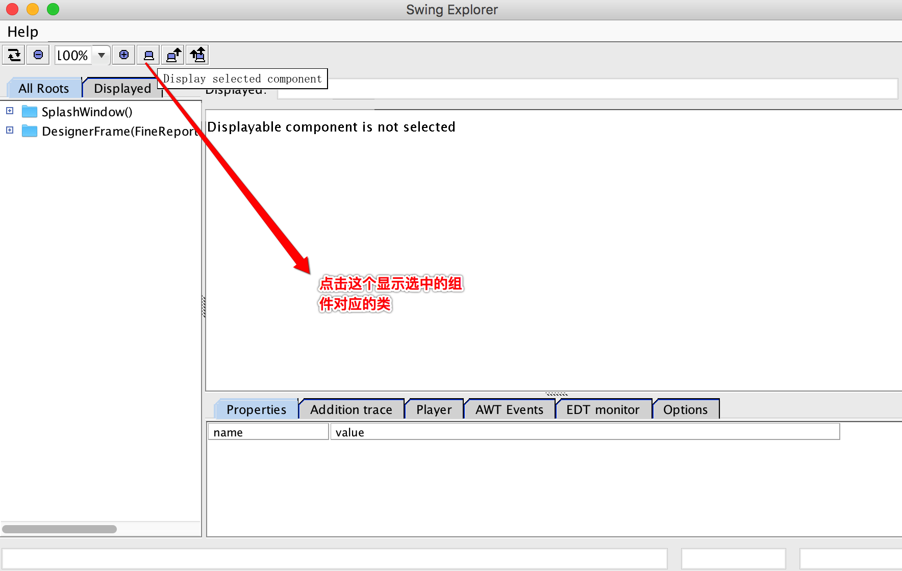
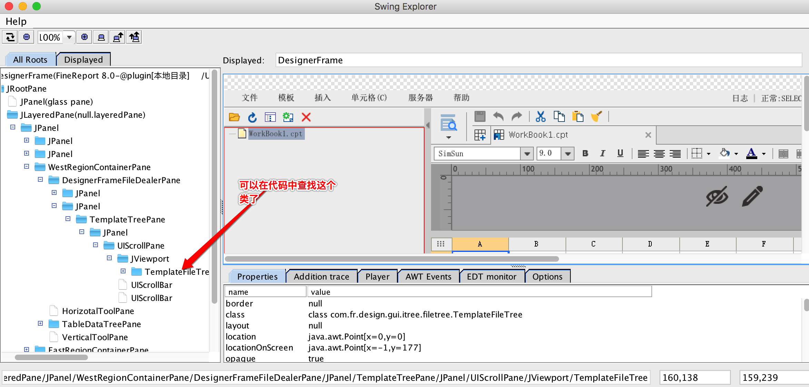
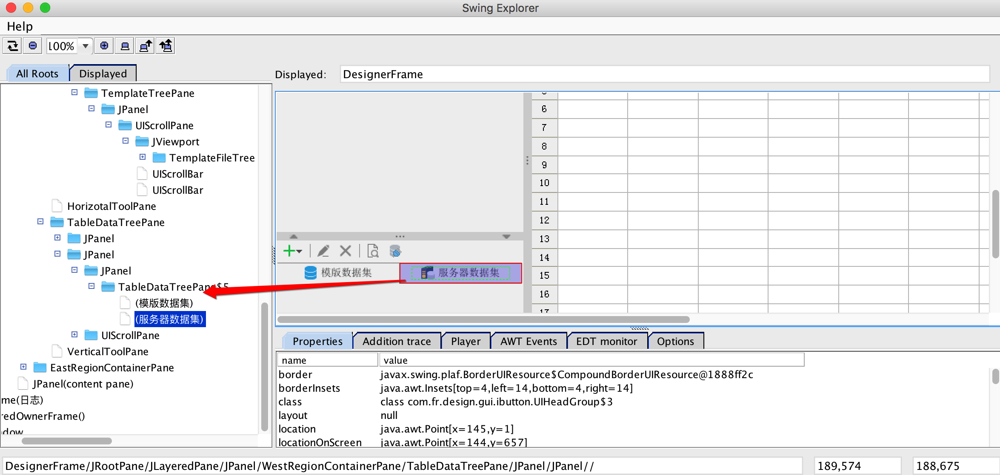
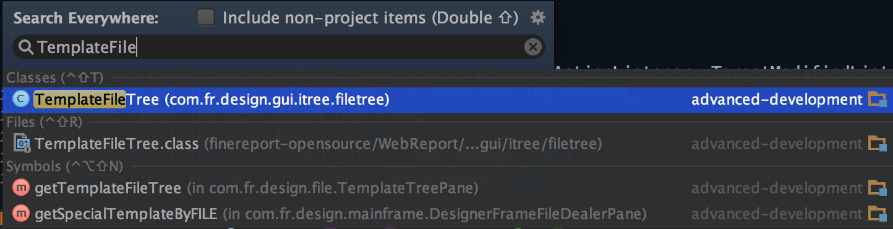

## 使用 Designer4Debug 定位组件源码

在开发过程中，经常需要定位设计器 UI 上某个组件所对应的源码类。可以通过 **Designer4Debug + SwingExplorer** 进行可视化定位。

### 步骤

1. 确保使用最新的[设计器源码](https://github.com/finereport-overseas/report-starter-11)。

2. 启动设计器时选择 **Designer4Debug**，即使用主函数 `com.fr.start.Designer4Debug`：

   

3. 启动后会同时打开设计器和一个 **Swing Explorer** 窗口：

   

4. 将 Swing Explorer 窗口置于前端，选中其中的树节点：

   

5. 点击 **"Display selected component"** 按钮：

   

6. 此后，Swing Explorer 的组件显示区域会实时展示设计器的界面内容。

7. 在设计器中点击想要查找的组件，左侧代码树上会定位到该组件对应的类：

   

   

8. 在 IDE 中搜索该类即可找到源码：

   

9. **查找弹出对话框中的组件**：切换到设计器窗口，点击相应菜单将对话框弹出，再切换回 Swing Explorer 点击刷新，即可看到新的对话框并按上述步骤定位。
