# JavaScript 调试

调试技巧在任何一项技术研发中都是必不可少的技能。掌握各种调试技巧，必定能在工作中起到事半功倍的效果：快速定位问题、降低故障概率、帮助分析逻辑错误等等。本文将一一讲解各种前端 JS 调试技巧。

---

## Alert 调试

Alert 是最原始的调试方式。在 IE6 为主的早期时代，JS 调试功能非常弱，只能通过 `window.alert()` 来调试：

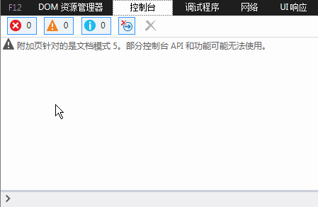

虽然原始，但即便是今天，alert 在某些场合依然有其用武之地。

---

## Console 调试

随着前端开发越来越复杂，alert 的弊端逐渐显现：弹窗遮挡页面、阻断渲染、调试代码需手动清理。现代浏览器相继推出了 JS 调试控制台，支持 `console.log(xxx)` 的形式在控制台打印调试信息。

以 IE 为例：

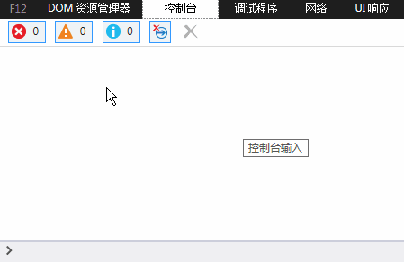

Chrome 为 Console 扩展了更丰富的功能：

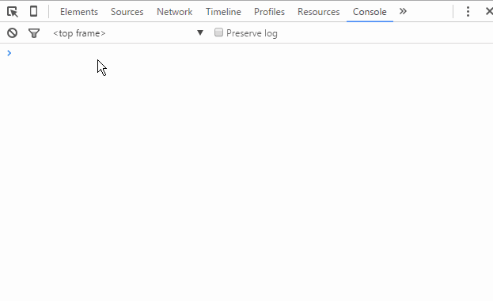

Chrome 开发团队的想象力更进一步：

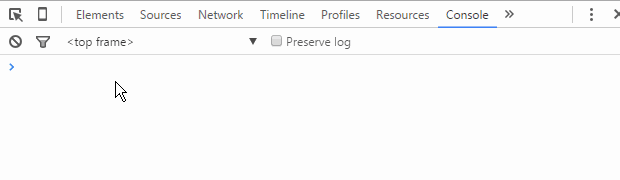

> **提示**：如果在使用 `console` 对象前先做存在性验证，不删除调试代码也不会影响业务逻辑。但为了代码整洁，调试完成后仍应尽量删除。

---

## JS 断点调试

> 断点，调试器的功能之一，可以让程序中断在需要的地方，从而方便分析。——百度百科

JS 断点调试，即在浏览器开发者工具中为 JS 代码添加断点，让 JS 执行到某一特定位置停住，方便开发者对该处代码段进行分析与逻辑处理。

示例代码如下——一个传入两个数并加上随机整数后返回总和的函数：

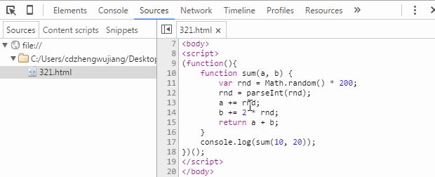

### 方法一：Console 验证

通过在代码中插入 `console.log()` 打印变量来验证逻辑：

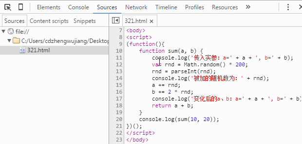

### 方法二：Sources 断点

在 Chrome 开发者工具的 Sources 面板中直接添加断点：

1. `F12`（或 `Ctrl + Shift + I`）打开开发者工具
2. 点击 **Sources** 菜单
3. 在左侧文件树中找到对应文件
4. 点击行号列，即可添加/删除断点

断点触发后，可在 Sources 界面看到当前作用域中的所有变量和值。

#### 控制面板说明

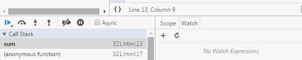

各图标功能（从左到右）：

| 图标 | 功能 |
|------|------|
| Pause/Resume | 暂停/恢复脚本执行（执行到下一断点停止） |
| Step over | 执行到下一步的函数调用（跳到下一行） |
| Step into | 进入当前函数 |
| Step out | 跳出当前执行函数 |
| Deactivate/Activate all | 关闭/开启所有断点（不会取消） |
| Pause on exceptions | 异常情况自动断点设置 |

逐行执行查看变量变化的效果：

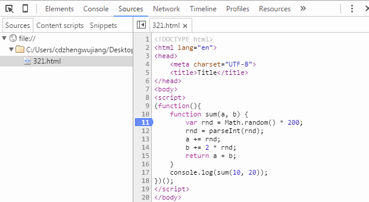

其余功能键演示：

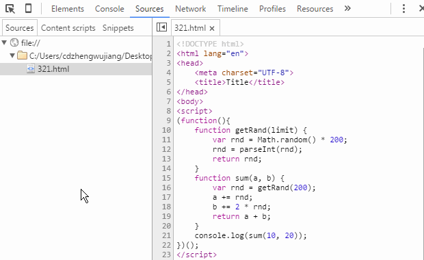

> **注意**：在断点状态下查看变量值是较新版本 Chrome 才支持的功能。旧版本可将鼠标悬停于变量名上查看，或右键 "Add to watch" 在 Watch 面板查看，也可切换到 Console 面板直接输入变量名回车查看。

---

## Debugger 断点

通过在代码中插入 `debugger;` 语句，代码执行到该位置时会自动断点，效果与 Sources 面板断点一致。

**使用场景**：对于动态/异步加载的 HTML 片段中内嵌的 JS 代码，Sources 面板中无法找到对应文件，无法直接打断点，此时 `debugger;` 语句就非常有用。

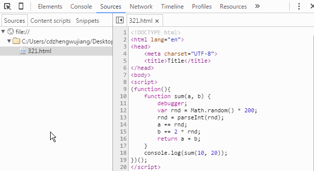

> 调试完成后需删除 `debugger;` 语句。

---

## DOM 断点调试

DOM 断点在 DOM 元素上添加断点，当元素状态变化时触发，最终定位到对应的 JS 逻辑。

在 Chrome 开发者工具的 **Elements** 面板中，右键 DOM 节点即可设置 DOM 断点。

### 子节点变化时断点（Break on subtree modifications）

当节点的子节点发生增加、删除或顺序交换时触发断点：

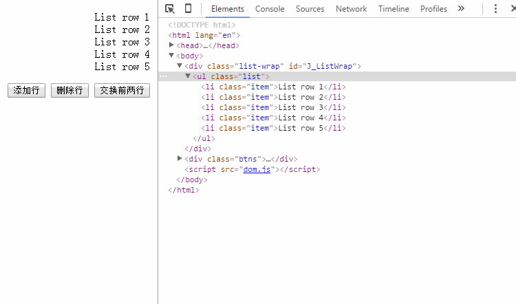

> 注意：对子节点进行**属性修改**或**内容修改**不会触发此断点。

### 节点属性变化时断点（Break on attributes modifications）

当节点的属性（包括 `data-*` 自定义属性）发生变化时触发断点：

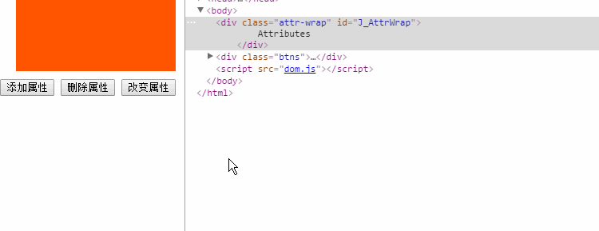

> 注意：对**子节点**属性的操作不会触发节点本身的此类断点。

### 节点被移除时断点（Break on node removal）

当节点被删除（如 `parentNode.removeChild(childNode)`）时触发断点。此方式使用较少。

---

## XHR Breakpoints

专为异步请求而生的断点调试功能。

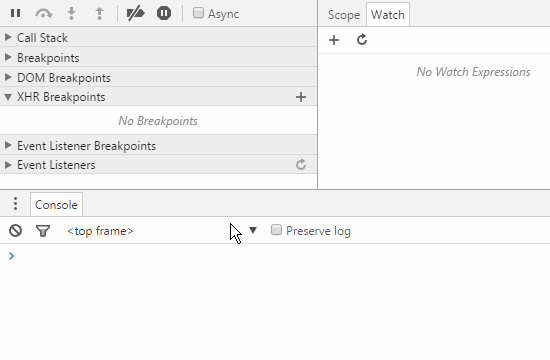

通过 "XHR Breakpoints" 右侧的 `+` 号添加断点条件，当异步请求的 URL 满足条件时自动断点，实际断点位置为 `xhr.send()` 语句处。

**优势**：可自定义断点规则，针对某一批、某一个乃至所有异步请求进行断点设置。

---

## Event Listener Breakpoints

事件监听器断点，根据事件名称进行断点设置。当事件被触发时，断点到事件绑定的位置。支持鼠标、键盘、动画、定时器、XHR 等所有页面及脚本事件。

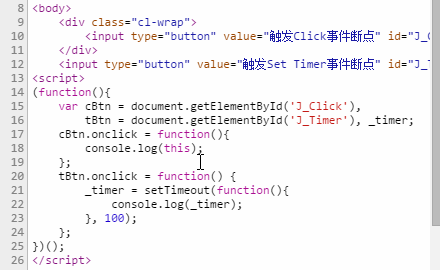

示例演示了：
- `click` 事件被触发时断点
- `setTimeout` 被设置时断点

---

调试是项目开发中非常重要的环节，不仅可以帮助快速定位问题，还能节省开发时间。熟练掌握各种调试手段，需要不断积累经验，在不同场景中选择最合适的方式。
