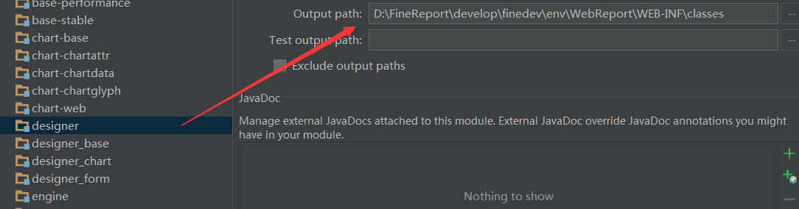
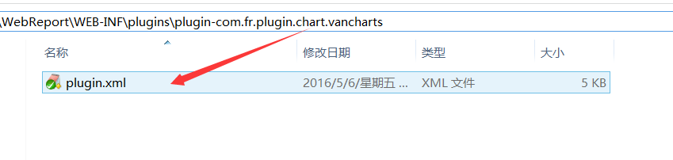
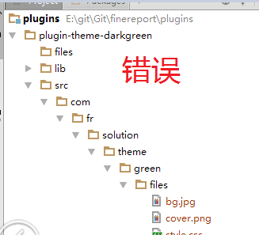
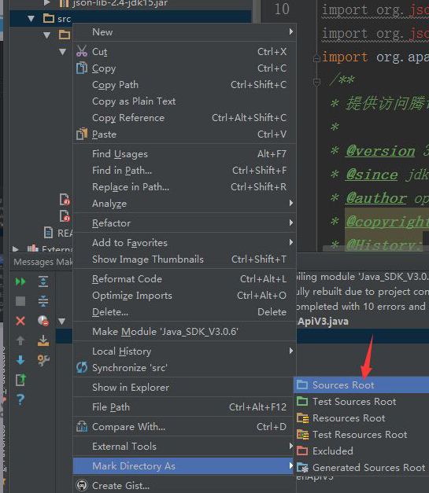

# 插件安装失败

当插件无法在设计器中正常加载时，可按以下步骤逐一排查。

---

## 1. 检查插件编译路径

确保插件工程**编译成功**，且与 designer 工程的 class 输出路径一致。若出现 `ClassNotFoundException`，很可能是工程未编译，或未输出到同一目录。

- 配置成同一路径后，需要**手动重新编译**，然后到该路径下确认 `.class` 文件是否已生成。
- 如果没有插件源码，则需要让 designer 工程依赖插件的 jar 包。



---

## 2. 检查 plugin.xml

打开当前设计器所用 Env 的路径，确保以下文件存在且内容正确：

```
WebReport/WEB-INF/plugins/{yourplugin}/plugin.xml
```

**注意**：如果手动编辑过 `plugin.xml`，需确保文件以 **UTF-8（无 BOM）** 格式保存。在 Windows 上使用记事本编辑时，默认会保存为 UTF-8+BOM 格式，需改用 EditPlus 等工具另存为纯 UTF-8 格式。



---

## 3. 检查设计器启动日志

查看设计器启动日志。一般来说，如果 `plugin.xml` 被加载但内容不正确，日志中会有相应的类报错信息。

日志文件位于设计器工作目录下的 `logs/` 目录中，参见[日志查看技巧](logging-tips.md)。

---

## 4. 确认插件 src 标记为 Sources Root

若插件 src 目录未标记为 Sources Root，编译将无法正常进行。

**问题状态**：



**解决方案**：右键 src 目录 → **Mark Directory as → Sources Root**


