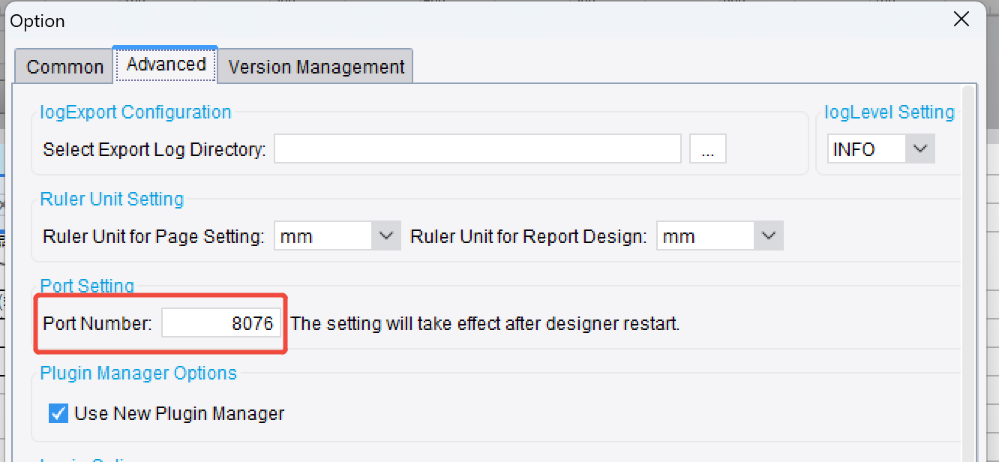
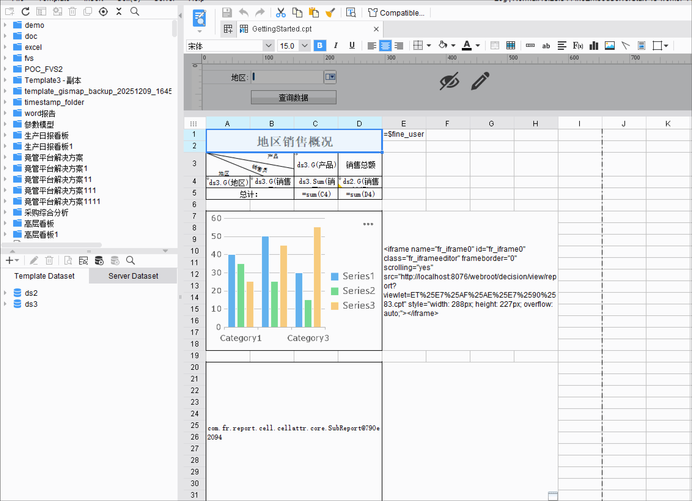

# 远程设计调试

> **常规调试方法**：
> - 启动 Tomcat 作为服务器，设计器远程连接过去。
>   - 调试设计器端：在 IDE 里打断点。
>   - 调试 Tomcat 端：用 IDE 集成 Tomcat 后打断点。
> - 也可以启动两个设计器实例，其中一个以 Jetty 作为服务器，另一个只启动设计器并远程连接过去。
>   - 设计器默认端口是8075，有一个设计器需要换成其他端口避免冲突

---

## 注意事项
- 远程环境本地环境的插件版本要一致，否则本地环境的插件无法生效 

---

## 示例

