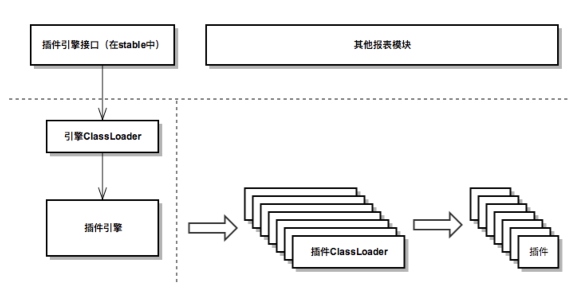
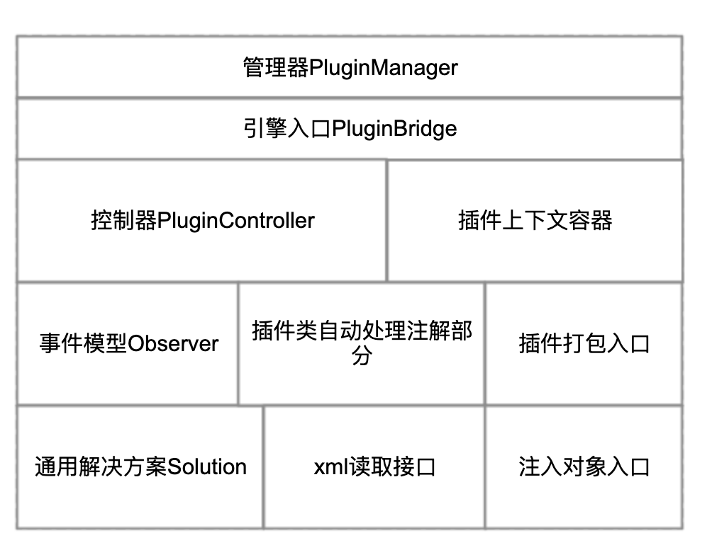
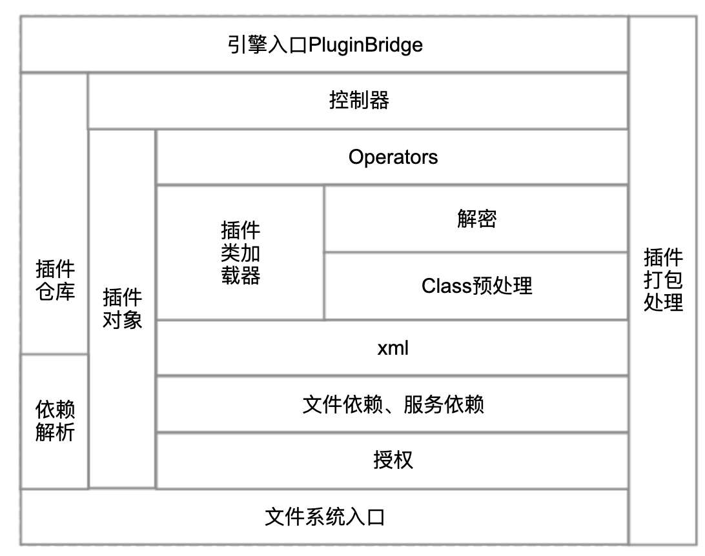
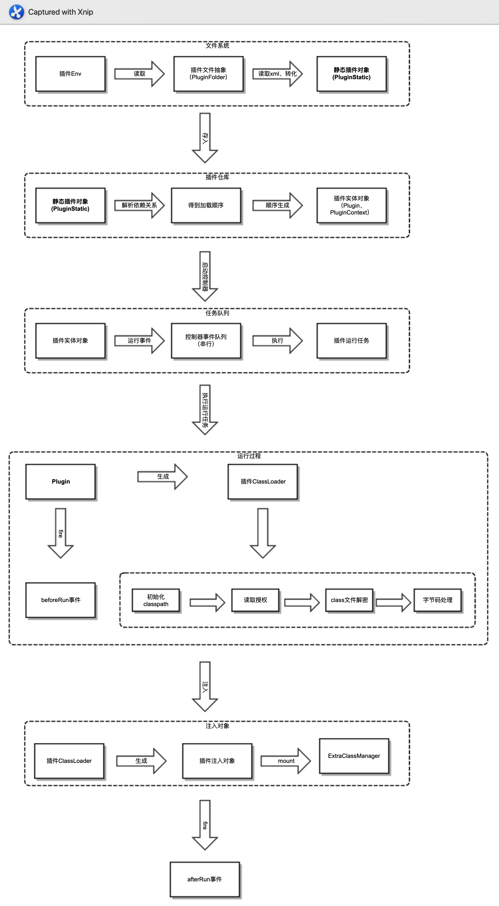

# 插件架构

## 关键特性

- **热部署** — 引入了对象清理、资源释放、缓存更新的问题
- **混淆、加密** — 不能直接使用引擎部分，必须通过 bridge 访问
- **字节码层面处理** — 在运行前通过字节码操作实现动态代理的等效功能

---

## 要点

- 插件引擎只监听环境切入与切出，切入时启动、切出时关闭
- 所有 `plugin.xml` 中描述的对象在运行的第一时间生成，不等待 servlet 事件
- 插件引擎放弃动态代理，改为运行前字节码操作，之后可对插件对象使用 `instanceof` 等操作
- **每个插件有单独的 ClassLoader**
  - 插件自身加载资源时，不要使用系统 ClassLoader
  - 报表中用 `IOUtils` 读取资源、`GeneralUtils.classForName()` 反序列化对象，这两个工具方法会遍历所有插件
  - 每次运行创建新的 ClassLoader，保证类初始化时做操作的插件在热部署时不出问题

---

## 整体结构

插件框架整体分为两部分：

| 部分 | 位置 | 说明 |
|---|---|---|
| 接口定义层 | `stable` 模块 | 所有相关接口定义、基础功能实现，可被外部访问 |
| 引擎实现层 | 插件引擎内部 | 通过自定义 ClassLoader 加载，需通过 `PluginManager` 访问 |

### 接口部分（stable 模块）

- **插件上下文接口**：定义插件上下文对象的功能、获取方式等
- **管理器**：连接接口层与引擎实现
  - 控制器：定义插件生命周期的控制接口（运行、禁用、更新、删除等）
  - 插件资源池
  - 插件上下文对象
- **observer**：插件监听模型，用于对各种插件事件的监听，解决热部署中的对象清理、资源释放、缓存更新等问题
- **solution**：通用解决方案模块，提供更简便的热部署问题处理工具
- **pack / transformer**：分别定义插件打包时自定义任务的接口，以及插件 class 文件的处理接口
- **其他**：插件对象注入、`ExtraClassManager` 定义、`plugin.xml` 读取接口、授权与错误码

### 引擎部分

| 模块 | 说明 |
|---|---|
| `bridge` | 与 `PluginManager` 相连，是整个插件引擎的入口 |
| `control` | 控制器，与 `Plugin` 对象配合，实现运行、禁用、更新删除，实现热部署 |
| `core` | `Plugin`、`PluginContext` 实现，自定义 `PluginClassLoader` |
| `env` | 插件文件系统抽象，处理不同部署环境差异 |
| `pretreatment` | 打包前预处理，集成 javassist，在打包时自动处理 class 文件 |
| `transformer` | 运行时处理，集成 javassist，在 class 文件被加载前做字节码处理 |
| `encryption` | 插件加密和解密模块 |
| `dependence / embfile` | 对应 `plugin.xml` 中标签的处理 |
| 其他 | license、错误处理、xml 读取 |

---

## 插件加载运行流程

