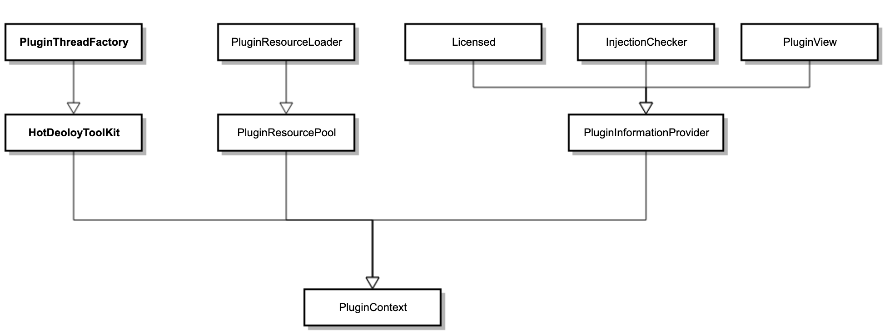

# 插件上下文对象

`PluginContext` 是插件模块的核心，每个插件都对应一个 `PluginContext` 对象。

---

## 获取当前插件上下文

在插件内部，直接使用 `PluginContexts.currentContext()` 获取当前上下文：

```java
PluginContext context = PluginContexts.currentContext();
```

该方法从调用栈中找到调用者的 Class 对象，再根据该 Class 的 ClassLoader 自动匹配对应的插件上下文。

---

## 获取指定插件上下文

在插件外部，通过 `PluginManager` 获取：

```java
// 1. 获取所有插件上下文（包括运行中、未运行、禁用的插件）
List<PluginContext> all = PluginManager.getContexts();

// 2. 获取满足条件的插件上下文（如包含 extra-core 注入的插件）
List<PluginContext> filtered = PluginManager.getContexts(new PluginFilter() {
    @Override
    public boolean accept(PluginContext context) {
        return context.contain(PluginModule.ExtraCore);
    }
});

// 3. 根据 ClassLoader 获取（每个插件有独立的 ClassLoader）
PluginContext context = PluginManager.getContext(clazz.getClassLoader());
```

---

## 上下文对象接口层次

`PluginContext` 实现了多个接口，继承结构如下：



各接口职责如下：

| 接口 | 说明 |
|---|---|
| `PluginThreadFactory` | 定义生成 `Executor`、`Timer`、`Socket` 等的入口，通过上下文生成的这些对象无需手动释放资源 |
| `HotDeployToolKit` | 热部署工具包，定义可恢复任务的执行入口 |
| `PluginResourceLoader` | 资源读取接口，范围为当前插件及报表 |
| `PluginResourcePool` | 更宽泛的资源池，除读取资源文件外还提供 `classForName` 方法 |
| `PluginInformationProvider` | 提供插件静态信息，包括授权、xml 配置、注入类型检查等 |
| `Licensed` | 授权信息 |
| `InjectionChecker` | 检查是否包含某个模块或某种类型的注入，常用于实现 `PluginFilter` |
| `PluginView` | 插件视图对象，包含 xml 中描述的 `id`、`name`、`vendor` 等信息 |
| `PluginContext` | 在上述接口基础上，还提供状态检查、获取完整 xml、获取注入对象等功能 |

---

## 常用功能示例

### 检查插件是否可用（授权校验）

```java
PluginContext context = PluginContexts.currentContext();
if (!context.isAvailable()) {
    // 授权不可用，插件功能受限
    return;
}
```

### 检查是否包含指定注入

```java
// 用于 PluginFilter 中筛选特定插件
boolean hasHandler = context.contain("JavaScriptFileHandler");
boolean hasCoreModule = context.contain(PluginModule.ExtraCore);
```

### 读取 plugin.xml 自定义属性

```java
PluginXmlElement xml = PluginContexts.currentContext()
        .getXml()
        .getElement(PluginElementName.Attributes);

if (xml != null) {
    List<PluginXmlElement> children = xml.getChild("encode");
    if (children != null && !children.isEmpty()) {
        String name = children.get(0).getAttribute("name");
        System.out.println(name);
    }
}
```
