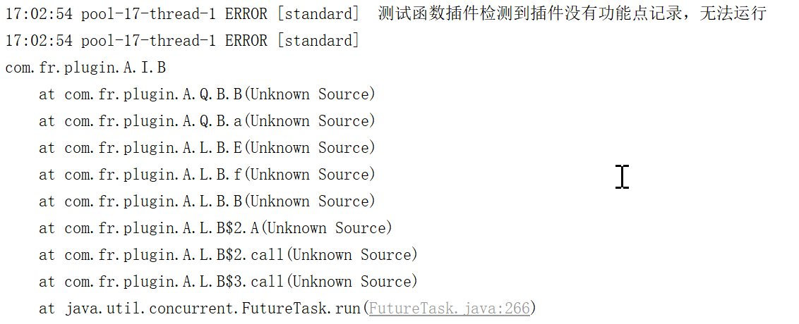
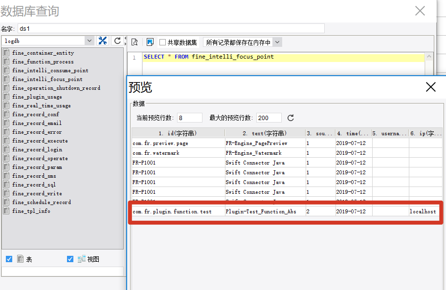

# 插件功能点记录

功能点记录用于统计开发者插件被用户使用的情况。**所有插件都必须包含功能点记录**，否则插件虽然在插件管理器中显示为"已安装且激活"，但实际运行中不会生效，并在 `fanruan.log` 中出现如下报错：



添加功能点记录分两步操作，以 `plugin-function` 插件为例：

---

## 第一步：在 plugin.xml 中标记记录类

```xml
<?xml version="1.0" encoding="UTF-8" standalone="no"?>
<plugin>
    <!-- 其他信息已省略 -->
    <function-recorder class="com.fr.plugin.MyAbs"/>
</plugin>
```

在 `<plugin>` 节点下增加 `<function-recorder>` 节点，`class` 属性指向添加了功能点记录的类名。

> 一个插件可以有多个 `function-recorder`，如果希望记录多个功能点到日志数据库中。

---

## 第二步：在记录类中添加注解

1. 在类名上加 `@EnableMetrics` 注解，表明该类包含功能点记录
2. 在要记录使用情况的方法上加 `@Focus` 注解，描述该功能点的信息

```java
@EnableMetrics
public class MyAbs extends AbstractFunction {

    @Focus(id = "com.fr.plugin.function.test", text = "Plugin-Test_Function_Abs", source = Original.PLUGIN)
    public Object run(Object[] args) {
        return 1;
    }
}
```

`@Focus` 注解参数说明：

| 参数 | 说明 |
|---|---|
| `id` | 功能点唯一标识，通常与插件 ID 关联 |
| `text` | 功能点描述文本，会记录到日志数据库 |
| `source` | 来源类型，插件使用 `Original.PLUGIN` |

---

## 效果

功能点记录生效后，当插件被使用时，可在日志数据库中查询到插件的使用情况，用于统计分析：


