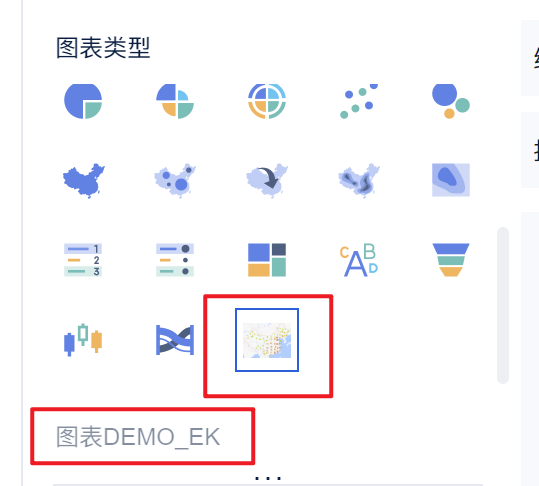
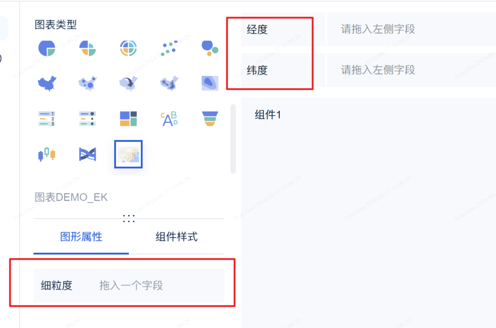
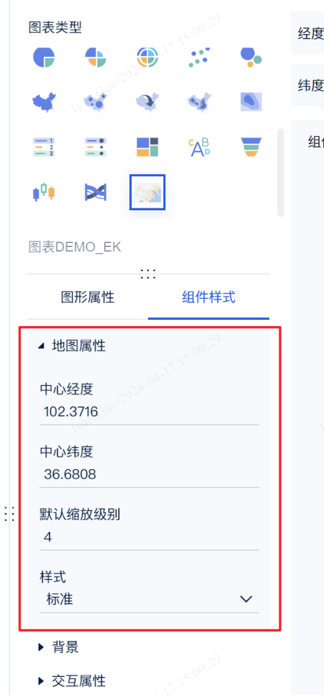
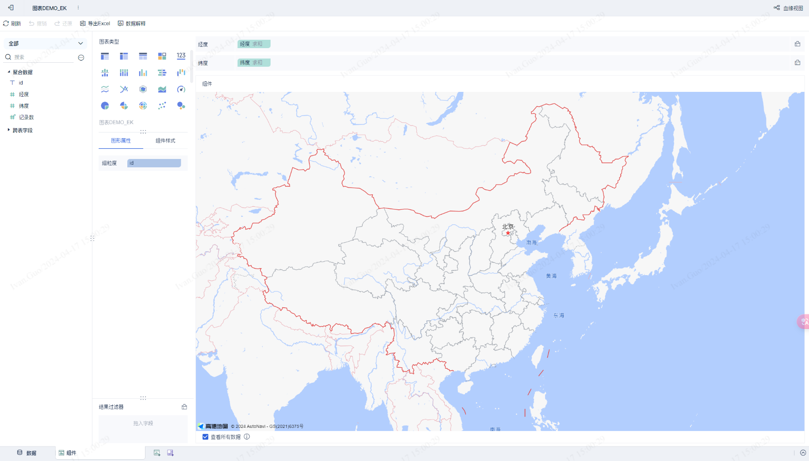
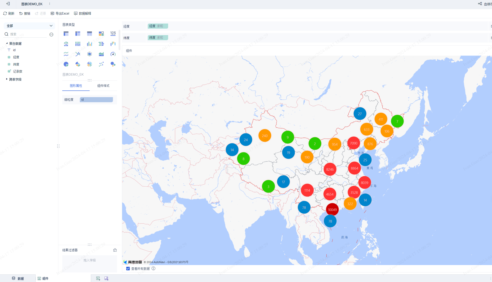
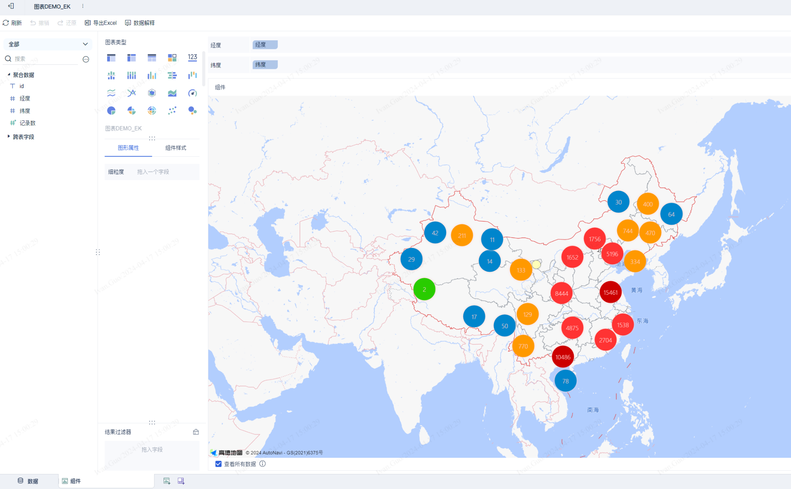
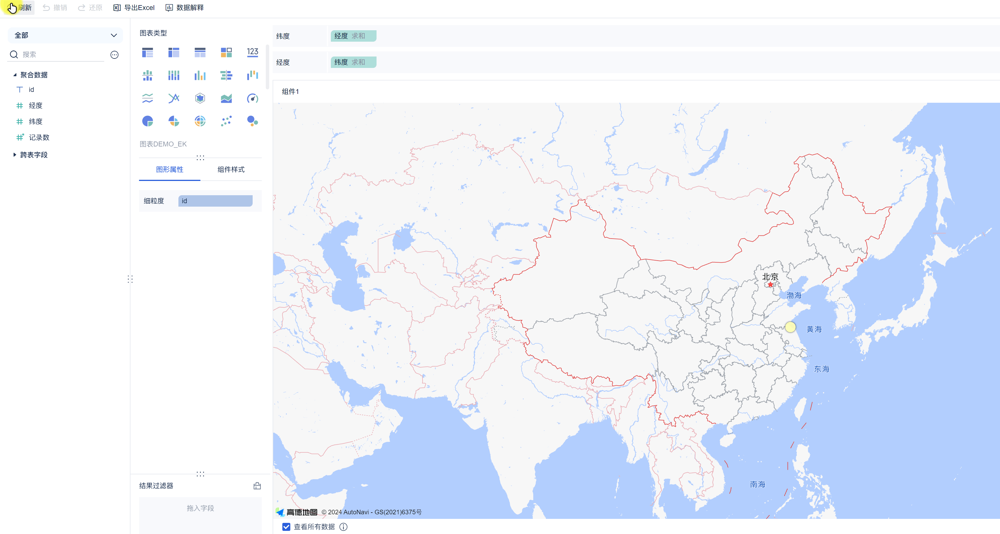
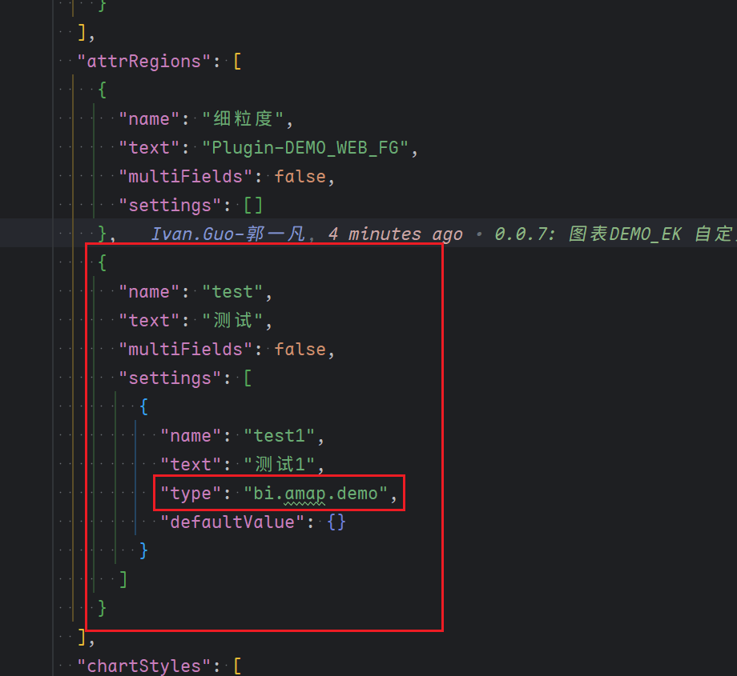
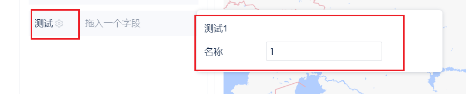

# 自定义图表（地图）

本示例通过 `CustomComponentProvider` 接口，实现一个基于高德地图的自定义图表插件，覆盖从基础渲染到进阶联动的完整开发流程。

---

## 插件接口

### CustomComponentProvider

```java
package com.finebi.provider.api.component;

import com.finebi.common.context.OperationContext;
import com.finebi.provider.api.component.data.DataModel;
import com.fr.common.annotations.Open;
import com.fr.stable.fun.mark.Mutable;
import com.fr.web.struct.AssembleComponent;
import java.util.List;

@Open
public interface CustomComponentProvider extends Mutable {
    String XML_TAG = "CustomComponentProvider";
    int CURRENT_LEVEL = 1;

    /** 自定义图表名称 */
    String getName();

    /** 自定义图表类型 */
    String getType();

    /** 自定义图表 icon */
    String getIcon();

    /** 空自定义图表提示，不写默认取 icon */
    String getPreviewIcon();

    /** 自定义图表编辑 dom，不写默认取预览 */
    String getEditPageHTML(OperationContext var1);

    /** 自定义图表渲染 js、css 注入（编辑态） */
    AssembleComponent editClient(OperationContext var1);

    /** 自定义图表预览 dom，注入依赖文件和挂载节点 */
    String getPreviewPageHTML(OperationContext var1);

    /** 自定义图表渲染 js、css 注入（预览态） */
    AssembleComponent previewClient(OperationContext var1);

    /** 自定义图表配置文件，返回 JSON 字符串 */
    String config();

    /** 是否需要进行自定义数据处理 */
    boolean needDataProcess(CustomComponentContext var1);

    /** 对 BI 计算后即将返回前端的数据进行自定义处理 */
    List<DataModel> process(List<DataModel> var1, CustomComponentContext var2);
}
```

### AbstractCustomComponentProvider

```java
package com.finebi.provider.api.component;

import com.finebi.common.context.OperationContext;
import com.finebi.provider.api.component.data.DataModel;
import com.fr.stable.fun.mark.API;
import com.fr.web.struct.AssembleComponent;
import java.util.List;

@API(level = 1)
public abstract class AbstractCustomComponentProvider implements CustomComponentProvider {

    public String getPreviewIcon() {
        return this.getIcon();
    }

    public String getEditPageHTML(OperationContext context) {
        return this.getPreviewPageHTML(context);
    }

    public AssembleComponent editClient(OperationContext context) {
        return this.previewClient(context);
    }

    public int currentAPILevel() { return 1; }

    public String mark4Provider() { return this.getClass().getName(); }

    public boolean needDataProcess(CustomComponentContext customComponentContext) { return false; }

    public List<DataModel> process(List<DataModel> dataModels, CustomComponentContext customComponentContext) {
        return dataModels;
    }
}
```

---

## 基础教程

### 一、向前端图表类型添加图表选项

继承 `AbstractCustomComponentProvider`，实现相应方法：

```java
// MapHotComponentProvider.java
@EnableMetrics
public class MapHotComponentProvider extends AbstractCustomComponentProvider {

    @Override
    public String getName() {
        return PluginConstantsEK.PLUGIN_MAP_NAME;
    }

    @Override
    public String getType() {
        return PluginConstantsEK.PLUGIN_MAP_TYPE;
    }

    @Override
    public String getIcon() {
        try {
            String render = TemplateUtils.render("${fineServletURL}");
            return render + "/resources?path=/com/finebi/plugin/tptj/ivan/chart/demo/amap/icon.png";
        } catch (Exception ignore) {}
        return "";
    }

    @Focus(id = PluginConstantsEK.PLUGIN_ID, text = PluginConstantsEK.PLUGIN_NAME, source = Original.PLUGIN)
    @Override
    public String getPreviewPageHTML(OperationContext context) {
        return "<div id=\"amap-demo-container\"></div>";
    }

    @Override
    public AssembleComponent previewClient(OperationContext context) {
        return MapHotComponent.KEY;
    }

    @Override
    public String config() {
        return IOUtils.readResourceAsString("com/finebi/plugin/tptj/ivan/chart/demo/amap/config/config.json");
    }
}
```

```xml
<!-- plugin.xml -->
<extra-core>
    <CustomComponentProvider class="com.finebi.plugin.tptj.ivan.chart.demo.amap.MapHotComponentProvider"/>
</extra-core>
```



---

### 二、向前端图表类型添加对应的配置

实现 `config()` 方法，返回 JSON 格式字符串。

```json
// config.json（地图示例）
{
  "dataRegions": [
    { "name": "lat", "text": "Plugin-DEMO_WEB_LAT" },
    { "name": "lng", "text": "Plugin-DEMO_WEB_LNG" }
  ],
  "attrRegions": [
    {
      "name": "细粒度",
      "text": "Plugin-DEMO_WEB_FG",
      "multiFields": false,
      "settings": []
    }
  ],
  "chartStyles": [
    {
      "name": "mapProp",
      "text": "Plugin-DEMO_WEB_MAP_ATTRIBUTE",
      "multiFields": true,
      "settings": [
        { "name": "centerLng", "text": "Plugin-DEMO_WEB_CENTER_LNG", "type": "Input", "defaultValue": "102.3716" },
        { "name": "centerLat", "text": "Plugin-DEMO_WEB_CENTER_LAT", "type": "Input", "defaultValue": "36.6808" },
        { "name": "defaultZoom", "text": "Plugin-DEMO_WEB_DEFAULT_ZOOM", "type": "Input", "defaultValue": "4" },
        {
          "name": "style",
          "text": "Plugin-DEMO_WEB_STYLE",
          "type": "Select",
          "defaultValue": "normal",
          "items": [
            { "text": "标准", "value": "normal" },
            { "text": "幻影黑", "value": "dark" },
            { "text": "月光银", "value": "light" },
            { "text": "远山黛", "value": "whitesmoke" },
            { "text": "草色青", "value": "fresh" },
            { "text": "雅士灰", "value": "grey" },
            { "text": "涂鸦", "value": "graffiti" },
            { "text": "马卡龙", "value": "macaron" },
            { "text": "靛青蓝", "value": "blue" },
            { "text": "极夜蓝", "value": "darkblue" },
            { "text": "酱籽", "value": "wine" }
          ]
        }
      ]
    }
  ]
}
```





#### JSON 配置文件说明

- **dataRegions**（JSONARRAY）：数据区域，目前最多支持两条
- **attrRegions**（JSONARRAY）：图形属性区域，`settings` 支持的类型：`JSONARRAY`、`color`、`size`、`symbol`、`Checkbox`、`RadioGroup`、`Segment`、`Select`、`ColorPicker`、`Input`
- **chartStyles**（JSONARRAY）：组件样式区域，`type` 支持：`Checkbox`、`RadioGroup`、`Segment`、`Select`、`ColorPicker`、`Input`

> **注：** 配置项不支持自定义格式、不支持配置项联动，仅支持以上几种基础格式。`name` 代表 id（前端 JS 通过 name 获取对应值），`text` 代表显示名称（支持国际化 key）。

<details>
<summary>config.json 全配置示例</summary>

```json
{
    "dataRegions": [
        { "name": "自定义数据1", "text": "国际化key" },
        { "name": "自定义数据2" }
    ],
    "attrRegions": [
        { "name": "颜色1", "multiFields": false, "settings": "color" },
        { "name": "大小1", "multiFields": true, "settings": "size" },
        { "name": "形状1", "multiFields": false, "settings": "symbol" },
        {
            "name": "自定选项",
            "multiFields": false,
            "settings": [
                { "name": "Checkbox", "type": "Checkbox", "defaultValue": ["2","3"], "items": [{"text":"选项1","value":"1"},{"text":"选项2","value":"2"},{"text":"选项2","value":"3"}] },
                { "name": "RadioGroup", "type": "RadioGroup", "defaultValue": "2", "items": [{"text":"选项1","value":"1"},{"text":"选项2","value":"2"}] },
                { "name": "Segment", "type": "Segment", "defaultValue": "2", "items": [{"text":"选项1","value":"1"},{"text":"选项2","value":"2"}] },
                { "name": "Select", "type": "Select", "defaultValue": "1", "items": [{"text":"选项1","value":"1"},{"text":"选项2","value":"2"}] },
                { "name": "ColorPicker", "type": "ColorPicker", "defaultValue": "#ffffff" },
                { "name": "Input", "type": "Input", "defaultValue": "test" }
            ]
        }
    ],
    "chartStyles": [
        {
            "name": "自定选项",
            "settings": [
                { "name": "Checkbox", "type": "Checkbox", "defaultValue": ["2","3"], "items": [{"text":"选项1","value":"1"},{"text":"选项2","value":"2"},{"text":"选项2","value":"3"}] },
                { "name": "RadioGroup", "type": "RadioGroup", "defaultValue": "2", "items": [{"text":"选项1","value":"1"},{"text":"选项2","value":"2"}] },
                { "name": "Segment", "type": "Segment", "defaultValue": "2", "items": [{"text":"选项1","value":"1"},{"text":"选项2","value":"2"}] },
                { "name": "Select", "type": "Select", "defaultValue": "1", "items": [{"text":"选项1","value":"1"},{"text":"选项2","value":"2"}] },
                { "name": "ColorPicker", "type": "ColorPicker", "defaultValue": "#ffffff" },
                { "name": "Input", "type": "Input", "defaultValue": "test" }
            ]
        }
    ]
}
```

</details>

---

### 三、将图表显示到前端页面上

前端通过 `BIPlugin.init(render)` 注册渲染函数：

```js
// render图表渲染方法签名
function render(
    data,                // 数据
    config,              // 配置
    saveSessionCallback,
    closeSessionCallBack,
    extensionCallBack
) {}

// 注册渲染方法
new BIPlugin().init(render);
```

高德地图具体实现示例：

```js
(function ($) {
  function render(data, config, saveSessionCallback, closeSessionCallBack, extensionCallBack) {
    // 查找初始化时的 dom 对象（在 getPreviewPageHTML 中定义）
    const dom = document.getElementById("amap-demo-container");

    // 必须设置宽高，否则图表渲染不出来
    dom.style.width = document.body.clientWidth + "px";
    dom.style.height = document.body.clientHeight + "px";

    // 获取配置项
    const mapAttribute = config["chartStyle"]["地图属性"]["value"];

    // 地图组件初始化
    const map = new AMap.Map(dom, {
      resizeEnable: true,
      center: [mapAttribute[0], mapAttribute[1]],
      zoom: mapAttribute[2],
    });

    // 地图设置样式
    map.setMapStyle("amap://styles/" + mapAttribute[3]);

    window.addEventListener("resize", function () {
      dom.style.width = document.body.clientWidth + "px";
      dom.style.height = document.body.clientHeight + "px";
    });
  }

  new BIPlugin().init(render);
})(jQuery);
```



---

### 四、前端读取数据

`data` 包含维度和指标数据，`config` 包含图形属性和组件样式配置。

```js
(function ($) {
    function render(data, config, saveSessionCallback, closeSessionCallBack, extensionCallBack) {
        const dom = document.getElementById("amap-demo-container");
        dom.style.width = document.body.clientWidth + "px";
        dom.style.height = document.body.clientHeight + "px";

        const mapAttribute = config["chartStyle"]["地图属性"]["value"];

        const map = new AMap.Map(dom, {
            resizeEnable: true,
            center: [mapAttribute[0], mapAttribute[1]],
            zoom: mapAttribute[2],
        });
        map.setMapStyle("amap://styles/" + mapAttribute[3]);

        // 获取全部的经纬度点数据
        const points = _getAllPoint(data.dataMapping, data.dataModels[0]);

        if (points != null) {
            var pointCluster = new AMap.MarkerCluster(map, points, {
                gridSize: 60,
                renderClusterMarker: _renderCarClusterMarker,
                renderMarker: _renderMarker,
            });
        }

        window.addEventListener("resize", function () {
            dom.style.width = document.body.clientWidth + "px";
            dom.style.height = document.body.clientHeight + "px";
        });
    }

    function _renderCarClusterMarker(context) {
        const div = document.createElement('div');
        let bgColor;
        if (context.count < 10) bgColor = 'hsla(108,100%,40%,1)';
        else if (context.count < 100) bgColor = 'hsl(201,100%,40%)';
        else if (context.count < 1000) bgColor = 'hsla(36,100%,50%,1)';
        else if (context.count < 10000) bgColor = 'hsla(0,100%,60%,1)';
        else bgColor = 'hsla(0,100%,40%,1)';
        const size = Math.round(30 + Math.pow(context.count / context.count, 1 / 5) * 20);
        div.style.cssText = `background-color:${bgColor};width:${size}px;height:${size}px;border-radius:${size/2}px;line-height:${size}px;text-align:center;color:#fff;font-size:14px;`;
        div.innerHTML = context.count;
        context.marker.setOffset(new AMap.Pixel(-size / 2, -size / 2));
        context.marker.setContent(div);
    }

    function _renderMarker(context) {
        context.marker.setContent('<div style="background-color:rgba(255,255,178,.9);height:18px;width:18px;border:1px solid rgba(255,255,178,1);border-radius:12px;box-shadow:rgba(0,0,0,1) 0px 0px 3px;"></div>');
        context.marker.setOffset(new AMap.Pixel(-9, -9));
    }

    function _getAllPoint(dataMapping, dataModel) {
        let lngId = dataMapping['经度'];
        let latId = dataMapping['纬度'];
        let lngIndex, latIndex;
        dataModel.fields.forEach((item, index) => {
            if (lngId.indexOf(item.id) >= 0) lngIndex = index;
            if (latId.indexOf(item.id) >= 0) latIndex = index;
        });
        const points = [];
        for (let i = 0; i < dataModel.rowCount; i++) {
            points.push({ lnglat: [dataModel.colData[lngIndex][i], dataModel.colData[latIndex][i]] });
        }
        return points;
    }

    new BIPlugin().init(render);
})(jQuery);
```

> **注：** 接口无法直接获取明细数据，若希望使用明细数据，可将其转为维度，或添加细粒度属性。

**通过细粒度划分效果：**



**通过维度划分效果：**



> [基础教程 DEMO 源码](https://code.fanruan.com/Ivan.Guo/bi.chart.demo.v6/src/branch/master/%E8%AF%B4%E6%98%8E/0.0.1/0.0.1.zip)

---

## 进阶教程

### 一、数据处理接口

**场景：** 产品已有的数据处理方式无法满足需求，希望在数据返回前端前进行额外处理。

> 注意：插件拿到的数据是产品已经处理过的，插件处理在产品处理后执行。

重写 `needDataProcess` 和 `process` 方法：

```java
@Override
public boolean needDataProcess(CustomComponentContext customComponentContext) {
    return true;
}

@Override
public List<DataModel> process(List<DataModel> dataModels, CustomComponentContext customComponentContext) {
    // 示例：每次只随机返回一个点的数据
    return dataModels.stream().map(dataModel -> new DataModel() {
        @Override
        public List<Dimension> getFields() { return dataModel.getFields(); }

        @Override
        public List<List<Object>> getColData() {
            List<List<Object>> colData = new ArrayList<>(dataModel.getFields().size());
            dataModel.getColData().forEach(d ->
                colData.add(Collections.singletonList(d.get((int)(Math.random() * d.size())))));
            return colData;
        }
    }).collect(Collectors.toList());
}
```



> [数据处理 DEMO 源码](https://code.fanruan.com/Ivan.Guo/bi.chart.demo.v6/src/branch/master/%E8%AF%B4%E6%98%8E/0.0.2/0.0.2.zip)

---

### 二、页面刷新接口

**场景：** 需要用户手动触发图表刷新，而非整个页面刷新。

调用 `extensionCallBack('refresh')` 刷新图表 iframe：

```js
function render(data, config, saveSessionCallback, closeSessionCallBack, extensionCallBack) {
    // ...
    document.querySelector("#amap-demo-click").onclick = function () {
        // 每次执行该方法都会刷新 iframe，调用前需有逻辑判断
        extensionCallBack('refresh');
    };
}

new BIPlugin().init(render);
```


> [刷新接口 DEMO 源码](https://code.fanruan.com/Ivan.Guo/bi.chart.demo.v6/src/branch/master/%E8%AF%B4%E6%98%8E/0.0.3/0.0.3.zip)

---

### 三、保存配置接口

**场景：** 刷新图表后，希望保留用户操作前的状态（如地图中心点、缩放等级）。

保存的配置存放在 `config.customConfig` 中，下次渲染时读取：

```js
function render(data, config, saveSessionCallback, closeSessionCallBack, extensionCallBack) {
    let map;
    const customConfig = config.customConfig;
    if (customConfig != null && JSON.stringify(customConfig).length > 2) {
        // 读取上次保存的配置
        map = new AMap.Map(dom, { center: [customConfig.lng, customConfig.lat], zoom: customConfig.zoom });
    } else {
        map = new AMap.Map(dom, { center: [mapAttribute[0], mapAttribute[1]], zoom: mapAttribute[2] });
    }

    document.querySelector("#amap-demo-click").onclick = function () {
        // 保存当前中心点和缩放等级
        saveSessionCallback({
            zoom: map.getZoom(),
            lng: map.getCenter().lng,
            lat: map.getCenter().lat,
        });
        extensionCallBack('refresh');
    };
}

new BIPlugin().init(render);
```


> [保存配置 DEMO 源码](https://code.fanruan.com/Ivan.Guo/bi.chart.demo.v6/src/branch/master/%E8%AF%B4%E6%98%8E/0.0.4/0.0.4.zip)

---

### 四、组件联动（dimensionSelected，支持跳转和联动）

**场景：** 点击图表数据点时联动仪表板内其他组件，或进行页面跳转。

根据用户数据类型选择合适事件：

```js
// 点击指标事件（数据栏里是指标【绿色】时使用）
extensionCallBack("pointSelected", {
    pos: { x: 鼠标位置x, y: 鼠标位置y },
    measure: measureId,   // 点击指标的维度 id
    row: currentClicked,  // 点击行的各字段值 { id: 字段值 }
});

// 点击维度事件（数据栏里是维度【蓝色】时使用）
extensionCallBack("dimensionSelected", {
    pos: { x: 鼠标位置x, y: 鼠标位置y },
    measure: measureId,
    row: currentClicked,
});
```

完整示例（非聚合点点击联动）：

```js
function _renderMarker(context) {
    context.marker.setContent('...');
    context.marker.setOffset(new AMap.Pixel(-9, -9));

    let datum = context.data[0];
    const currentClicked = {
        [datum.idId]: datum.idVal,
        [datum.lngId]: datum.lngVal,
        [datum.latId]: datum.latVal
    };
    const currentId = datum.lngId;

    context.marker.on('click', ev => {
        const demo = {
            pos: { x: window.event.pageX, y: window.event.pageY },
            measure: currentId,
            row: currentClicked,
        };
        // 根据字段类型选择联动方式
        for (let field of data.dataModels[0].fields) {
            if (field.id === currentId) {
                if (field.isDimension) extensionCallBack("dimensionSelected", demo);
                else if (field.isMeasure) extensionCallBack("pointSelected", demo);
                break;
            }
        }
    });
}
```


> [联动 DEMO 源码](https://code.fanruan.com/Ivan.Guo/bi.chart.demo.v6/src/branch/master/%E8%AF%B4%E6%98%8E/0.0.6/0.0.6.zip)

---

### 五、自定义组件（配置项扩展）

**场景：** 需要实现复杂的配置项（超出内置类型），可在 `config.json` 中指定自定义组件类型，并在插件中将该组件注入到 subject。

```js
// config.json 中指定自定义组件
{
    "name": "自定义组件",
    "type": "bi.test.widget",
    "defaultValue": "1"
}
```

```js
// 自定义组件实现（需注入到 subjectPage）
!(function () {
    var Demo = BI.inherit(BI.Widget, {
        props: { baseCls: "" },
        render: function () {
            var self = this;
            return {
                type: "bi.vertical",
                width: 300,
                items: [{
                    el: {
                        type: "bi.vertical_adapt",
                        items: [
                            { el: { type: "bi.label", text: "名称", textAlign: "left" }, width: 70, rgap: 10 },
                            {
                                el: {
                                    type: "bi.editor",
                                    value: self.options.value,
                                    cls: "bi-border bi-border-radius",
                                    width: 150,
                                    height: 24,
                                    allowClear: false,
                                    listeners: [{
                                        eventName: "EVENT_CHANGE",
                                        action: function () {
                                            self.options.setValue(this.getValue());
                                        }
                                    }]
                                }
                            }
                        ]
                    },
                    tgap: 10
                }]
            };
        }
    });
    BI.shortcut("bi.amap.demo", Demo);
})();
```





> [自定义组件 DEMO 源码](https://code.fanruan.com/Ivan.Guo/bi.chart.demo.v6/src/branch/master/%E8%AF%B4%E6%98%8E/0.0.7/0.0.7.zip)
