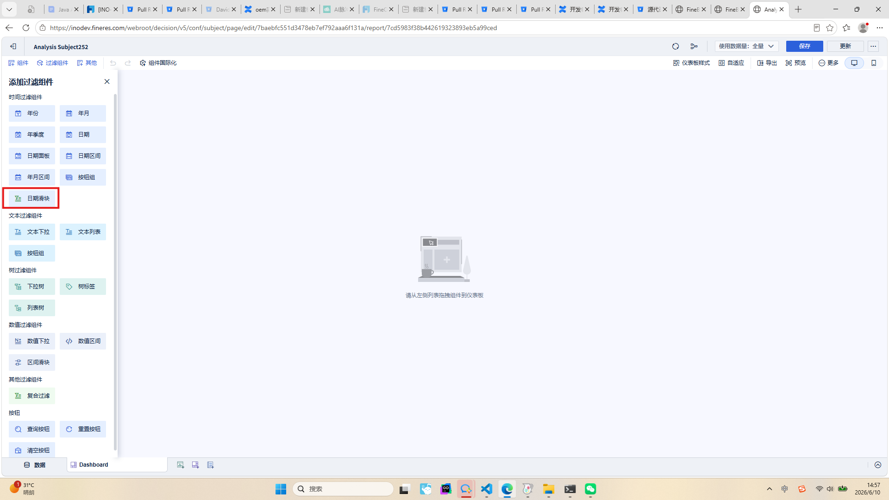
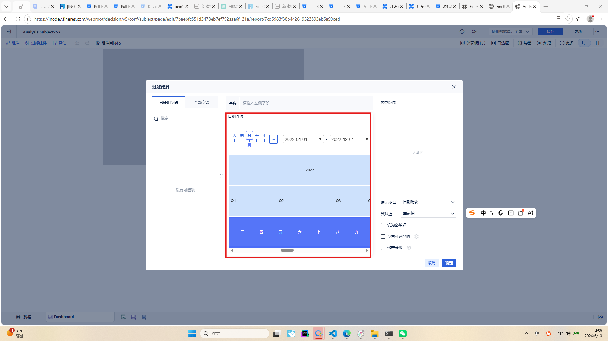
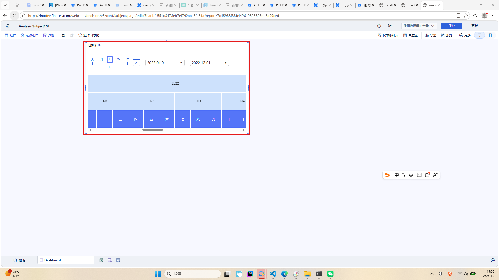

# 自定义过滤组件

## 第一步：注入组件接口

实现如下图所示效果：



在插件中配置自定义控件的属性，继承 `AbstractCustomFilterWidgetProvider`：

```java
public class FilterProvider extends AbstractCustomFilterWidgetProvider {

    /**
     * 配置自定义控件的名称（支持国际化）
     */
    @Override
    public String getName() {
        try {
            Locale currentLocale = null;
            String resourceBaseName = "ru/soundbi/filters/datesliderfilter/resource/locale/locale";
            try {
                InterProviderFactory.getProvider().addResource(resourceBaseName);
            } catch (Exception e) {
            }
            HttpServletRequest req = null;
            try {
                if (RequestContextHolder.getRequestAttributes() != null) {
                    req = ((ServletRequestAttributes) RequestContextHolder.getRequestAttributes()).getRequest();
                }
            } catch (Exception e) {
                // 忽略异常，继续尝试其他方式
            }
            if (req != null) {
                currentLocale = ProviderFactory.INSTANCE.getInternationalProvider().getClientLocale(req);
            }
            if (currentLocale == null) {
                return "Plugin-Xml-I18n-Custom-Date-Slider-Plugin-Name";
            }
            String key = "Plugin-Xml-I18n-Custom-Date-Slider-Plugin-Name";
            String localizedText = InterProviderFactory.getProvider().getLocText(key, currentLocale);
            return localizedText;
        } catch (Exception e) {
            // 如果无法加载国际化资源，返回键值作为后备
        }
        return "Plugin-Xml-I18n-Custom-Date-Slider-Plugin-Name";
    }

    /**
     * 配置该自定义控件的 xType
     */
    @Override
    public String getType() {
        return "bi.custom.date.dateslider";
    }

    /**
     * 配置该自定义组件的展示图标
     */
    @Override
    public String getIcon() {
        return "http://webapi.amap.com/theme/v1.3/mapinfo_05.png";
    }

    /**
     * 配置该自定义控件的选项组件 xtype（可以为空）
     */
    @Override
    public String getCustomTool() {
        return ""; // "bi.plugin.testwidget"
    }

    /**
     * 配置该自定义控件的预览 html（可以为空）
     */
    @Override
    public String getPreviewPageHTML(OperationContext context) {
        return "<link rel=\"stylesheet\" type=\"text/css\" href=\"https://fanruan.design/fineui/2.0/fineui.min.css\" />"
                + "<script src=\"https://fanruan.design/fineui/2.0/fineui.min.js\"></script>"
                + "<div>context: </div>" + context.getSystemInfo() + context.getUserInfo()
                + "<div id=\"container\">这是预览</div>";
    }

    /**
     * 配置该自定义控件的编辑 html（可以为空）
     */
    @Override
    public String getEditPageHTML(OperationContext context) {
        return "<link rel=\"stylesheet\" type=\"text/css\" href=\"https://fanruan.design/fineui/2.0/fineui.min.css\" />"
                + "<script src=\"https://fanruan.design/fineui/2.0/fineui.min.js\"></script>"
                + "<div>context: </div>" + context.getSystemInfo().getServletURL() + context.getUserInfo().getDisplayName()
                + "<div id=\"container\">这是编辑</div>";
    }

    @Override
    public AssembleComponent previewClient(OperationContext context) {
        return FilterComponent.KEY;
    }

    /**
     * 配置该自定义控件支持的字段类型：
     * - 字符类型：BICommonConstants.COLUMN.STRING
     * - 日期类型：BICommonConstants.COLUMN.DATE
     * - 数值类型：BICommonConstants.COLUMN.NUMBER
     */
    @Override
    public int getFilterFieldType() {
        return BICommonConstants.COLUMN.DATE;
    }
}
```

## 第二步：构造自定义过滤控件的处理逻辑

在插件中定义自定义过滤控件的渲染逻辑，控制编辑态和预览态的展示效果。

编辑态效果：



预览态效果：



以下是一个自定义日期滑块过滤组件的前端实现示例：

```js
import { shortcut, store, extend } from '../../core';
import { ControlFilterModel } from './control.filter.model';
import './HTMLComponents/date-picker.js';
import './HTMLComponents/scale-selector.js';
import './HTMLComponents/date-range-picker.js';
import './HTMLComponents/date-range-scale-selector.js';
import { ErrorCode, RES_STATUS } from '../../contsant/index';
import { formatDate, getControlUsedMeasuresAndTableNames, setCssScale, setTransformScale } from '../../utils';

export interface ControlStringSingleProps {
    baseCls: string;
    $testId: string;
    height: number;
    width?: number;
    isPreviewMode: boolean;
    cssScaleGetter: () => number;
}

@shortcut()
@store(ControlFilterModel)
export class ControlDateIntervalFilter extends BI.Widget {
    static xtype = 'bi.custom.date.dateslider';

    static EVENT = {
        EVENT_CHANGE: 'EVENT_CHANGE',
    };

    props: ControlStringSingleProps = {
        baseCls: 'bi-date-interval-control',
        $testId: 'bi-date-interval-control',
        isPreviewMode: false,
        cssScaleGetter: () => 1,
    };

    model: ControlFilterModel['model'];
    store: ControlFilterModel['store'];

    watch = {
        disabled: () => {},
    };

    setMinMaxDate() {
        this.element[0].setAttribute('min-date', this.minData || '2022-01-01');
        this.element[0].setAttribute('max-date', this.maxData || '2022-12-01');
    }

    mounted() {
        this.getMinMaxDate();
        try {
            this.element[0].closest('.bi-show-widget-factory.bi-control-widget,.bi-abs.bi-control-widget.bi-card')
                .style.setProperty("overflow", "visible");
        } catch (e) {}
        try {
            this.element[0].closest('.bi-fit-widget.bi-export-widget').style.setProperty("z-index", "100");
        } catch (e) {}
        this.element[0].style.setProperty('height', '24px');
        setTimeout(() => {
            this.element[0].style.setProperty('top', "0");
            this.element[0].style.setProperty('left', "0");
            this.element[0].style.setProperty('right', "0");
            this.element[0].style.setProperty('bottom', "0");
            this.element[0].style.setProperty('height', '100%');
            this.element[0].style.setProperty('--scale-text-color', '#2c60db');
            this.element[0].style.setProperty('--scale-border-color', '#2c60db');
            this.element[0].style.setProperty('--scale-tick-color', '#2c60db');
            this.element[0].style.setProperty('--collapse-btn-color', '#2c60db');
            this.element[0].style.setProperty('--collapse-icon-color', '#2c60db');
            this.element[0].style.setProperty('--collapse-btn-color-hover', '#2c60db');
            this.element[0].style.setProperty('--background-item-color', '#f2f7fe');
            this.element[0].style.setProperty('--higher-periods-active-color', '#cde1fc');
        }, 200);
    }

    _defaultConfig() {
        const conf = super._defaultConfig(...arguments);
        return extend(conf, {
            baseCls: ``,
            el: null,
            tagName: 'date-range-scale-selector',
            listeners: [
                {
                    eventName: 'range-changed',
                    action(e) {},
                }
            ],
        });
    }

    date_value_to_str(v) {
        if (v == undefined) return undefined;
        let p0 = (x) => `${x < 10 ? '0' : ''}${x}`;
        return `${p0(v.year)}-${p0(v.month)}-${p0(v.day)}`;
    }

    // 获取最早最晚日期
    private getMinMaxDate(): Promise<{minData: any, maxData: any}> {
        return BI.Utils.getControlDefaultValueByWidgetInfo(
            [{ ...this.getRequestParams(), originDefaultValue: 1, measuresConfig: [] }],
            this.model.templateHelper
        ).then((minRes) => {
            const minData = minRes.data;
            return BI.Utils.getControlDefaultValueByWidgetInfo(
                [{ ...this.getRequestParams(), originDefaultValue: 2, measuresConfig: [] }],
                this.model.templateHelper
            ).then((maxRes) => {
                const maxData = maxRes.data;
                this.minData = this.date_value_to_str(minData[Object.keys(minData)[0]].value);
                this.maxData = this.date_value_to_str(maxData[Object.keys(maxData)[0]].value);
                if (this.element) {
                    this.element[0].setAttribute('min-date', this.minData);
                    this.element[0].setAttribute('max-date', this.maxData);
                }
                return { minData, maxData };
            });
        }).catch((error) => {
            console.error('获取日期范围失败:', error);
        });
    }

    // 获取请求参数
    private getRequestParams() {
        const measurePoolHelper = this.model.templateHelper.getMeasurePoolHelper();
        const measureHelper = measurePoolHelper.getMeasureHelper();
        let fieldIds: string[] = [];
        BI.each(this.model.dimensions, (_, dimension) => {
            const { fieldId, sort } = dimension;
            fieldIds = [...fieldIds, fieldId, ...measureHelper.getAllUsedCalTargets(fieldId)];
            if (sort?.targetFieldId) {
                fieldIds = [
                    ...fieldIds,
                    sort.targetFieldId,
                    ...measureHelper.getAllUsedCalTargets(sort.targetFieldId),
                ];
            }
        });

        const { measures, generaTableNames } = getControlUsedMeasuresAndTableNames(fieldIds, measureHelper);
        const tableNames = this.model.selectedTable;
        const relationTableNames = BI.flatten(
            this.model.templateHelper.getPoolHelper().getRelationModelByTableNames(tableNames)
        );

        return {
            wId: this.model.wId,
            dimensions: this.model.dimensions,
            view: this.model.view,
            value: this.model.value,
            type: this.model.type,
            tableName: BI.uniq(BI.concat(
                tableNames,
                generaTableNames.filter(tableName => relationTableNames.includes(tableName))
            )),
            measuresConfig: [],
            dateIntervalValue: this.model.dateIntervalValue,
            useDateInterval: this.model.useDateInterval,
            showTime: this.model.showTime,
        };
    }

    render() {
        this.element.attr({
            "min-date": '2020-01-01',
            "max-date": '2026-01-01',
            'granularity': "month",
            "start-date": this.date_value_to_str(this.model.value?.start?.value) || '2022-01-01',
            "end-date": this.date_value_to_str(this.model.value?.end?.value) || '2022-12-01',
            'week-numbering': 'ISO',
            'first-day-of-week': '1'
        });
        this.element.on("range-changed", (e: any) => {
            let ev = {
                start: e.originalEvent.detail.startDate,
                end: e.originalEvent.detail.endDate,
            };
            ev.start = ev.start.split("T")[0];
            ev.end = ev.end.split("T")[0];
            if ((ev.start == "") || (ev.end == "")) {
                this.fireEvent(ControlDateIntervalFilter.EVENT.EVENT_CHANGE, null);
                return;
            }
            ev.start = {
                type: 1, value: {
                    day: parseInt(ev.start.split("-")[2]),
                    month: parseInt(ev.start.split("-")[1]),
                    year: parseInt(ev.start.split("-")[0])
                }
            };
            ev.end = {
                type: 1, value: {
                    day: parseInt(ev.end.split("-")[2]),
                    month: parseInt(ev.end.split("-")[1]),
                    year: parseInt(ev.end.split("-")[0])
                }
            };
            this.model.collapse = e.originalEvent.detail.collapse;
            this.model.granularity = e.originalEvent.detail.granularity;
            this.fireEvent(ControlDateIntervalFilter.EVENT.EVENT_CHANGE, ev);
        });
        this.element[0].style.overflow = "visible";
        this.element[0].style.height = "24px";
    }

    setValue(v?: any) {
        if (v.start) {
            this.element[0].setAttribute('start-date', this.date_value_to_str(v.start.value));
        }
        if (v.end) {
            this.element[0].setAttribute('end-date', this.date_value_to_str(v.end.value));
        }
    }

    getValue() {}

    reset() {
        this.setValue();
    }
}
```

## 插件 Demo

[plugin-bi-custom-filter-widget](https://github.com/finereport-overseas/plugin-bi-custom-filter-widget)
