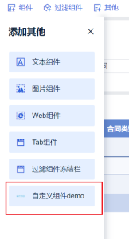

# 自定义组件

## 第一步：注入组件接口

实现如下图所示效果：



实现注册自定义组件的 Provider，继承 `AbstractCustomWidgetProvider`：

```java
public class XXXProvider extends AbstractCustomWidgetProvider {

    /** 自定义组件名称或国际化 key */
    @Override
    public String getName() {
        return "自定义组件demo";
    }

    /** 自定义组件类型 */
    @Override
    public String getType() {
        return "demo";
    }

    /** 自定义组件 icon */
    @Override
    public String getIcon() {
        return "http://webapi.amap.com/theme/v1.3/mapinfo_05.png";
    }

    /** 自定义选项 xtype */
    @Override
    public String getCustomTool() {
        return "bi.plugin.testwidget";
    }

    // 下面的接口见第二步
    ......
}
```

## 第二步：构造渲染页面

分**编辑**和**预览**两个场景，分别提供 HTML 片段和对应的前端 Atom 入口：

```java
public class XXXProvider extends AbstractCustomWidgetProvider {

    /** 组件编辑界面的 html，不写默认取预览 */
    @Override
    public String getEditPageHTML(XXContext context) {
        return "<div id=\"container\"></div>";
    }

    @Override
    public Atom editClient() {
        return XXXComponent.KEY;
    }

    /** 组件预览界面的 html */
    @Override
    public String getPreviewPageHTML(XXContext context) {
        return "<div id=\"container\"></div>";
    }

    @Override
    public Atom previewClient() {
        return XXXComponent.KEY;
    }
}
```

### JS 规范

#### 1. 实现自定义组件渲染

```javascript
/**
 * @param data   过滤信息，包括：
 *               - controlFilterParamsMap：控件过滤
 *               - linkageParamsMap：自定义联动过滤
 * @param config 配置信息，包括：
 *               - customWidgetConfig：自定义保存配置
 *               - customWidgetToolConfig：自定义选项保存配置
 * @param closeSessionCallback      结束当前页面会话，把主动权交还给 BI
 * @param saveSessionCallback(json) 保存回调，入参为要保存的 json 对象，返回 Promise
 *                                  示例：saveSessionCallback({ renderTimes: renderTimes + 1 })
 * @param extensionCallBack         回调函数，用于刷新：extensionCallBack('refresh')
 */
function render(data, config, closeSessionCallback, saveSessionCallback, extensionCallBack) {

}

new BIPlugin().init(render);
```

#### 2. 实现自定义选项组件

对应 JS 注入到主题编辑页面，xtype 需与 `getCustomTool()` 返回值一致：

```javascript
const widget = BI.inherit(BI.Widget, {
    ......
    render: function () {
        // 从 options 中获取自定义选项配置及保存方法
        const {
            customWidgetToolConfig = {},
            saveCustomWidgetToolConfig
        } = this.options;
        // saveCustomWidgetToolConfig({...}) 用于保存选项配置
        ......
    }
});

BI.shortcut('bi.plugin.testwidget', widget);
```

## 插件 Demo

[plugin-bi-custom-widget-demo](https://github.com/finereport-overseas/plugin-bi-custom-widget-demo)
